.. _dicom-guide:

Understanding DICOM with Orthanc
================================

.. contents::

This section of the Orthanc Book provides a **gentle, informal,
high-level introduction to DICOM**. We will try and map DICOM's own
concepts to a modern terminology that should hopefully be more easy to
understand for software engineers diving for the first time into
DICOM. Once the concepts of this page are understood, interested
readers are invited to read a more formal textbook about DICOM, such
as the so-called "`Practical introduction and survival guide
<https://www.springer.com/us/book/9783642108495>`__", or to read the
full `DICOM specification
<http://dicom.nema.org/medical/dicom/current/output/html/>`__.

All the DICOM concepts that are defined in this introduction are
illustrated with `Orthanc <https://www.orthanc-server.com/>`__, a
lightweight, yet powerful standalone DICOM server for healthcare and
medical research. As Orthanc is free and open-source software, it is a
good companion to learn DICOM.

.. _dicom-format:

DICOM file format
-----------------

The DICOM standard can be very roughly divided in 2 parts:

1. The part specifying the DICOM **file format**.
2. The part specifying the DICOM **network protocol**.

The DICOM file format is the topic of the present section. It is
inherently similar to well-known formats such as JPEG, PNG or
TIFF. However, besides the so-called "**pixel data**" that encodes the
medical image itself, a DICOM file also embeds medical information.

.. _dicom-tags:

DICOM tags
^^^^^^^^^^

The medical information encoded by a DICOM file is called a **data
set** and takes the form of a `key-value associative array
<https://en.wikipedia.org/wiki/Associative_array>`__.  Each value can
itself be a list of data sets (called a **sequence**), leading to a
hierarchical data structure that is much like a XML or JSON file.

In the DICOM terminology, each key is called a **DICOM tag**. The list
of the standard DICOM tags are normalized by an official dictionary,
each tag being identified by two 16-bit hexadecimal numbers. For
instance, the birth date of a patient is associated with the DICOM tag
``(0x0010, 0x0030)``. Note that it is common to drop the "``0x``"
prefix and to simply write ``0010,0030``. For better readability, it
is also common to nickname these DICOM tags with a `camel case
<https://en.wikipedia.org/wiki/CamelCase>`__ English name (such as
"*PatientName*" or "*StudyDescription*"). The standard associates each
DICOM tag with a data type (a string, a date, a floating-point
number...), that is known as its **value representation**.

Here is how :ref:`Orthanc Explorer <orthanc-explorer>` displays the
DICOM tags stored in a DICOM file (note that the file contains a
sequence identified by the tag ``ProcedureCodeSequence (0x0008,
0x1032)``):

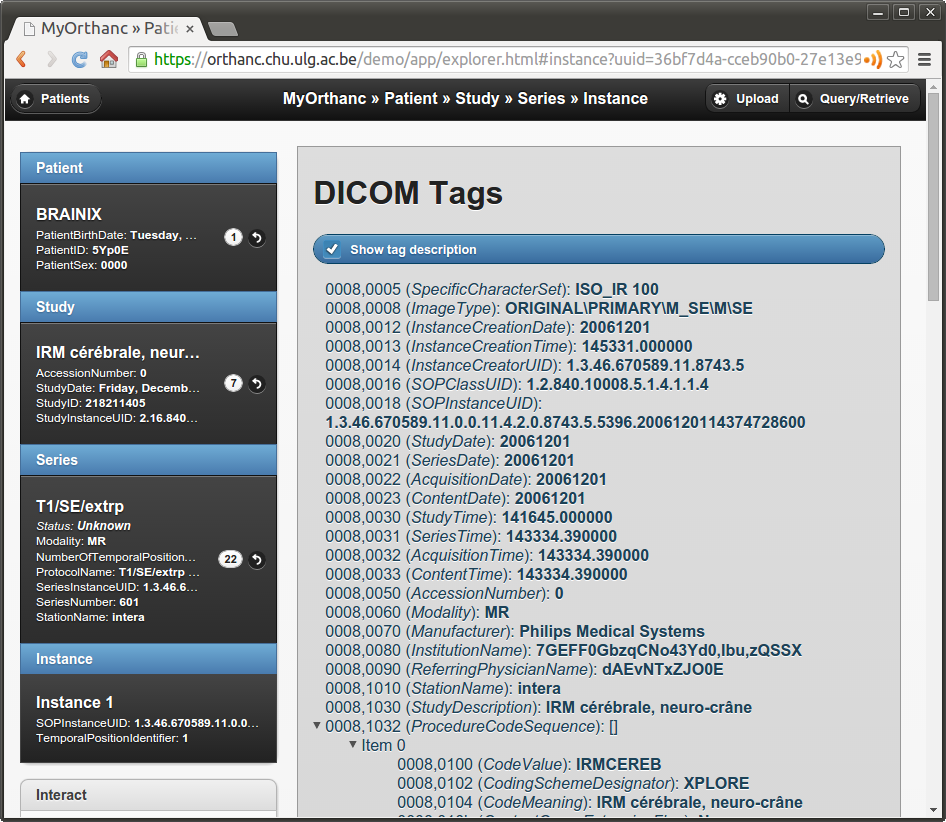

|

The DICOM file format also specifies the set of DICOM tags that are
mandatory or optional for each kind of imaging modality (CT, MR, NM,
CBCT, PET...). Such a specification is called a **storage
service-object pair** (storage SOP). Mandatory tags are called "*type
1*", mandatory tags that can have a null value are called "*type 2*",
and optional tags are called "*type 3*".

The DICOM standard also allows vendors to introduce non-standard,
**proprietary tags** for their own use. Proprietary tags can be
identified by the fact that their first hexadecimal number is odd
(e.g. ``(0x0009, 0x0010)``). Obviously, such proprietary tags should
be avoided for maximal interoperability.

.. _dicom-pixel-data:

Pixel data
^^^^^^^^^^

The image itself is associated with the DICOM tag ``PixelData (0x7fe0,
0x0010)``. The content of image can be compressed using many image
formats, such as JPEG, `Lossless JPEG
<https://en.wikipedia.org/wiki/Lossless_JPEG>`__ or `JPEG 2000
<https://en.wikipedia.org/wiki/JPEG_2000>`__. Obviously,
non-destructive (lossless) compression should always be favored to
avoid any loss of medical information. Note that a DICOM file can also
act as a wrapper around a video encoded using `MPEG-2
<https://en.wikipedia.org/wiki/MPEG-2>`__ or `H.264
<https://en.wikipedia.org/wiki/H.264/MPEG-4_AVC>`__.

The image compression algorithm can be identified by inspecting the
**transfer syntax** that is associated with the DICOM file in its
header.

In practice, few imaging devices in hospitals (besides the `PACS
<https://en.wikipedia.org/wiki/Picture_archiving_and_communication_system>`__
itself) support image compression. As a consequence, to ensure best
portability, the pixel data of most DICOM files circulating in
hospitals is **uncompressed**. In other words, the image is encoded as
a raw buffer, with a given width, height, pixel type (integer or
float), `color depth <https://en.wikipedia.org/wiki/Color_depth>`__
(most often 8, 10, 12 bpp - *bits per pixel*) and photometric
interpretation (most often grayscale or RGB). The transfer syntax that
is associated with such uncompressed images can either be `little
endian <https://fr.wikipedia.org/wiki/Endianness>`__ (the most common
case) or big endian.

A DICOM image can be **multi-frame**, meaning that it encodes an array
of different image frames. This is for instance used to encode
uncompressed video sequences, that are often referred to as **cine**
or **2D+t** images (e.g. for `ultrasound imaging
<https://en.wikipedia.org/wiki/Medical_ultrasound>`__).

`As written in its DICOM conformance statement
<https://bitbucket.org/sjodogne/orthanc/src/default/Resources/DicomConformanceStatement.txt>`__,
the Orthanc software can receive, store and send any kind of DICOM
images (i.e. all the standard transfer syntaxes are
supported). Furthermore, Orthanc can :ref:`convert most uncompressed
images <supported-images>` to PNG images. The `PNG format
<https://en.wikipedia.org/wiki/Portable_Network_Graphics>`__ was
chosen by Orthanc as it is lossless, is natively supported by many
browsers, software or programming frameworks, and is able to encode up
to 16bpp integer pixels. This on-the-fly conversion to PNG images is
what happens when previewing a DICOM image within :ref:`Orthanc
Explorer <orthanc-explorer>`:

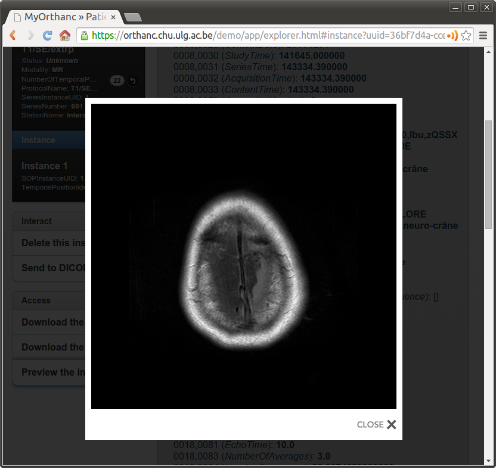

.. _model-world:

Model of the real world
^^^^^^^^^^^^^^^^^^^^^^^

This concludes our overview of the DICOM file format itself. It is now
important to give an overview of the so-called "**DICOM model of the
real world**" (`source
<http://dicom.nema.org/medical/dicom/current/output/html/part04.html#sect_C.6.1.1>`__):

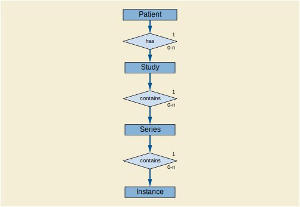

This UML diagram shows that a given **patient** benefits during her
life from a set of medical imaging **studies**.  Each study is made of
a set of **series**. Each series is in turn a set of **instances**,
the latter being a synonym for a single DICOM file. In Orthanc's
vocabulary, a **DICOM resource** is an umbrella term to talk either
about a patient, a study, a series or an instance.

Any imaging study can be associated with multiple series of
images. This is especially visible with nuclear medicine, as any
`PET-CT-scan <https://en.wikipedia.org/wiki/PET-CT>`__ study will
contain at least two separate series: the CT series and the PET
series. But any kind of imaging study will usually generate a set of
separate series. In general, a series can be thought of as either a
single 2D image (as in standard `digital radiography
<https://en.wikipedia.org/wiki/Digital_radiography>`__), a single 3D
volume (as in a `CT-scan <https://en.wikipedia.org/wiki/CT_scan>`__),
or a 2D+t cine sequence. But a series might also encode a single PDF
report, a `structured report
<http://www.dclunie.com/pixelmed/DICOMSR.book.pdf>`__, a 3D+t image
(i.e. a temporal sequence of 3D images)...

In any case, the actual pixel data of a given series is spread across
multiple DICOM instances. This allows to split a single huge image
(medical imaging commonly deals with 4GB images) into hundreds of
small files of several megabytes, each of which can entirely fit in
the computer memory, at the price of a severe redundancy of the
medical information that is embedded within these files.

For each of these 4 kinds of DICOM resources, the DICOM standard
specifies a **module** as a set of DICOM tags that describe these
resources. For instance, the DICOM tag *PatientName* is part of the
patient module, whereas *SeriesDescription* is part of the series
module. Any storage service-object pair (as :ref:`defined above
<dicom-tags>`) can be decomposed into a set of modules that make sense
for its associated type of modality, and whose conjunction forms
encodes all the medical information.

According to this model of the real world, the default Web interface
of Orthanc allows to browse from the patient level to the instance
level. Here is how :ref:`Orthanc Explorer <orthanc-explorer>` displays
a series:

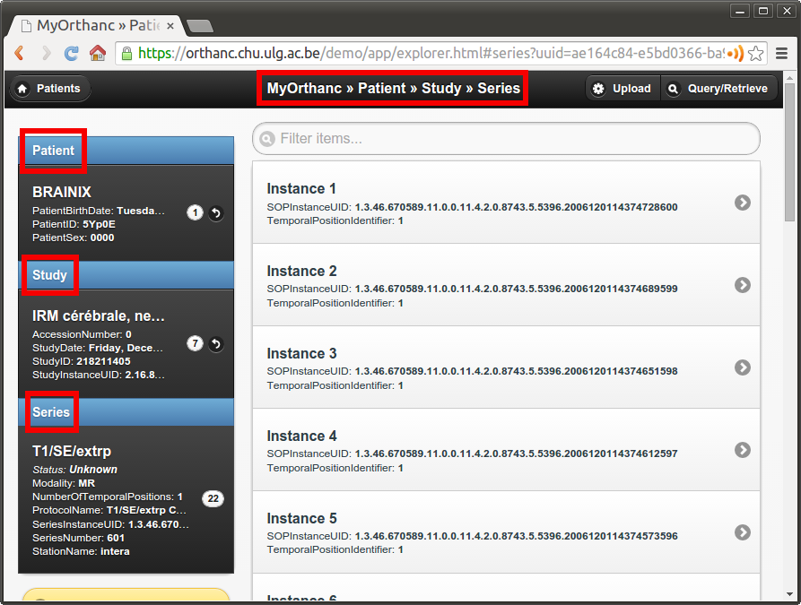

|

On the left side of the interface, an overview of the patient module,
the study module and the series module is displayed. On the right side,
the multiple instances of the series are accessible.

.. _dicom-identifiers:

DICOM identifiers
^^^^^^^^^^^^^^^^^

Very importantly, the DICOM standard specifies DICOM tags that allow
to index each single DICOM resource:

* Patients are indexed with ``PatientID (0x0010, 0x0020)`` (part of the patient module).
* Studies are indexed with ``StudyInstanceUID (0x0020, 0x000d)`` (part of the study module).
* Series are indexed with ``SeriesInstanceUID (0x0020, 0x000e)`` (part of the series module).
* Instances are indexed with ``SOPInstanceUID (0x0008, 0x0018)`` (part of the SOP module).

The DICOM standard orders *StudyInstanceUID*, *SeriesInstanceUID* and
*SOPInstanceUID* to be `globally unique
<https://en.wikipedia.org/wiki/Globally_unique_identifier>`__. In
other words, it is mandatory for two different imaging devices to
never generate the same identifiers, even if they are manufactured by
different vendors. Orthanc exploits this rule to derive its :ref:`own
unique identifiers <orthanc-ids>`.

Importantly, even if the *PatientID* must be unique inside a given
hospital, it is not guaranteed to be globally unique. This means that
different patients imaged in different hospitals might share the same
*PatientID*. For this reason, you should always browse from the study
level (and not from the patient level) as soon as you deal with an
application that handles patients from different hospitals.

*Note:* Note that since Orthanc 1.4.0, the :ref:`Orthanc Explorer
<orthanc-explorer>` interface provides a new tab entitled "Studies"
for study-level access.

Finally, the patient module is not always fully meaningful. This is
for instance the case in emergency imaging, where the `radiology
information system
<https://en.wikipedia.org/wiki/Radiology_information_system>`__ might
not have previously encountered the imaged patient. In such a case, an
unique ``AccessionNumber (0x0008, 0x0050)`` is associated with the
imaging study by the imaging device of the emergency room: The patient
module will be injected later on in the PACS once the administrative
information is available, as part of a reconciliation process.

In any case, the core engine Orthanc keeps an index of all these DICOM
identifiers (*PatientID*, *AccessionNumber*, *StudyInstanceUID*,
*SeriesInstanceUID* and *SOPInstanceUID*) and is able to quickly maps
them to its own :ref:`internal identifiers <orthanc-ids>`. This lookup
is implemented by the ``/tools/lookup`` URI of the :ref:`REST API of
Orthanc <rest>`.

.. _dicom-protocol:

DICOM network protocol
----------------------

This concludes our overview of the DICOM file format. :ref:`As written
above <dicom-format>`, we now describe the second main part of the
DICOM standard, i.e. the **DICOM network protocol**.

.. _dicom-protocol-overview:

Overview
^^^^^^^^

The DICOM protocol is actually one of the earliest example of `Web
services <https://en.wikipedia.org/wiki/Web_service>`__, long before
the introduction of `SOAP <https://en.wikipedia.org/wiki/SOAP>`__ or
`REST
<https://en.wikipedia.org/wiki/Representational_state_transfer>`__. It
allows to:

1. **Test the connection** between two devices (:ref:`C-Echo
   <dicom-echo>`).
2. **Send images** from the local imaging device to a remote device
   (:ref:`C-Store <dicom-store>`).
3. **Search the content** of a remote device (:ref:`C-Find <dicom-find>`).
4. **Retrieve images** from a remote device (:ref:`C-Move <dicom-move>`).

Here is a picture that summarizes some key concepts:

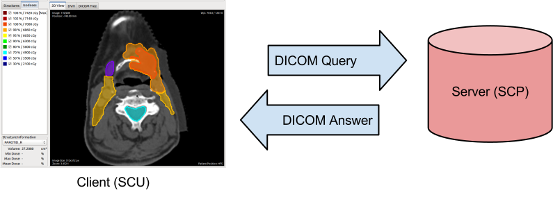

In the DICOM terminology, the client of a DICOM service is called a
**service class user** (SCU), and the server that handles the requests
is called a **service class provider** (SCP). The client sends a
request that is encoded as a DICOM file (the **command**), and the
server answers with a DICOM file.

The connection of a DICOM client to a DICOM server is called an
**association**. Such an association starts with a handshake where the
client and the server agree on which commands can be exchanged between
them, and on which :ref:`transfer syntaxes <dicom-pixel-data>` are
supported. The result of this negotiation is called the **presentation
context**. Once the association is negotiated, this communication
channel can be used to successively send multiple, independent
commands.

Parameters of a DICOM server
^^^^^^^^^^^^^^^^^^^^^^^^^^^^

Historically, the DICOM protocol was designed to work over
`point-to-point links
<https://en.wikipedia.org/wiki/Point-to-point_(telecommunications)>`__.
Nowadays, the DICOM protocol is used over the `TCP/IP stack
<https://en.wikipedia.org/wiki/Internet_protocol_suite>`__.  This
implies that a DICOM server can be identified by specifying the
parameters of its `network socket
<https://en.wikipedia.org/wiki/Network_socket>`__:

1. Its **IP address** (or, equivalently, its symbolic DNS hostname).
2. Its **TCP port** (the standard DICOM port is 104, but Orthanc uses
   the non-priviliged port 4242 by default).

Furthermore, each imaging device (may it be a client or a server) must
be associated with a symbolic name that is called the **application
entity title (AET)**. The AET is assumed to be unique inside the
Intranet of the hospital. For best compatibility between vendors, the
AET should be only made of alphanumeric characters in upper case (plus
the "``-``" and "``_``" characters), and its length must be below 16
characters.

Taken together, the IP address, the TCP port and the AET describe all
the parameters of a DICOM server. The administrators of a medical
imaging network should carefully keep track of these parameters for
each imaging device, and should define an hospital-wide policy to
assign AETs to new devices.

Configuring Orthanc
^^^^^^^^^^^^^^^^^^^

Orthanc can act both as a DICOM client and as a DICOM server,
depending on the parameters in its :ref:`configuration file
<configuration>`. To configure the **DICOM server** of Orthanc, the
following options are especially important:

1. ``DicomServerEnabled`` must be set to ``true``.
2. ``DicomAet`` must be set to the AET that is reserved to Orthanc.
3. ``DicomPort`` specifies the TCP port of the DICOM server.

To configure Orthanc as a **DICOM client**, you must list the remote DICOM
servers that are known to Orthanc into the ``DicomModalities`` option.
For each remote server, you must specify in the following order:

1. An user-friendly, symbolic name for the server that will be
   displayed by :ref:`Orthanc Explorer <orthanc-explorer>` (possibly
   its AET).
2. The AET of the remote server.
3. Its IP address or its hostname.
4. Its DICOM port (most probably 104, or 4242 if the remote server is
   another instance of Orthanc).

Of course, after any change to the configuration of Orthanc, the
software must be restarted to take the new parameters into account.

.. _dicom-echo:

C-Echo: Testing connectivity
^^^^^^^^^^^^^^^^^^^^^^^^^^^^

Routers might block the DICOM protocol between separate `subnets
<https://en.wikipedia.org/wiki/Subnetwork>`__ (often, only the HTTP,
HTTPS and SSH protocols are enabled by default). Furthermore, the
firewalls that are installed on the clients or on the servers might
also block the DICOM protocol. This is especially true for the
`Microsoft Windows firewall
<https://en.wikipedia.org/wiki/Windows_Firewall>`__ and for
:ref:`RedHat-based GNU/Linux boxes <redhat>`. As a consequence, after
any change in the DICOM topology of an hospital (notably when
connecting two imaging devices), one should always check whether the
DICOM protocol can travel from end to end, i.e.  between the DICOM
client and the DICOM server.

This is where the **DICOM Echo service** comes into play. This service
is triggered when the client sends a so-called ``C-Echo`` command to
the server as its DICOM query. The server answers with an empty DICOM
answer. In practice, to test the connectivity between two devices, you
should:

1. Use the standard command-line tool ``ping`` to test the **TCP-level
   connectivity** between the client and the server, then
2. Issue the **C-Echo** from the client to the server to test the
   DICOM-level connectivity.

The second step can be done directly from :ref:`Orthanc Explorer
<orthanc-explorer>`, the embedded administrative interface of Orthanc,
in the "*Query/Retrieve*" panel, as depicted below:

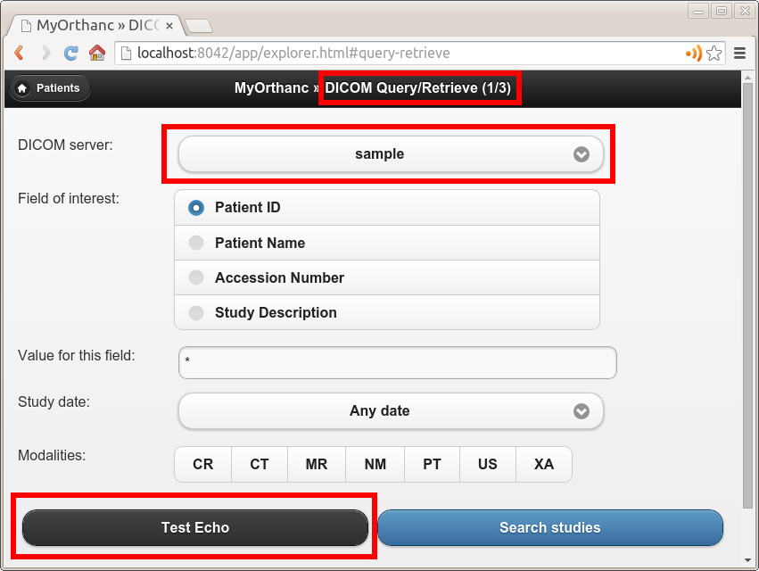

|

In this screenshot, ``sample`` corresponds to the symbolic name of a
DICOM server that is declared in the ``DicomModalities``
:ref:`configuration option <configuration>`. Once DICOM Echo succeeds,
the client should be able to send images to the server, and to
initiate a query/retrieve. This is the topic of the following
sections.

.. _dicom-store:

C-Store: Sending images to a server
^^^^^^^^^^^^^^^^^^^^^^^^^^^^^^^^^^^

The **DICOM Store Service** is used to send DICOM instances to a
remote imaging device. This service is triggered when the client sends
to the server a so-called ``C-Store`` command together with the
content of a DICOM instance. Schematically, C-Store works as follows:

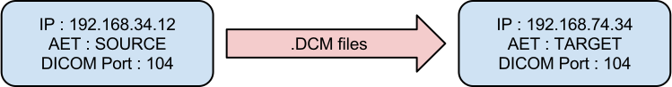

Orthanc can act both as a C-Store client (SCU) or as a C-Store server
(SCP). In other words, it can either send or receive DICOM files.

In the :ref:`Orthanc Explorer <orthanc-explorer>` interface, each
DICOM resource (patient, study, series or instance) comes with a
button entitled "*Send to remote modality*". Clicking on this button
allows to send the image to any DICOM server that is declared in the
``DicomModalities`` :ref:`configuration option <configuration>`. In
the following screenshot, all the instances of one patient will be
sent to the device whose symbolic name is ``sample``:

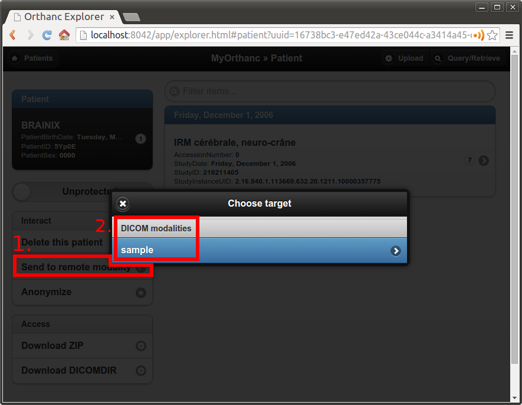

.. _dicom-find:

C-Find: Browsing the content of a server
^^^^^^^^^^^^^^^^^^^^^^^^^^^^^^^^^^^^^^^^

The **DICOM Find Service** is used to **search** a list of DICOM
resources that are hosted by some remote DICOM server. The kind of
resource that is looked for (patients, studies or series) must be
specified, leading to the **query level** of the query.  Besides the
query level, the query contains a set of filters on DICOM tags of
interest: These filters are essentially `wildcards
<https://en.wikipedia.org/wiki/Glob_(programming)>`__ describing the
resources that are looked for. This service is triggered when the
client sends to the server a so-called ``C-Find`` command that encodes
the query level and the filters. Schematically, C-Find works as
follows:

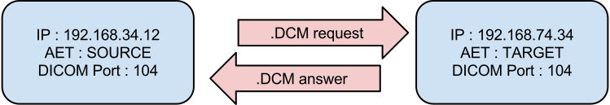

Orthanc can act both as a C-Find client (SCU) or as a C-Find server
(SCP). In other words, it can be used to search the content of a
remote server, and conversely it can inform a remote client about its
own content.

In the :ref:`Orthanc Explorer <orthanc-explorer>` interface, it
is possible to initiate a search at the study level. This feature
is available in the "*Query/Retrieve*" panel, as depicted below:

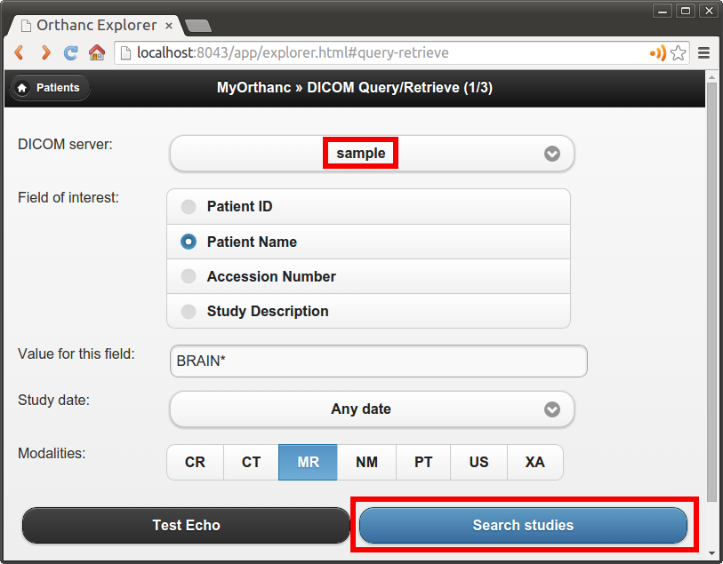

|

This screenshot shows that we are looking for a study whose associated
patient has a name that starts with "*Brain*", and that is of MR
modality. Orthanc Explorer then lists the matching studies:

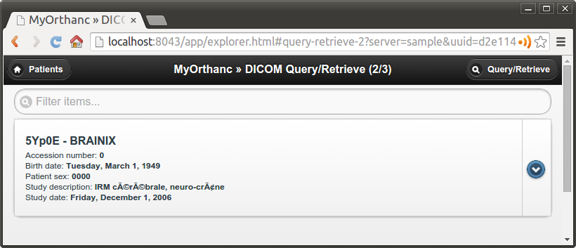

|

It is then possible to click on some matching study, to list the
individual series it is made of:

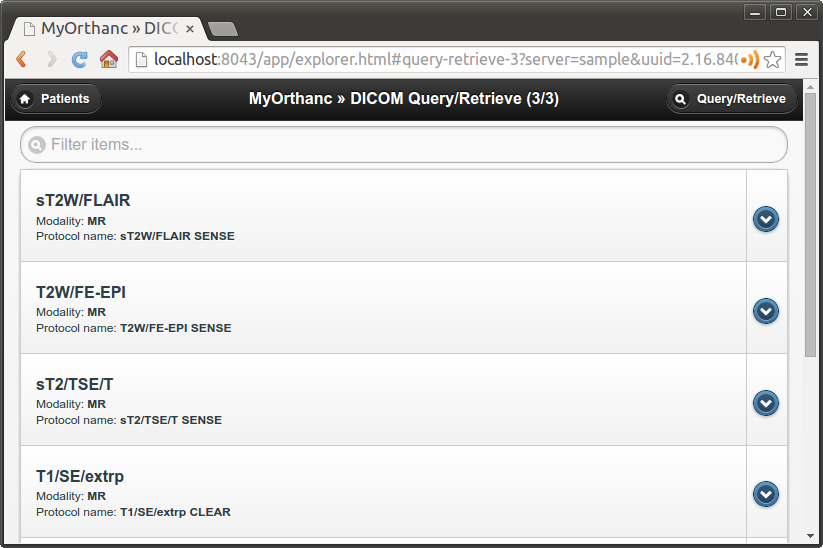

.. _dicom-move:

C-Move: Query/retrieve
^^^^^^^^^^^^^^^^^^^^^^

This brings us to the last important component of the DICOM network
protocol, the **DICOM Move Service**. This service is notably used to
locally retrieve DICOM files from a remote server, given the results
of a :ref:`C-Find query <dicom-find>`. Taken together, ``C-Find`` and
``C-Move`` give rise to the **query/retrieve** mechanism at is at the
core of the exchange of DICOM files within the hospital.

C-Move is probably the part of the DICOM standard that is the less
intuitive, which leads to many configuration problems in medical
imaging networks. This stems from the fact that C-Move is actually not
limited to query/retrieve. It is a more generic protocol that can
involve up to **3 distinct imaging devices**, as depicted below:

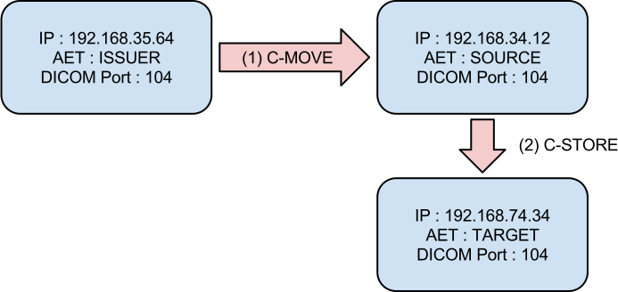

Whenever an imaging device (called the *issuer* above) initiates a
C-Move command, it asks a DICOM server (called the *source* above) to
send some of its images to another DICOM server (called the *target*
above). Accordingly, a C-Move command encodes the :ref:`identifiers
<dicom-identifiers>` of the DICOM resources to be sent, together with
the AET of the target server.  To put it in other words, a C-Move
command drives a **C-Store between two remote DICOM servers** (the
*source* and the *target*).

The query/retrieve mechanism corresponds to the special case of a
C-Move command where the target and the issuer are the same imaging
device. The most common configuration problem for query/retrieve is
therefore to forget to declare the AET of the "*issuer/target*" device
into the configuration of the "*source*" device.

Orthanc can act both as a C-Move client (SCU) or as a C-Move server
(SCP). This implies that Orthanc can either initiate a query/retrieve,
or be driven as part of a query/retrieve request. You might want to
give a look at the ":ref:`query-retrieve`" section of this book to
learn how to concretely configure Orthanc for query/retrieve.

A C-Move session can be initiated from the :ref:`Orthanc Explorer
<orthanc-explorer>` interface, after a :ref:`C-Find query
<dicom-find>` is complete. It is sufficient to click on the download
button that is to the right of the study or series of interest:

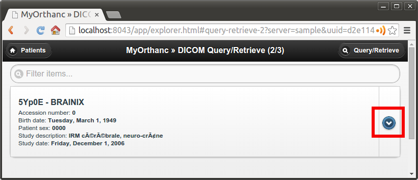

|

A dialog box then pops up, asking the AET of the *target* modality.
By default, this field is pre-filled with the AET of Orthanc, which
corresponds to the initiation of a query/retrieve:

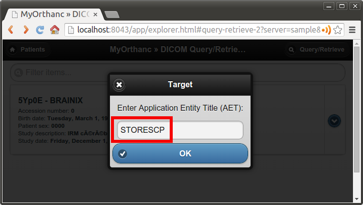

|

*Note 1:* Even if C-Move may seem counter-intuitive, this is the most
popular and widespread way to initiate a query/retrieve against a PACS
server. The DICOM standard features an `alternative mechanism called
C-Get
<http://dclunie.blogspot.be/2016/05/to-c-move-is-human-to-c-get-divine.html>`_.
As of Orthanc 1.4.1, C-Get is not supported yet (but work is in
progress).

*Note 2:* As :ref:`written above <dicom-pixel-data>`, the Orthanc
engine is quite generic and is compatible with virtually any image
compression algorithm (aka. transfer syntax). In particular, during
the :ref:`negotiation of a presentation context
<dicom-protocol-overview>`, Orthanc reports by default that it is
compatible with the JPEG 2000 encoding. This leads some PACS engines
to compress their images before sending them to Orthanc, so as to
reduce the network bandwidth. Unfortunately, because many medical
image analysis software are not compatible with such an image
compression, the JPEG 2000 image that is received by Orthanc might be
unusable by such software. You might therefore have to **disable
transfer syntaxes** by setting the ``*TransferSyntaxAccepted`` options
to ``false`` in the :ref:`configuration file of Orthanc
<configuration>` (by default, all the transfer syntaxes are enabled).

Using HTTP instead of the DICOM protocol
^^^^^^^^^^^^^^^^^^^^^^^^^^^^^^^^^^^^^^^^

We conclude this brief overview of DICOM by insisting on the fact that
the **DICOM protocol inherently targets the Intranet** of a single
hospital, not the Internet or the cloud. This protocol might be
blocked by outbound firewalls, and there is no convention ensuring
that the AETs are globally unique across all the
hospitals. Furthermore, even though the DICOM protocol supports TLS
encryption, this feature is rarely enabled.

Depending on your application, you might therefore want to leverage
the **HTTP protocol** in the context of DICOM. Such Web-based
protocols are probably more familiar to physicians/physicists/software
engineers, are easier to work with, can be transparently encrypted
(**HTTPS**), and are compatible with multiple-hospital scenarios. To
this end, you have two possibilities:

1. Resort to the :ref:`Orthanc peer <peers>` mechanism. Because each
   Orthanc server comes with its built-in :ref:`REST API <rest>`,
   remote systems can obtain a full programmatic control over the
   content of Orthanc. This access can be secured by HTTP
   authentication and :ref:`SSL encryption <https>`. The :ref:`Orthanc
   Explorer <orthanc-explorer>` interface can transparently use this
   peer mechanism to send DICOM files over HTTP(S).
2. Resort to the `DICOMweb standard
   <https://www.dicomstandard.org/dicomweb/>`__, that is an extension
   to the DICOM standard specifying how to access the content of a
   remote DICOM server through HTTP(S). Because the peer mechanism is
   bound to Orthanc, DICOMweb offers a less expressive, but more
   generic access to remote servers.  Importantly, a `DICOMweb plugin
   to Orthanc
   <https://www.orthanc-server.com/static.php?page=dicomweb>`__ is
   freely available.
