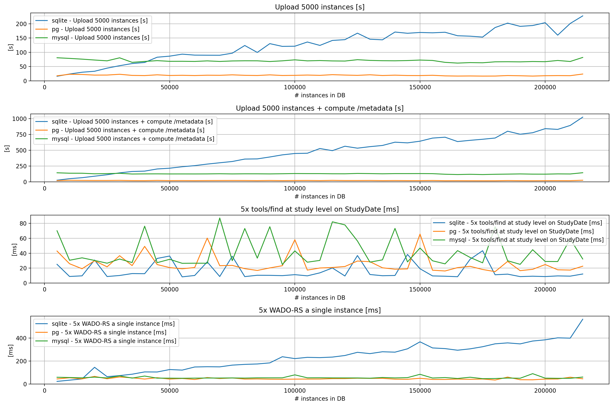

.. _db-benchmark:

Which Database engine should I use ?
====================================

By default, Orthanc stores the index of the DICOM instances as an 
embedded `SQLite database <https://www.sqlite.org/index.html>`_ saved
in the ``IndexStorageDirectory``.  This is very convenient when
you simply want to try Orthanc or need to handle a relatively 
small amount of data.

If, at some point, you need to store large amounts of data and require
more stable performance, you should use an external database server.
Although we provide plugins for :ref:`PostgreSQL <postgresql>`,
:ref:`MySQL <mysql>` and :ref:`ODBC <odbc>`, we strongly recommend
using the :ref:`PostgreSQL <postgresql>` plugin since this is the one
we focus on when implementing new features or optimizing performance.

Benchmark
---------

We have setup a `test scenario <https://github.com/orthanc-server/orthanc-setup-samples/tree/master/docker/databases-benchmark>`_ 
to compare the performances of the default SQLite engine against the PostgreSQL and the MySQL plugins.

Note: these tests have been performed with the ``orthancteam/orthanc:25.10.3`` Docker images.

The first plot shows the time required to ingest 5 studies, each with 4 series of 250 instances.
The ingest is performed with 5 parallel HTTP clients and the :ref:`DICOMweb <dicomweb>` plugin
is enabled which means it starts caching the ``/metadata`` routes during the ingest.

The second plot shows the time required to ingest and generate the ``/metadata``.  As you can see,
the ingest performance of SQLite clearly deteriorates as soon as you have 25.000 instances
in the DB while the PostgreSQL remains, ingesting around 250 instances per second.

The third plot shows the time required to perform 5 calls to ``/tools/find`` at study level.
This plot is actually not very representative since the DB contains a very small number of studies.

The fourth plot shows the time required to retrieve a single instance through :ref:`DICOMweb WADO-RS <dicomweb>`.
This is typical of API calls performed by the :ref:`Stone Web viewer <stone_webviewer>` or the :ref:`OHIF viewer <ohif>`.

The bad performance of the DICOMWeb plugin with SQLite to compute the ``metadata`` cache can 
actually be explained by the fourth plot that shows that even simple search operations in the database get slower.

Conclusions
-----------

From a performance point of view, you may stick with SQLite if you do not plan to store more than 
25.000 - 50.000 instances.  

Typically, if you are only handling ``CR, DX`` or simple ``US`` images, SQLite is a very good option.
SQLite also remains a good option if you are using Orthanc as a buffer to transfer, convert or sanitize images
in a workflow, especially if you do not need the DICOMWeb plugin.

As soon as you plan to store thousands of ``MR, CT, MG`` or other large image sets, you should
switch to the :ref:`PostgreSQL <postgresql>`.

You should only use :ref:`MySQL <mysql>` or :ref:`ODBC <odbc>` if your company policy requires it,
as their performance is not optimal and they currently lack the latest DB features like:

* The ``ExtendedFind`` extension to perform ordering and more advanced filtering in ``/tools/find``.
* Key-Value Stores and Queues to enable some features like the Rest API
  of the :ref:`Worklist plugin <worklist>` or enable the :ref:`advanced storage <advanced-storage>` plugin.

