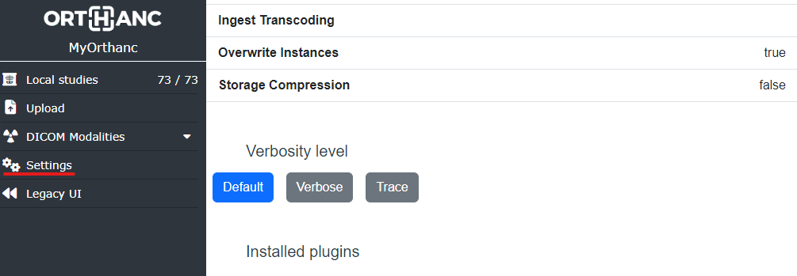

.. _log:

Collecting logs
---------------

Standard logs
=============

Everytime the Orthanc service starts, it will generate
a new log file in ``C:\Program Files\Orthanc Server\Logs`` on Windows 
and in ``/var/log/orthanc/`` on Linux.  

By default, on Windows, if the Orthanc service fails to start, it will 
retry to start 5 times and stop so it does not generate thousands of log files.

Log files are named as ``Orthanc.log.YYYYMMDD-hhmmss.ffff`` including
the date/time when Orthanc was started.  

Orthanc is not removing old logs so these log files might accumulate 
and consume lot's of space.  It's up to you to manage the logs folder
to make sure you don't fill your disk with logs.

Generating an exploitable debug log
===================================

.. highlight:: bash

By default, the Orthanc logs contain only the ``WARNING`` and
``ERROR`` information levels. For your logs to be exploitable by the
Orthanc community, you must include more information by adding the
``--verbose`` or ``--trace`` command-line options, which will add the
``INFO`` and ``TRACE`` information levels. If you are starting Orthanc
from the command-line, simply add these flags and redirect the
standard outputs to some log file. For instance::

  $ ./Orthanc --trace --logfile=orthanc.log

Note that the Orthanc command-line tool has many other options related
to logging. Check out the :ref:`full manpage <manpage>`.
  
However, if you use packaged versions of Orthanc that starts the
server in background (such as GNU/Linux packages or the `Windows
installers <https://www.orthanc-server.com/download-windows.php>`__),
you will have to manually start Orthanc. The sections below explain
how to achieve this goal with the officially supported packages.

With Orthanc Explorer 2 installed
^^^^^^^^^^^^^^^^^^^^^^^^^^^^^^^^^

If you have the :ref:`Orthanc Explorer 2 plugin <orthanc-explorer-2>` 
enabled, open the settings pane at `http://localhost:8042/ui/app/#/settings
<http://localhost:8042/ui/app/#/settings>`__ and change the verbose level
from there without restarting Orthanc:

Under Windows
^^^^^^^^^^^^^

If you used the `official Windows installers
<https://www.orthanc-server.com/download-windows.php>`__:

1. Stop the Orthanc service. The actual process depends on your
   version of Windows.

2. Make sure you have a ``C:\Temp`` folder available to store the log file.

3. In a command-line shell, manually start Orthanc to generate the
   ``Orthanc.log`` file::

   $ "C:\Program Files\Orthanc Server\Orthanc.exe" --verbose "C:\Program Files\Orthanc Server\Configuration" > C:\Temp\Orthanc.log 2<&1

   This will start Orthanc with exactly the same configuration as your service,
   but in verbose mode.

4. Once the log has been generated (in ``C:\Temp\Orthanc.log``), stop Orthanc 
   and possibly restart the Orthanc service.

By default, the Orthanc service will always start in the default ``Warning`` log level.  
If you want to make it start in ``Verbose`` mode at every start, you should set this Registry
Key to 1::

   Computer\HKEY_LOCAL_MACHINE\SOFTWARE\WOW6432Node\Orthanc\Orthanc Server\Verbose

Under Debian GNU/Linux
^^^^^^^^^^^^^^^^^^^^^^

1. Stop the Orthanc service::

   $ sudo /etc/init.d/orthanc stop

2. Manually start Orthanc (using the same configuration as the
   service) and generate the log::

   $ sudo -u orthanc /usr/sbin/Orthanc --verbose /etc/orthanc/ > Orthanc.log 2>&1

3. Restart the Orthanc service::

   $ sudo /etc/init.d/orthanc start

Under Docker
^^^^^^^^^^^^

With ``orthancteam/orthanc`` images, simply define the ``VERBOSE_ENABLED`` environment 
variable to ``true`` when starting your container and then, run this command to 
retrieve the logs in a file::

  $ sudo docker logs your_container_name &> /tmp/orthanc.log

With ``jodogne/orthanc`` images, use this command line::

  $ sudo docker run -a stderr -p 4242:4242 -p 8042:8042 --rm jodogne/orthanc --verbose /etc/orthanc > Orthanc.log 2>&1

  
Changing the log level while Orthanc is running
===============================================

Starting with Orthanc 1.6.0, you can dynamically change the log level
while Orthanc is running using the :ref:`REST API <rest>`::
  
  $ curl -X PUT http://localhost:8042/tools/log-level -d "verbose"
  $ curl -X PUT http://localhost:8042/tools/log-level -d "trace"
  $ curl -X PUT http://localhost:8042/tools/log-level -d "default"

Log categories
==============

Starting with Orthanc 1.8.2, log messages are associated with a
**category**. The category indicates the subsystem of Orthanc from
which the message comes (such as the embedded HTTP server, the DICOM
communications, Lua scripts...).

It is possible to choose a different log level for each category. This
can be done when starting Orthanc as follows::

  $ ./Orthanc --verbose-http --trace-dicom

This command would start Orthanc in verbose mode for HTTP-related
messages, and would enable debug messages related to DICOM. The full
list of the available log categories (``http``, ``dicom``, ``lua``,
``plugins``...) can be found in the :ref:`manpage of Orthanc
<manpage>` or by starting Orthanc with the ``--help`` flag.

It is also possible to dynamically change the log level of a category
while Orthanc is running by using the :ref:`REST API <rest>`, for
instance::
  
  $ curl -X PUT http://localhost:8042/tools/log-level-http -d "verbose"
  $ curl -X PUT http://localhost:8042/tools/log-level-dicom -d "trace"
  $ curl -X PUT http://localhost:8042/tools/log-level-plugins -d "default"

The list of the available log categories is also available through the
REST API, by inspecting the URIs that are prefixed by
``/tools/log-level``::

  $ curl http://localhost:8042/tools/
    [...]
    "log-level",
    "log-level-dicom",
    "log-level-generic",
    "log-level-http",
    "log-level-jobs",
    [...]
  
**Remarks:**

* Messages that are not associated with a well-identified category are
  considered as belonging to the ``generic`` category.

* Using the ``--verbose`` or ``--trace`` command-line options, or
  changing the value of the ``/tools/log-level`` URI will reset the
  log level of **all** the categories. Note that the command-line
  options are applied from left to right.

* Provided that you have left the ``DeidentifyLogs`` configuration to
  its ``true`` default value, Orthanc logs will not contain any sensitive
  patient information at ``default`` or ``verbose`` level; however, 
  at ``trace`` level, the DICOM logs will still contain PHI.

* Starting from Orthanc 1.12.2, Orthanc is logging the thread name in the
  logs.  If you need to revert back to the previous format, add the 
  ``--logs-no-thread`` command line option at startup.
