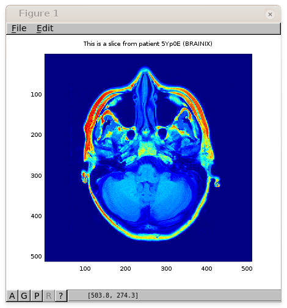

Interfacing with Matlab and Octave
==================================

Thanks to the REST API of Orthanc, it is easy to access DICOM images
from Matlab or Octave, as depicted in the following sample image:

Both Matlab and Octave have access to HTTP servers thanks to their
built-in `urlread() function
<http://nl.mathworks.com/help/matlab/ref/urlread.html>`__.  Once must
simply install a Matlab/Octave library to decode JSON files.  The
`JSONLab toolkit <https://github.com/fangq/jsonlab>`__ works perfectly
to this end.

.. highlight:: matlab

Using JSONlab, the following code will download and display a DICOM image::

  SERIES = 'ae164c84-e5bd0366-ba937a6d-65414092-f294d6b6';
  URL = 'http://demo.orthanc-server.com/';

  # Get information about the instances in this DICOM series
  instances = loadjson(urlread([ URL '/series/' SERIES '/instances' ]));

  # Select one slice from the series
  instance = instances{1}.ID

  # Decode the slice with Orthanc thanks to the "/matlab" URI
  slice = eval(urlread([ URL '/instances/' instance '/matlab' ]));

  # Compute the maximum value in this slice
  max(max(slice))

  # Display the slice
  imagesc(slice)

  # Annotate the graph with the patient name and ID
  tags = loadjson(urlread([ URL '/instances/' instance '/tags?simplify' ]));
  title([ 'This is a slice from patient ' tags.PatientID ' (' tags.PatientName ')' ])

  
Opening the raw DICOM file
--------------------------

Here is another sample Matlab/Octave script explaining how to download
the raw DICOM file corresponding to one given instance stored in
Orthanc, then decode this DICOM file using Matlab/Octave::

  SERIES = 'ae164c84-e5bd0366-ba937a6d-65414092-f294d6b6';
  URL = 'http://demo.orthanc-server.com/';

  # Get information about the instances in this DICOM series
  instances = loadjson(urlread([ URL '/series/' SERIES '/instances' ]));

  # Select one slice from the series
  instance = instances{1}.ID

  # Download the raw DICOM file and store it as a file named "instance.dcm"
  urlwrite([ URL '/instances/' instance '/file' ], 'instance.dcm');

  if exist('OCTAVE_VERSION', 'builtin') ~= 0
    # If running Octave instead of Matlab, load the "dicom" package from Octave Forge
    pkg load image
    pkg load dicom
  endif

  # Decode the downloaded DICOM file
  im = dicomread('instance.dcm');
  imagesc(im)

.. highlight:: bash

**Note:** If running Octave, you will have to manually install the
`dicom package from Octave Forge
<https://octave.sourceforge.io/dicom/index.html>`__. Download the
source code of the package, make sure the ``libgdcm2-dev`` and
``octave-image`` packages are installed (for Ubuntu 16.04), then type
the following command to install the ``dicom`` package::

  $ octave --no-gui --eval "pkg install ./dicom-0.2.0.tar.gz"
