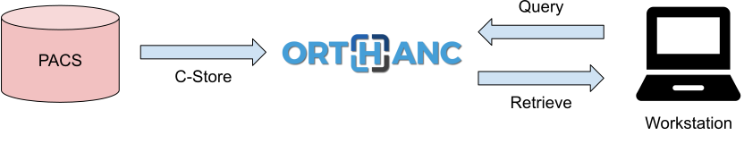
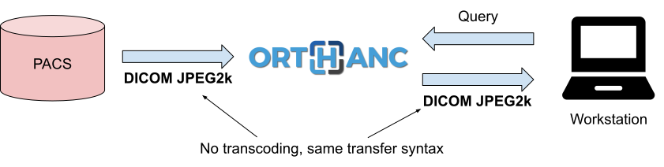
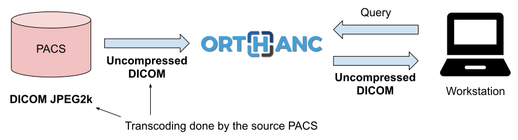
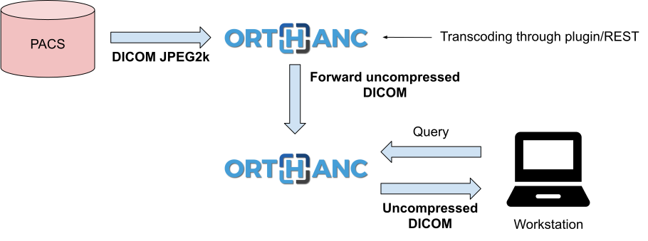

.. _transcoding:

Transcoding of DICOM files
==========================

.. contents::

Work-in-progress
----------------

Forthcoming Orthanc 1.7.0 will feature transcoding. The information in
the sections below will thus soon become invalid!

To be documented for Orthanc 1.7.0:

* Explanation of DICOM protocol (transparent transcoding from
  compressed transfer syntaxes to uncompressed transfer syntaxes).
  
  * ``TranscodeDicomProtocol`` global configuration option

  * ``AllowTranscoding`` in ``DicomModalities`` configuration option

* ``/instances/.../modify`` route: ``Transcode`` option

* Routes to create archives: ``Transcode`` option

General information
-------------------

As of release 1.6.1, Orthanc does not feature support for transcoding
DICOM instances yet. In other words, the Orthanc core never changes
the :ref:`transfer syntax <dicom-pixel-data>` of some DICOM instance
when it has to send it to another modality using the DICOM protocol.

Adding support for transcoding is one of the features that is pending
on `our roadmap
<https://hg.orthanc-server.com/orthanc/file/default/TODO>`__, and for which 
we are looking for industrial sponsors.

Motivation for transcoding
--------------------------

Let's consider the following basic workflow, in which some imaging
workstation must access a medical image that originates from a PACS
and that is served through an Orthanc proxy:

This is quite a common situation, e.g. in university hospitals where
researchers must access medical images without having authorization to
log in the clinical PACS. It is also common if the main PACS restricts
the number of workstations that can directly be connected to it, or if
Orthanc acts as gateway through Internet.

The problem is that the software running on workstations might not be
able to display some DICOM transfer syntaxes. This is especially true
in research software, that is often limited to uncompressed transfer
syntaxes. For instance, let's consider the following scenario where a
workstation wants to access an image from the PACS:

A typical PACS system will decide, when requested to export an image
using DICOM C-Store, to compress the image in order to reduce the
network bandwidth and the storage requirements. Orthanc is fine with
it: As a vendor neutral archive, Orthanc can basically
receive/store/transmit any DICOM transfer syntax. Unfortunately, this
might not be the case of the target workstation, that is often limited
to some selected transfer syntaxes. As a consequence, the workstation
will complain about not being to read the DICOM file (in the situation
depicted above, because the PACS has decided to send the DICOM image
using the JPEG2k transfer syntax).

Solutions
---------

There are basically 4 solutions to this issue. The first one, as
stated above, would be to **implement transcoding in Orthanc**. Feel
free to `get in touch with us
<https://www.orthanc-server.com/orthanc-pro.php>`__ if you want to
sponsor this development.

The second solution consists in making Orthanc **refuse to accept the
transfer syntaxes** that are not supported by the workstation. This
is depicted in the following diagram:

.. highlight:: json

If Orthanc tells the PACS that is doesn't accept, say, DICOM JPEG2k,
the source PACS will be aware of this, and will transcode the DICOM
file before it is sent to Orthanc. This is the role of the following
:ref:`configuration options <configuration>` that specifies which
transfer syntaxes are accepted by Orthanc::

  {
    "DeflatedTransferSyntaxAccepted"     : true,
    "JpegTransferSyntaxAccepted"         : true,
    "Jpeg2000TransferSyntaxAccepted"     : true,
    "JpegLosslessTransferSyntaxAccepted" : true,
    "JpipTransferSyntaxAccepted"         : true,
    "Mpeg2TransferSyntaxAccepted"        : true,
    "RleTransferSyntaxAccepted"          : true,
    "UnknownSopClassAccepted"            : false
  }

If all of those options are set to ``false``, Orthanc will only
receive uncompressed transfer syntaxes (obviously provided that the
source PACS supports DICOM transcoding).

The third solution consists in **applying an external conversion
tool** to every DICOM image that is received by Orthanc. The standard
command-line tools ``gdcmconv`` from `GDCM
<http://gdcm.sourceforge.net/html/gdcmconv.html>`__ or ``dcmconv``
from `DCMTK <https://support.dcmtk.org/docs/dcmconv.html>`__ can be
used to change the transfer syntax of a given DICOM file. These tools
can be invoked from a :ref:`Lua script <lua>` (check out
``OnStoredInstance()`` callback) or from an :ref:`Orthanc plugin
<creating-plugins>` (check out
``OrthancPluginRegisterOnStoredInstanceCallback()`` function). A
sample Lua script that converts every incoming DICOM file to the
JPEG2k transfer syntax is `part of the Orthanc sources
<https://hg.orthanc-server.com/orthanc/file/default/Resources/Samples/Lua/AutomatedJpeg2kCompression.lua>`__.

Finally, as a fourth solution, it is possible to **combine two Orthanc
servers**, the first one being configured to accept any transfer
syntax, and the second one being responsible to serve the DICOM files
after conversion to uncompressed transfer syntax (which should be
compatible with any workstation):

In this solution, a plugin or an external script continuously monitors
the content of the first Orthanc server thanks to its :ref:`REST API
<rest>`. Whenever a DICOM instance is received by the first Orthanc,
the plugin/script uses external conversion tools to convert the
instance to an uncompressed transfer syntax, then forward it to a
second Orthanc server. In other words, the first Orthanc server acts
as a transient buffer for decompression. Contrarily to the third
solution, this solution has the advantage of better scalability (as
decompression implemented in a Lua callback blocks Orthanc as long as
the Lua script has not returned).
