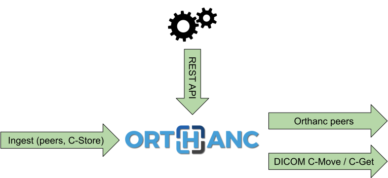

.. _transcoding:

Transcoding of DICOM files
==========================

.. contents::

General information
-------------------

**DICOM transcoding** refers to the process of changing the
:ref:`transfer syntax <dicom-pixel-data>` of some DICOM instance.

Transcoding can be used to **compress** DICOM images, which is useful
to reduce the required storage area or to optimize the network
bandwidth for exchanges between sites. Conversely, transcoding can be
used to **decompress** DICOM images, which is needed as many DICOM
viewers or specialized analysis software do not provide support for
compressed transfer syntaxes.

Support for transcoding was introduced in Orthanc 1.7.0. 

Motivation for transcoding
--------------------------

Let's consider the following basic workflow, in which some imaging
workstation must access a medical image that originates from a PACS
and that is served through an Orthanc proxy:

This is quite a common situation, e.g. in university hospitals where
researchers must access medical images without having authorization to
log in the clinical PACS. It is also common if the main PACS restricts
the number of workstations that can directly be connected to it, or if
Orthanc acts as gateway through Internet.

The problem is that the software running on workstations might not be
able to display some DICOM transfer syntaxes. This is especially true
in research software, that is often limited to uncompressed transfer
syntaxes. For instance, let's consider the following scenario where a
workstation wants to access an image from the PACS:

.. image:: ../images/Transcoding2.svg
           :align: center
           :width: 700px

A typical PACS system will decide, when requested to export an image
using DICOM C-Store, to compress the image in order to reduce the
network bandwidth and the storage requirements. Orthanc is fine with
it: As a vendor neutral archive, Orthanc can basically
receive/store/transmit any DICOM transfer syntax. Unfortunately, this
might not be the case of the target workstation, that is often limited
to some selected transfer syntaxes. As a consequence, the workstation
will complain about not being to use the DICOM file (in the situation
depicted above, because the PACS has decided to send the DICOM image
using the JPEG2k transfer syntax).

Transcoding in Orthanc
----------------------

Orthanc 1.7.0 was the first release of Orthanc to feature built-in
support for DICOM transcoding. Transcoding is available at multiple
levels, as depicted by the green arrows on the following drawing:

* **Automated transcoding while ingesting**. Orthanc can be configured
  to automatically transcode each DICOM instance it receives (either
  by DICOM protocol or by REST API) to a fixed transfer syntax. This
  is especially useful to either create an archive of compressed files
  (for long-term archiving), or to create a DICOM buffer with
  uncompressed files (for interfacing with DICOM modalities that do
  not support compressed transfer syntaxes). If the transcoding fails,
  the DICOM instance is still stored using its original transfer
  syntax.

  Automated transcoding is enabled by setting the :ref:`configuration
  option <configuration>` ``IngestTranscoding`` to the transfer syntax
  UID of interest. For instance, setting ``IngestTranscoding`` to
  ``1.2.840.10008.1.2.1`` will decompress all the received DICOM
  instances. Conversely, setting it to ``1.2.840.10008.1.2.4.70`` will
  compress and store images using JPEG Lossless.

* **Decompression while sending instances using the DICOM protocol**.
  Orthanc can be configured to automatically decompress DICOM images
  on its outgoing connections, if the remote modality does not support
  the compressed transfer syntax of the source DICOM instances. This
  feature is available for both :ref:`DICOM C-Move and C-Get commands
  <dicom-move>`. Note that Orthanc won't transcode DICOM instances to
  a compressed transfer syntax over the DICOM protocol.

  By default, this automated decompression is enabled. This might be
  undesirable if you want to limit the resources that are used by
  Orthanc. As a consequence, you can disable this feature either
  globally (by setting configuration option ``TranscodeDicomProtocol``
  to ``false``), or on a per-modality basis (by setting the option
  ``AllowTranscoding`` to ``false`` in the ``DicomModalities``
  section).

.. highlight:: bash

* **Transcoding while sending instances to an Orthanc peer**. The
  ``/peers/{id}/store`` route in the Orthanc REST API allows to send
  DICOM resources (patients, studies, series or instances) to
  :ref:`another Orthanc server over HTTP/HTTPS <peering>`. Starting
  with Orthanc 1.7.0, the ``Transcode`` option can be used in the JSON
  POST body to instruct to transcode the DICOM files before they are
  sent. For instance::

    $ curl -X POST http://localhost:8042/peers/sample/store -d '{"Transcode":"1.2.840.10008.1.2.4.70","Resources":["66c8e41e-ac3a9029-0b85e42a-8195ee0a-92c2e62e"]}'
    
* **Transcoding using the REST API**. Starting with Orthanc 1.7.0,
  some routes in the REST API also accept the ``Transcode`` option
  in their JSON POST body. Those routes notably include:

  * The routes to create ZIP files or DICOMDIR archives (``.../media``
    and ``.../archive``).

  * The routes to modify DICOM resources
    (``/{patients|studies|series|instances}/{id}/modify``).
    
Importantly, if you need to transcode JPEG2k DICOM instances, you'll
have to install the :ref:`GDCM plugin <gdcm>` that replaces the
built-in transcoder of Orthanc based on DCMTK, by the GDCM transcoder.

The following :ref:`advanced configuration options <configuration>`
are also available to control transcoding:

* ``BuiltinDecoderTranscoderOrder`` controls the transcoder that is
  used by Orthanc. It specifies whether the built-in transcoder of
  Orthanc (that uses DCMTK) is applied before or after the transcoding
  plugins, or not applied at all. "After" means that the built-in
  transcoder is applied if all the transcoding plugins have failed to
  transcode the image.

* ``DicomLossyTranscodingQuality`` controls the quality level of lossy
  compression (notably for JPEG transcoding).

Solutions to avoid transcoding
------------------------------

Up to release 1.6.1, Orthanc didn't feature support for transcoding
DICOM instances. In other words, the Orthanc core never changed the
:ref:`transfer syntax <dicom-pixel-data>` of some DICOM instance when
it had to send it to another modality using the DICOM protocol.

Three workarounds were available to bypass the need for DICOM
transcoding in Orthanc <= 1.6.1. These workarounds are still valid in
Orthanc >= 1.7.0, if transcoding is undesirable (e.g. if Orthanc is
being run on a computer with sparse CPU/RAM resources).

Refusing transfer syntaxes
^^^^^^^^^^^^^^^^^^^^^^^^^^

The first solution consists in making Orthanc **refuse to accept the
transfer syntaxes** that are not supported by the workstation. This is
depicted in the following diagram:

.. image:: ../images/Transcoding3.svg
           :align: center
           :width: 700px

.. highlight:: json

If Orthanc tells the PACS that is doesn't accept, say, DICOM JPEG2k,
the source PACS will be aware of this, and will take care of
transcoding the DICOM files before they are sent to Orthanc. This is
the role of the following :ref:`configuration options <configuration>`
that specifies which transfer syntaxes are accepted by Orthanc::

  {
    "DeflatedTransferSyntaxAccepted"     : true,
    "JpegTransferSyntaxAccepted"         : true,
    "Jpeg2000TransferSyntaxAccepted"     : true,
    "JpegLosslessTransferSyntaxAccepted" : true,
    "JpipTransferSyntaxAccepted"         : true,
    "Mpeg2TransferSyntaxAccepted"        : true,
    "RleTransferSyntaxAccepted"          : true,
    "UnknownSopClassAccepted"            : false
  }

If all of those options are set to ``false``, Orthanc will only
receive uncompressed transfer syntaxes (obviously provided that the
source PACS itself supports DICOM transcoding).

Using external conversion tools
^^^^^^^^^^^^^^^^^^^^^^^^^^^^^^^

The second solution consists in **applying an external conversion
tool** to every DICOM image that is received by Orthanc. The standard
command-line tools ``gdcmconv`` from `GDCM
<http://gdcm.sourceforge.net/html/gdcmconv.html>`__ or ``dcmconv``
from `DCMTK <https://support.dcmtk.org/docs/dcmconv.html>`__ can be
used to change the transfer syntax of a given DICOM file. These tools
can be invoked from a :ref:`Lua script <lua>` (check out
``OnStoredInstance()`` callback) or from an :ref:`Orthanc plugin
<creating-plugins>` (check out
``OrthancPluginRegisterOnStoredInstanceCallback()`` function). A
sample Lua script that converts every incoming DICOM file to the
JPEG2k transfer syntax is `part of the Orthanc sources
<https://hg.orthanc-server.com/orthanc/file/default/OrthancServer/Resources/Samples/Lua/AutomatedJpeg2kCompression.lua>`__. Note
that this solution makes no sense anymore in Orthanc 1.7.0, as it
provides built-in support for transcoding.

Transcoding buffer
^^^^^^^^^^^^^^^^^^

Finally, as a third solution, it is possible to **combine two Orthanc
servers**, the first one being configured to accept any transfer
syntax, and the second one being responsible to serve the DICOM files
after conversion to uncompressed transfer syntax (which should be
compatible with any workstation):

In this solution, the first Orthanc server acts as a transient server
that implements the decompression (i.e. it transcodes all the DICOM
instances it receives to an uncompressed transfer syntax). To carry on
the transcoding, this first Orthanc server can be:

* either an instance Orthanc >= 1.7.0, with transcoding enabled, or

* an instance of Orthanc (any version) equipped with a plugin or an
  external script to do the necessary conversions to an uncompressed
  transfer syntax, as explained in the second solution above.

Whenever a DICOM instance is received by the first Orthanc, the DICOM
instance is thus transcoded. The first Orthanc server automatically
forwards all the transcoded instances to the second instance of
Orthanc, thanks to a :ref:`Lua script <lua>` or an :ref:`external
script <rest>`, taking advantage of :ref:`Orthanc peering <peering>`.

Contrarily to the second solution, this solution has the advantage of
better scalability (as decompression can be a time-consuming
operation). The second instance of Orthanc can run even on a low-end
computer, with any version of Orthanc.
