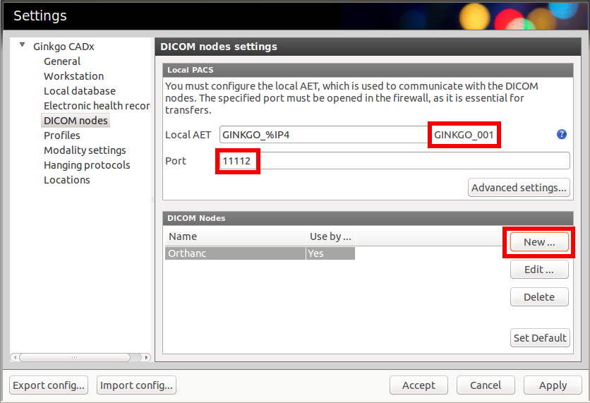
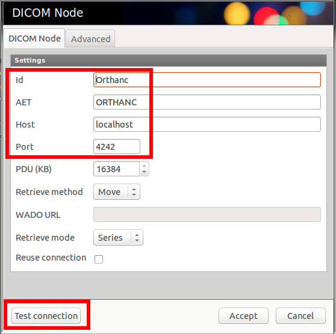

.. _ginkgo-cadx:

Ginkgo CADx
===========

This section explains how to connect the `Ginkgo CADx viewer
<http://ginkgo-cadx.com/en/>`__ to an Orthanc server, both running on
the local computer. First, start Orthanc without specifying a
configuration file (i.e. using its default configuration).  Then, open
the settings pannel of Ginkgo CADx:

Write down the AET and the DICOM port of Ginkgo CADx (in this case,
respectively ``GINKGO_001`` and ``11112``). Then, create a new DICOM
node corresponding to Orthanc by clicking on the "*New...*" button,
which raises the following dialog box:

.. highlight:: json

Complete the highlighted fields with the default parameters of
Orthanc, as shown in the screenshot.  Do not forget to click on the
"*Test connection*" button to make sure the :ref:`C-Echo <dicom-echo>`
succeeds. Stop Orthanc, create a new :ref:`configuration file
<configuration>`, and declare Gingko CADx in the ``DicomModalities``
section, given the parameters you wrote down above::

  // The list of the known DICOM modalities
  "DicomModalities" : {
    "ginkgo" : [ "GINKGO_001", "localhost", 11112 ]
  },

Restart Orthanc using this newly created configuration file, and
you will be able to do query/retrieve from Gingko CADx through the
"*PACS Q/R*" menu.
