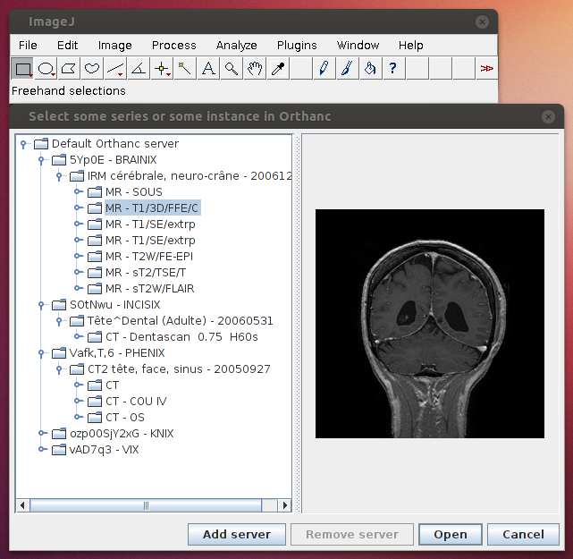

.. _imagej:

Interface with ImageJ
=====================

The Orthanc project proposes a plugin for ImageJ to browse the content
of an Orthanc server, then import 2D/3D DICOM images from Orthanc into
ImageJ. The source code is licensed under the GNU GPLv3 license.

This plugin hopefully greatly simplifies the indexation of DICOM
images when dealing with ImageJ (e.g. for quality control of DICOM
modalities, or for pedagogical use). There is also no need to carry on
any complex network configuration, since the plugin directly uses the
REST API of Orthanc. This makes its installation and its use quite
straightforward.

Resources
---------

* Link to `the source code
  <https://orthanc.uclouvain.be/hg/orthanc-imagej/file/default>`__.

* Link to `precompiled JAR binaries
  <https://orthanc.uclouvain.be/downloads/cross-platform/orthanc-imagej/index.html>`__.

* Link to `demonstration video
  <https://www.youtube.com/watch?v=wsslVhE-R1Q>`__.
