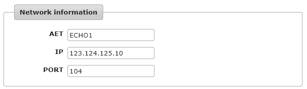
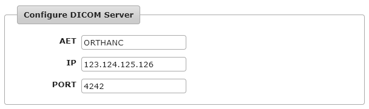

.. _configure-modality:
.. highlight:: json

Connect your modality to Orthanc
================================

This section explains how to connect a modality to an Orthanc server.

First, retrieve the IP address of your Orthanc Server.  Make sure
to retrieve the IP address of the correct network interface
(in this case ``123.124.125.126``).
You should also make sure that your firewall enables incoming traffic
on the DICOM port for that network interface (``4242`` by default).

Then, start Orthanc without specifying a
configuration file (i.e. using its default configuration).  On your modality, 
search for "settings/network settings" (exact naming is platform dependent).
You should find this kind of information

Write down the AET, IP and DICOM port of the modality (in this case,
respectively ``ECHO1``, ``123.124.125.10`` and ``104``). 

Then, still in your modality network settings, you should find a panel
in which you can configure a PACS or a target DICOM Server.  Enter
the following information (adapt it with the IP address of your
Orthanc Server):

Once you've entered this configuration in your modality, you might
have access to a "*Test connection/C-ECHO*" button to validate that
the modality can reach the Orthanc Server.

Then, stop Orthanc, update you :ref:`configuration file
<configuration>`, and declare your modality in the ``DicomModalities``
section, given the parameters you wrote down above::

  // The list of the known DICOM modalities
  "DicomModalities" : {
    "echo1" : [ "ECHO1", "123.124.125.10", 104 ]
  },

Restart Orthanc using this newly created configuration file, and
you will be able to send data from your modality to your Orthanc Server.

Further readings:

* :ref:`dicom`
* :ref:`troubleshooting`
