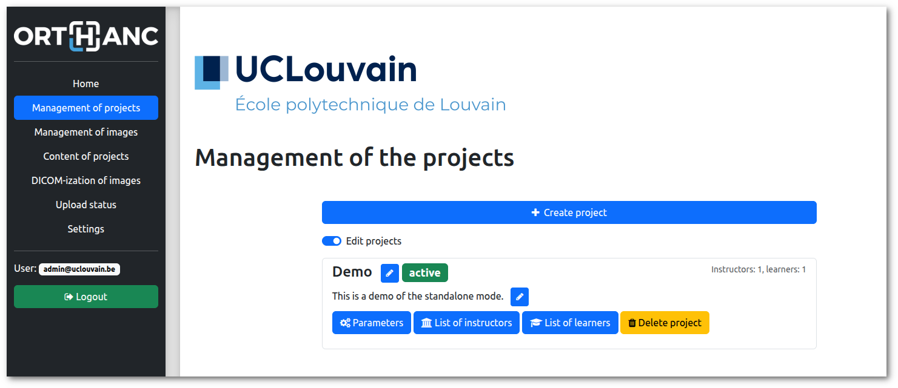
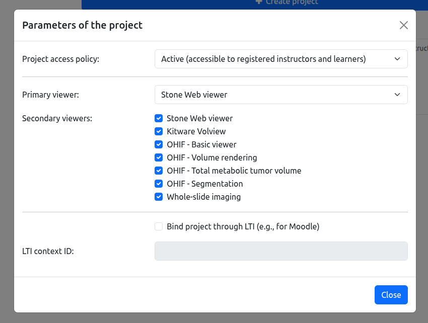
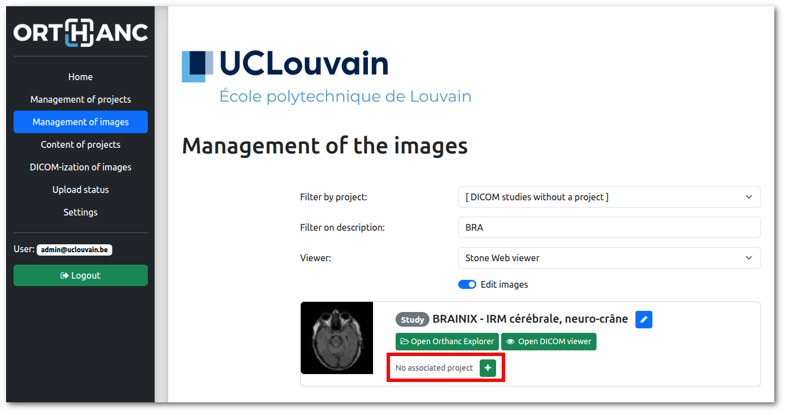
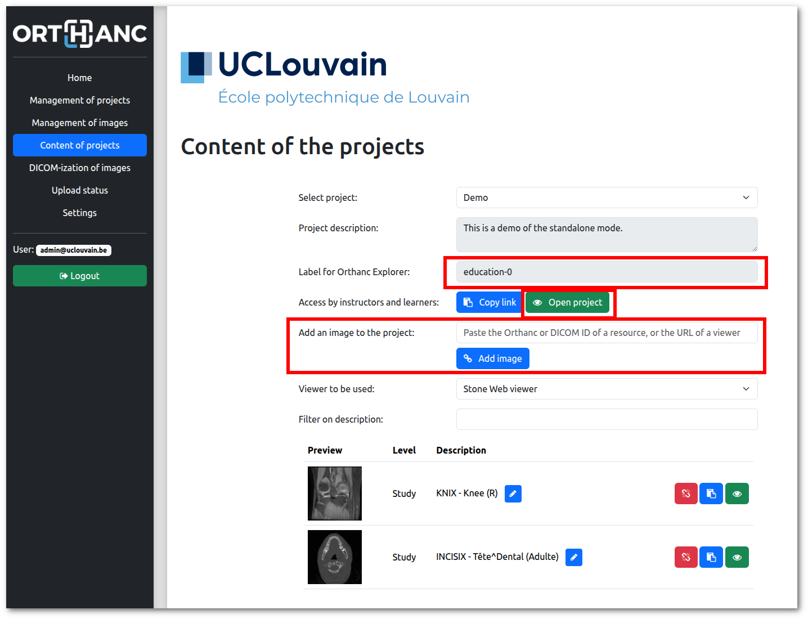
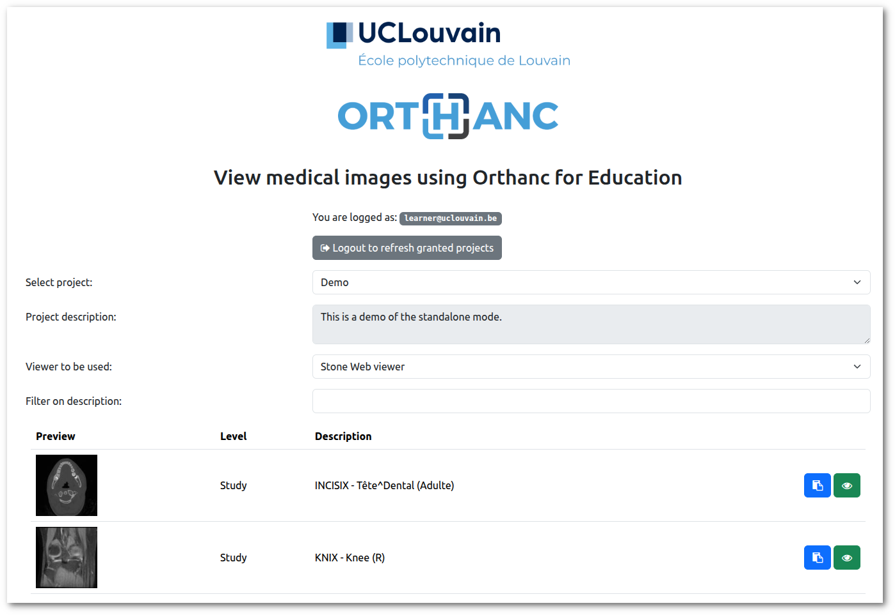

.. _education:

Education plugin for Orthanc
============================

.. contents::

The Education plugin turns Orthanc into a tool for sharing medical
images with students for **educational purposes**. The plugin also
supports the **LTI 1.3 protocol**, allowing access from Learning
Management Systems such as Moodle.

The images can be displayed using the **Web viewers** that are
integrated as plugins for Orthanc (i.e., :ref:`Stone Web viewer
<stone_webviewer>`, :ref:`OHIF <ohif>`, and :ref:`Kitware VolView
<volview>`). The plugin also includes support for **virtual
microscopy**: It facilitates the DICOM-ization of whole-slide images
and offers a Web-based viewer through an intuitive interface to the
:ref:`whole-slide imaging primitives <wsi>` of Orthanc.

The Education plugin requires the version of Orthanc to be above or
equal to 1.12.9. It is released under the AGPL license. Note that this
plugin overwrites the way users are authenticated by Orthanc.

This development was partially funded by the `Virtual Hospital grant
<https://www.virtual-hospital.org/>`__ at `Louvain School of
Engineering (EPL) <https://www.uclouvain.be/facultes/epl>`__.

Overview
--------

The Orthanc plugin supports two modes of operation. The **standalone
mode** allows Orthanc to operate as a Web server for sharing
collections of medical images with learners. In this mode, instructors
can provide learners with a URL linking to a Web page that lists the
images in the collection, allowing them to view the images using their
preferred Web viewer. The following screenshot shows this page:

.. image:: education/standalone.png
           :align: center
           :width: 800

|

The second mode of operation integrates Orthanc with a **Learning
Management System (LMS)**, such as Moodle. This integration is
implemented according to the LTI protocol 1.3. Click on the following
image to view a demo video:

.. image:: education/moodle.jpeg
           :align: center
           :width: 800
           :target: https://www.youtube.com/watch?v=GD-oPukwxyc

|

In this video, the left portion of the screen presents the
administrative interface of the Education plugin, used to associate
medical images with **collections of images** (those collections are
referred to as "projects"). The right portion displays the Moodle user
interface, enabling learners to access the images and open Web viewers
managed by Orthanc. Contrarily to the standalone mode,

Both modes of operation include a **permission system** ensuring that
learners can only view images they are authorized to
access. Additionally, the Education plugin supports multiple
collections, which can be associated with different instructors.

Compilation
-----------

.. highlight:: bash

Official releases of the plugin can be `downloaded from the Orthanc
homepage
<https://orthanc.uclouvain.be/downloads/sources/orthanc-education/index.html>`__. As
an alternative, the `repository containing the source code
<https://orthanc.uclouvain.be/hg/orthanc-education/file/default>`__
can be accessed using Mercurial.

The procedure to compile this plugin is similar of that for the
:ref:`core of Orthanc <binaries>`. The following commands should work
on most GNU/Linux distributions::

  $ mkdir Build
  $ cd Build
  $ cmake .. -DSTATIC_BUILD=ON -DCMAKE_BUILD_TYPE=Release
  $ make

The compilation will produce a shared library
``libOrthancEducation.so`` that contains the Education plugin for
Orthanc.

Pre-compiled Linux Standard Base (LSB) binaries `are available for
download <https://orthanc.uclouvain.be/downloads/linux-standard-base/orthanc-education/index.html>`__.
Pre-compiled binaries for `Microsoft Windows <https://orthanc.uclouvain.be/downloads/windows-64/orthanc-education/index.html>`__
and `macOS <https://orthanc.uclouvain.be/downloads/macos/orthanc-education/index.html>`__ are available as well.

Furthermore, the :ref:`Docker images <docker>`
``jodogne/orthanc-plugins`` and ``orthancteam/orthanc`` also contain the
plugin. Debian and Ubuntu packages can be found in the
:ref:`standalone repository <binaries>`
``https://debian.orthanc-labs.com/``.

Usage
-----

This section introduces the various concepts that are necessary to
understand how the Education plugin for Orthanc works.

User management
^^^^^^^^^^^^^^^

The Education plugin for Orthanc makes the distinction between 3
categories of users:

* **Administrators** are responsible for the configuration of Orthanc
  and for the management of the collections of medical images
  (referred to as "projects"). It is up to the administrators to
  upload the DICOM resources, to create the projects, to dispatch the
  images among the different projects, and to associate projects with
  instructors and learners. To this end, administrators have full
  access to the administrative interface of the Education plugin, to
  the configuration of all of the projects, as well as to both
  :ref:`Orthanc Explorer <orthanc-explorer>` and :ref:`Orthanc
  Explorer 2 <orthanc-explorer-2>`.

* **Standard users** represent either instructors (teachers) or
  learners (students). These users cannot modify the configuration of
  the platform, upload medical images, or distribute images across
  projects. Instructors can modify project-specific settings based on
  their pedagogical objectives, such as controlling project visibility
  or selecting which viewers are available for a given project. A user
  may act as an instructor in certain projects and as a learner in
  others. For this reason, the "teacher vs. learner" terminology is
  avoided, as it implies a fixed role for each user.

* **Guest users** are users who are not authenticated by the
  platform. They behave like learners but can only access projects
  with public visibility. This functionality can be used to publish
  massive open online courses (MOOCs) in the standalone mode of
  operation.

User authentication
^^^^^^^^^^^^^^^^^^^

The way the Education plugin authenticates administrators and standard
users is specified in the :ref:`configuration file of Orthanc
<configuration>`. The authentication process for administrators can
differ from the one used for standard users. As of release 1.0 of the
Education plugin, the following authentication mechanisms are
available:

* **Login**. In this case, the Education plugin displays a login page
  where the user can enter their credentials, which are specified in
  the configuration file. Internally, after a successful login, user
  information is stored as a `JWT
  <https://en.wikipedia.org/wiki/JSON_Web_Token>`__ session cookie
  named ``orthanc-education-user``.

* **HTTP headers**. In this case, the user identity is determined by
  the presence of a specific HTTP header, specified in the
  ``AuthenticationHttpHeader`` configuration option. This approach can
  be used in the standalone mode of operation, when `single sign-on
  (SSO) <https://en.wikipedia.org/wiki/Single_sign-on>`__ is
  implemented within an institution. At UCLouvain, this authentication
  mode has been validated with `Shibboleth
  <https://en.wikipedia.org/wiki/Shibboleth_(software)>`__ in
  combination with the ``libapache2-mod-shib`` module, with Apache
  acting as a :ref:`reverse proxy <apache>`. Two options are available
  for header-based authentication:

  * **Unrestricted**: If the specified HTTP header is present, the
    user is authenticated immediately, and the header value is
    interpreted as the user identifier.

  * **Restricted**: A user is authenticated only if the HTTP header
    value matches one of the allowed entries defined in the
    configuration. This option can be used to grant
    administrator-level access to a specific subset of users.

* **None**. In this mode, the login page is displayed, but no user can
  log in. This can be used to disable administrator-level access in
  order to freeze the platform configuration, or to prevent standard
  users from logging in when LTI-based authentication is available.

* **LTI-based authentication**. This authentication mechanism is
  automatically activated when LTI support is enabled for integration
  with a Learning Management System (LMS), such as
  Moodle. Authentication is then handled through `OIDC-based
  authentication <https://www.imsglobal.org/spec/lti/v1p3>`__
  initiated by the LTI platform. The mechanism grants instructor or
  learner access to a single project, corresponding to the deep link
  from which the request originates. The role (instructor or learner)
  is determined by the value of the
  ``https://purl.imsglobal.org/spec/lti/claim/roles`` field, and the
  user identifier is derived from the e-mail address provided by the
  LTI platform.  Upon successful authentication, user information is
  stored in a JWT session cookie named ``orthanc-education-lti``.

Note that if both the ``orthanc-education-user`` and
``orthanc-education-lti`` cookies are present, login-based
authentication takes precedence, since LTI-based authentication
provides more limited access.

Projects
^^^^^^^^

A project is defined as a collection of :ref:`DICOM resources
<dicom-format>`.  These resources can be studies, series, or
instances. The same DICOM resource can be shared by multiple projects.
Projects are created and managed by administrators. A project is
defined by the following parameters:

* The **list of instructors** specifies the standard users who are
  permitted to change the project configuration and review its stored
  images, including before the project is published to learners.

* The **list of learners** specifies which standard users are allowed
  to view the medical images in the collection. In standalone mode,
  learners can choose from a pre-selected set of Web viewers, as
  defined by the project instructors.

* The **access policy** determines which standard users or guest users
  are permitted to access the DICOM resources linked to a
  project. Three policies are available:

  * **Hidden**: The project is accessible only to its instructors and
    to the platform administrators. This allows instructors to prepare
    course material before granting students access to the medical
    images (for example, when setting up examinations).

  * **Active**: The project becomes accessible to the specified list
    of learners. Guest users cannot access the collection.

  * **Public**: The project is accessible to any standard user, as
    well as to any guest user. This policy can be used in the context
    of MOOCs.

* The **primary viewer** is the default Web viewer for the project,
  whose usage is recommended to learners by the project
  instructors. As of release 1.0, the following viewers are recognized
  by the Education plugin: :ref:`Stone Web viewer <stone_webviewer>`,
  :ref:`OHIF <ohif>`, :ref:`Kitware VolView <volview>`, and
  :ref:`Whole-slide imaging <wsi>`.

* The **secondary viewers** are a list of additional viewers that may
  be useful to learners alongside the primary viewer.

* **LTI context ID**: When the Education plugin is used with a
  Learning Management System (LMS) such as Moodle, this parameter
  specifies the identifier of the course in the LTI platform. Deep
  links in the LMS course can only be created to the project whose LTI
  context ID matches this course.

Here is a screenshot of how projects can be configured in the
administrative interface of the Education plugin:

The individual parameters of a project look as follows:

|

Collection of images
^^^^^^^^^^^^^^^^^^^^

The Education plugin offers an administrative interface for **linking
DICOM resources** to the collection of medical images associated with
each project:

Various filters are available to help identify DICOM resources that
are not yet assigned to any project. The association of DICOM studies,
series, and instances to projects is implemented internally using the
:ref:`labels feature of Orthanc <labels>`.

The **content of individual projects** can be inspected as well:

Besides allowing access to the medical images in the collection, this
page provides three important pieces of information highlighted in
red:

* The **Orthanc label** that is used to associate DICOM resources with
  the project. Consequently, as an alternative to the built-in
  administrative interface, :ref:`Orthanc Explorer <orthanc-explorer>`
  or :ref:`Orthanc Explorer 2 <orthanc-explorer-2>` can be used to
  link or unlink images with the project by editing the labels of the
  DICOM resources of interest.

* The **URL to access the content** of the project by instructors,
  learners, or guest users (if the project is public).

* An edit box is provided to facilitate adding an image to the project
  while it is being reviewed in one of the Web viewers supported by
  Orthanc. To do so, simply **paste the URL of the viewer**.

Access to learners
^^^^^^^^^^^^^^^^^^

After authentication, non-administrator users are redirected to a Web
page giving access to all projects for which they appear on the list
of learners:

**Guest users** also have access to this page, but only see the
projects with a public access policy.

If the authenticated standard user is also an **instructor of the
project**, this user can modify some parameters of the project (i.e.,
its access policy, its primary viewer, and its list of secondary
viewers).

DICOM-ization
^^^^^^^^^^^^^

An important use case of the Education plugin for Orthanc is to
provide a **virtual microscope** for teaching histology and digital
pathology. This use case takes advantage of the :ref:`whole-slide
imaging <wsi>` support implemented by the Orthanc project.

Example configuration
---------------------

HTTPS

Troubleshooting
---------------

