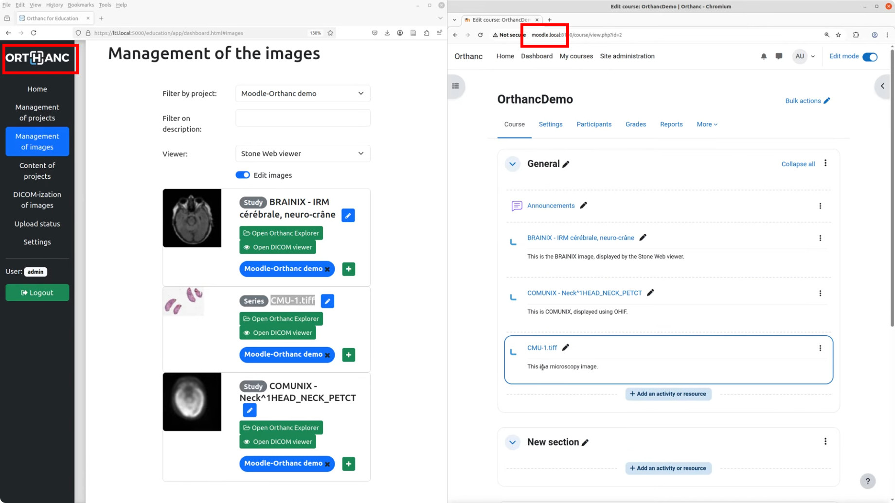

.. _education:

Education plugin for Orthanc
============================

.. contents::

The Education plugin turns Orthanc into a tool for sharing medical
images with students for **educational purposes**. The plugin also
supports the **LTI 1.3 protocol**, allowing access from Learning
Management Systems such as Moodle.

The images can be displayed using the **Web viewers** that are
integrated as plugins for Orthanc (i.e., :ref:`Stone Web viewer
<stone_webviewer>`, :ref:`OHIF <ohif>`, and :ref:`Kitware VolView
<volview>`). The plugin also includes support for **virtual
microscopy**: It facilitates the DICOM-ization of whole-slide images
and offers a Web-based viewer through an intuitive interface to the
:ref:`whole-slide imaging primitives <wsi>` of Orthanc.

The Education plugin requires the version of Orthanc to be above or
equal to 1.12.9. Note that this plugin overwrites the way users are
authenticated by Orthanc.

This development was partially funded by the `Virtual Hospital grant
<https://www.virtual-hospital.org/>`__ at `Louvain School of
Engineering (EPL) <https://www.uclouvain.be/facultes/epl>`__.

Overview
--------

The Orthanc plugin supports two modes of operation. The **standalone
mode** allows Orthanc to operate as a Web server for sharing
collections of medical images with students. In this mode, instructors
can provide students with a URL linking to a Web page that lists the
images in the collection, allowing them to view the images using their
preferred Web viewer. The following screenshot shows this page:

.. image:: education/standalone.png
           :align: center
           :width: 800

|

The second mode of operation integrates Orthanc with a **Learning
Management System (LMS)**, such as Moodle. This integration is
implemented according to the LTI protocol 1.3. Click on the following
image to view a demo video:

|

In this video, the left portion of the screen presents the
administrative interface of Orthanc, used to associate medical images
with **collections of images** (those collections are referred to as
"projects"). The right portion displays the Moodle user interface,
enabling students to access the images and open Web viewers managed by
Orthanc. The instructor of the project 

Both modes of operation include a **permission system** ensuring that
students can only view images they are authorized to
access. Additionally, the Education plugin supports multiple
collections, which can be associated with different teachers.

Compilation
-----------

.. highlight:: bash

Official releases of the plugin can be `downloaded from the Orthanc
homepage
<https://orthanc.uclouvain.be/downloads/sources/orthanc-education/index.html>`__. As
an alternative, the `repository containing the source code
<https://orthanc.uclouvain.be/hg/orthanc-education/file/default>`__
can be accessed using Mercurial.

The procedure to compile this plugin is similar of that for the
:ref:`core of Orthanc <binaries>`. The following commands should work
on most GNU/Linux distributions::

  $ mkdir Build
  $ cd Build
  $ cmake .. -DSTATIC_BUILD=ON -DCMAKE_BUILD_TYPE=Release
  $ make

The compilation will produce a shared library
``libOrthancEducation.so`` that contains the Education plugin for
Orthanc.

Pre-compiled Linux Standard Base (LSB) binaries `are available for
download <https://orthanc.uclouvain.be/downloads/linux-standard-base/orthanc-education/index.html>`__.
Pre-compiled binaries for `Microsoft Windows <https://orthanc.uclouvain.be/downloads/windows-64/orthanc-education/index.html>`__
and `macOS <https://orthanc.uclouvain.be/downloads/macos/orthanc-education/index.html>`__ are available as well.

Furthermore, the :ref:`Docker images <docker>`
``jodogne/orthanc-plugins`` and ``orthancteam/orthanc`` also contain the
plugin. Debian and Ubuntu packages can be found in the
:ref:`standalone repository <binaries>`
``https://debian.orthanc-labs.com/``.

Standalone mode
---------------

Integration with Learning Management Systems
--------------------------------------------

This plugin adds a dedicated button to Orthanc Explorer, which
provides an easy, fast access to the OHIF viewers ():

Labels
