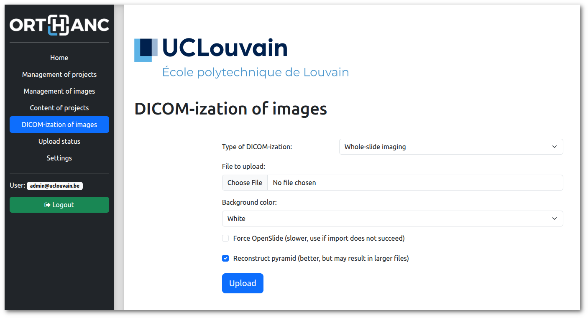
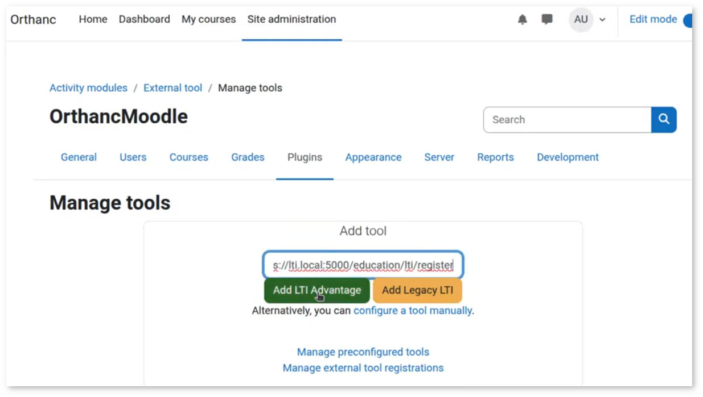
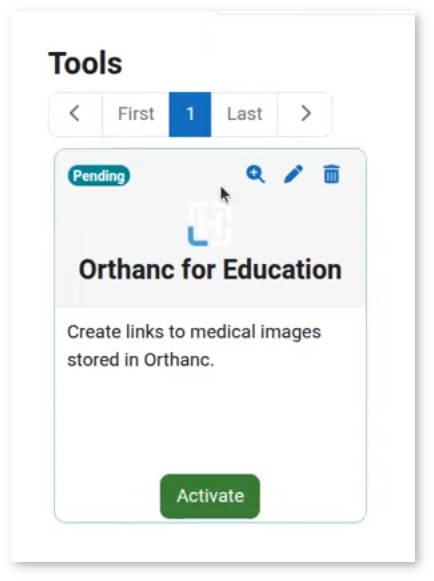
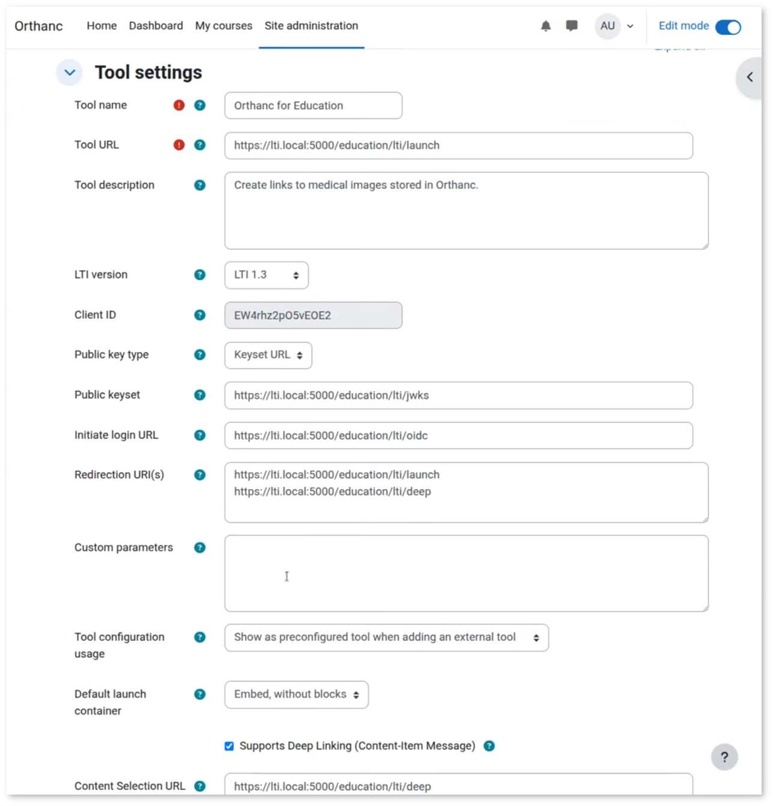
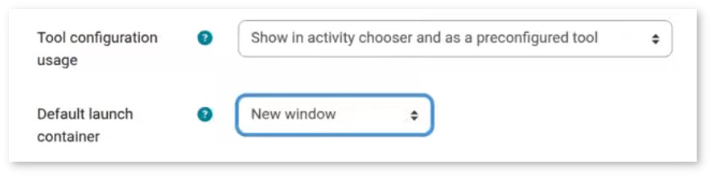
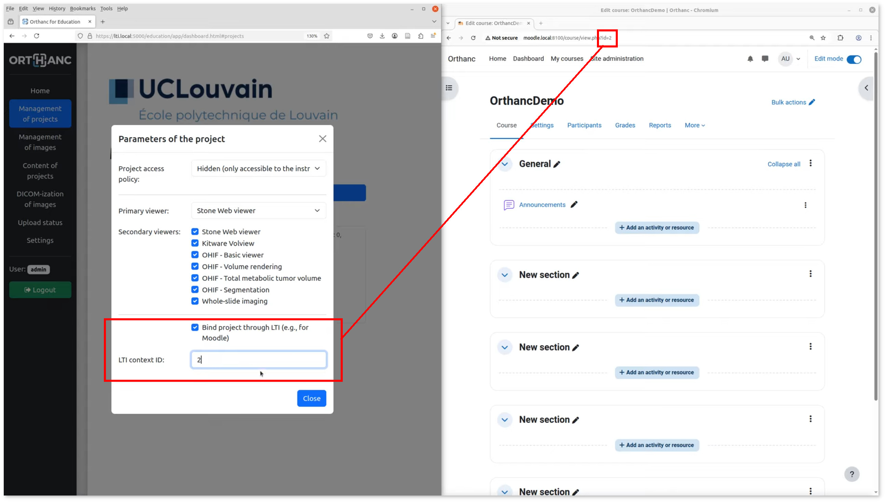

.. _education:

Education plugin for Orthanc
============================

.. contents::

The Education plugin turns Orthanc into a tool for sharing medical
images with students for **educational purposes**. The plugin also
supports the **LTI 1.3 protocol**, allowing integration with Learning
Management Systems such as Moodle.

The images can be displayed using the **Web viewers** that are
integrated as plugins for Orthanc (i.e., :ref:`Stone Web viewer
<stone_webviewer>`, :ref:`OHIF <ohif>`, and :ref:`Kitware VolView
<volview>`). The plugin also includes support for **virtual
microscopy**: It facilitates the DICOM-ization of whole-slide images
and offers a Web-based viewer through an intuitive interface to the
:ref:`whole-slide imaging primitives <wsi>` of Orthanc.

The Education plugin requires the version of Orthanc to be above or
equal to 1.12.9. It is released under the AGPL license. Note that this
plugin overwrites the way users are authenticated by Orthanc.

This development was partially funded by the `Virtual Hospital grant
<https://www.virtual-hospital.org/>`__ at `Louvain School of
Engineering (EPL) <https://www.uclouvain.be/facultes/epl>`__.

Overview
--------

The Orthanc plugin supports two modes of operation. The **standalone
mode** allows Orthanc to operate as a Web server for sharing
collections of medical images with learners. In this mode, instructors
can provide learners with a URL linking to a Web page that lists the
images in the collection, allowing them to view the images using their
preferred Web viewer. The following screenshot shows this page:

.. image:: education/standalone.png
           :align: center
           :width: 800

|

The second mode of operation integrates Orthanc with a **Learning
Management System (LMS)**, such as Moodle. This integration is
implemented according to the LTI protocol 1.3. Click on the following
image to view a demo video:

|

In this video, the left portion of the screen presents the
administrative interface of the Education plugin, used to associate
medical images with **collections of images** (those collections are
referred to as "projects"). The right portion displays the Moodle user
interface, enabling learners to access the images and open Web viewers
managed by Orthanc. Contrarily to the standalone mode,

Both modes of operation include a **permission system** ensuring that
learners can only view images they are authorized to
access. Additionally, the Education plugin supports multiple
collections, which can be associated with different instructors.

Compilation
-----------

.. highlight:: bash

Official releases of the plugin can be `downloaded from the Orthanc
homepage
<https://orthanc.uclouvain.be/downloads/sources/orthanc-education/index.html>`__. As
an alternative, the `repository containing the source code
<https://orthanc.uclouvain.be/hg/orthanc-education/file/default>`__
can be accessed using Mercurial.

The procedure to compile this plugin is similar of that for the
:ref:`core of Orthanc <binaries>`. The following commands should work
on most GNU/Linux distributions::

  $ mkdir Build
  $ cd Build
  $ cmake .. -DSTATIC_BUILD=ON -DCMAKE_BUILD_TYPE=Release
  $ make

The compilation will produce a shared library
``libOrthancEducation.so`` that contains the Education plugin for
Orthanc.

Pre-compiled Linux Standard Base (LSB) binaries `are available for
download <https://orthanc.uclouvain.be/downloads/linux-standard-base/orthanc-education/index.html>`__.
Pre-compiled binaries for `Microsoft Windows <https://orthanc.uclouvain.be/downloads/windows-64/orthanc-education/index.html>`__
and `macOS <https://orthanc.uclouvain.be/downloads/macos/orthanc-education/index.html>`__ are available as well.

Furthermore, the :ref:`Docker images <docker>`
``jodogne/orthanc-plugins`` and ``orthancteam/orthanc`` also contain the
plugin. Debian and Ubuntu packages can be found in the
:ref:`standalone repository <binaries>`
``https://debian.orthanc-labs.com/``.

Usage
-----

This section introduces the various concepts that are necessary to
understand how the Education plugin for Orthanc works.

User management
^^^^^^^^^^^^^^^

The Education plugin for Orthanc makes the distinction between 3
categories of users:

* **Administrators** are responsible for the configuration of Orthanc
  and for the management of the collections of medical images
  (referred to as "projects"). It is up to the administrators to
  **upload the DICOM resources**, to create the projects, to dispatch
  the images among the different projects, and to associate projects
  with instructors and learners. To this end, administrators have full
  access to the administrative interface of the Education plugin, to
  the configuration of all of the projects, as well as to both
  :ref:`Orthanc Explorer <orthanc-explorer>` and :ref:`Orthanc
  Explorer 2 <orthanc-explorer-2>`.

* **Standard users** represent either instructors or learners. These
  users *cannot* modify the configuration of the platform, upload
  medical images, or distribute images across projects. Instructors
  can modify project-specific settings based on their pedagogical
  objectives, such as controlling project visibility or selecting
  which viewers are available for a given project. A user may act as
  an instructor in certain projects and as a learner in others. For
  this reason, the "teacher vs. student" terminology is avoided, as it
  implies a fixed role for each user.

* **Guest users** are users who are not authenticated by the
  platform. They behave like learners but can only access projects
  with public visibility. This functionality can be used to publish
  massive open online courses (MOOCs) in the standalone mode of
  operation.

User authentication
^^^^^^^^^^^^^^^^^^^

The way the Education plugin authenticates administrators and standard
users is specified in the :ref:`configuration file of Orthanc
<configuration>`. The authentication process for administrators can
differ from the one used for standard users. As of release 1.0 of the
Education plugin, the following authentication mechanisms are
available:

* **Login**. In this case, the Education plugin displays a login page
  where the user can enter their credentials, which are specified in
  the configuration file. Internally, after a successful login, user
  information is stored as a `JWT
  <https://en.wikipedia.org/wiki/JSON_Web_Token>`__ session cookie
  named ``orthanc-education-user``.

* **HTTP headers**. In this case, the user identity is determined by
  the presence of a specific HTTP header, specified in the
  ``AuthenticationHttpHeader`` configuration option. This approach can
  be used in the standalone mode of operation, when `single sign-on
  (SSO) <https://en.wikipedia.org/wiki/Single_sign-on>`__ is
  implemented within an institution. At UCLouvain, this authentication
  mode has been validated with `Shibboleth
  <https://en.wikipedia.org/wiki/Shibboleth_(software)>`__ in
  combination with the ``libapache2-mod-shib`` module, with Apache
  acting as a :ref:`reverse proxy <apache>`. Two options are available
  for header-based authentication:

  * **Unrestricted**: If the specified HTTP header is present, the
    user is authenticated immediately, and the header value is
    interpreted as the user identifier.

  * **Restricted**: A user is authenticated only if the HTTP header
    value matches one of the allowed entries defined in the
    configuration. This option can be used to grant
    administrator-level access to a specific subset of users.

* **None**. In this mode, the login page is displayed, but no user can
  log in. This can be used to disable administrator-level access in
  order to freeze the platform configuration, or to prevent standard
  users from logging in when LTI-based authentication is available.

* **LTI-based authentication**. This authentication mechanism is
  automatically activated when LTI support is enabled for integration
  with a Learning Management System (LMS), such as
  Moodle. Authentication is then handled through `OIDC-based
  authentication <https://www.imsglobal.org/spec/lti/v1p3>`__
  initiated by the LTI platform. The mechanism grants instructor or
  learner access to a single project, corresponding to the **deep
  link** from which the request originates. The role (instructor or
  learner) is determined by the value of the
  ``https://purl.imsglobal.org/spec/lti/claim/roles`` field, and the
  user identifier is derived from the e-mail address provided by the
  LTI platform.  Upon successful authentication, user information is
  stored in a JWT session cookie named ``orthanc-education-lti``.

Note that if both the ``orthanc-education-user`` and
``orthanc-education-lti`` cookies are present, login-based
authentication takes precedence, since LTI-based authentication
provides more limited access.

.. _education_projects:

Projects
^^^^^^^^

A project is defined as a collection of :ref:`DICOM resources
<dicom-format>`.  These resources can be studies, series, or
instances. The same DICOM resource can be shared by multiple projects.
Projects are created and managed by administrators. A project is
defined by the following parameters:

* The **list of instructors** specifies the standard users who are
  permitted to change the project configuration and to review its
  stored images before the project is published to the learners.

* The **list of learners** specifies which standard users are allowed
  to view the medical images in the collection. In standalone mode,
  learners can choose from a pre-selected set of Web viewers, as
  defined by the project instructors.

* The **access policy** determines which standard users or guest users
  are permitted to access the DICOM resources linked to a
  project. Three policies are available:

  * **Hidden**: The project is accessible only to its instructors and
    to the platform administrators. This allows instructors to prepare
    course material before granting students access to the medical
    images (for example, when setting up examinations).

  * **Active**: The project becomes accessible to the specified list
    of learners. Guest users cannot access the collection.

  * **Public**: The project is accessible to any standard user, as
    well as to any guest user. This policy can be used in the context
    of MOOCs.

* The **primary viewer** is the default Web viewer for the project,
  whose usage is recommended to learners by the project
  instructors. As of release 1.0, the following viewers are recognized
  by the Education plugin: :ref:`Stone Web viewer <stone_webviewer>`,
  :ref:`OHIF <ohif>`, :ref:`Kitware VolView <volview>`, and
  :ref:`Whole-slide imaging <wsi>`.

* The **secondary viewers** are a list of additional viewers that may
  be useful to learners alongside the primary viewer.

* **LTI context ID**: When the Education plugin is used with a
  Learning Management System (LMS) such as Moodle, this parameter
  specifies the identifier of the course in the LTI platform. Deep
  links in the LMS course can only be created to the project whose LTI
  context ID matches this course.

Here is a screenshot of how projects can be configured in the
administrative interface of the Education plugin:

The individual parameters of a project look as follows:

|

.. _education_content:

Collection of images
^^^^^^^^^^^^^^^^^^^^

The Education plugin offers an administrative interface for **linking
DICOM resources** to the collection of medical images associated with
each project:

Various filters are available to help identify DICOM resources that
are not yet assigned to any project. The association of DICOM studies,
series, and instances to projects is implemented internally using the
:ref:`labels feature of Orthanc <labels>`.

The **content of individual projects** can be inspected as well:

Besides allowing access to the medical images in the collection, this
page provides three important pieces of information highlighted in
red:

* The **Orthanc label** that is used to associate DICOM resources with
  the project. Consequently, as an alternative to the built-in
  administrative interface of the Education plugin, :ref:`Orthanc
  Explorer <orthanc-explorer>` or :ref:`Orthanc Explorer 2
  <orthanc-explorer-2>` can be used to link or unlink images with the
  project by **manually editing the labels** of the DICOM resources of
  interest.  Note that the built-in interface only supports the
  association of studies and series. If you need to link a **DICOM
  instance** to a project, you must manually edit the labels.

* The **URL to access the content** of the project by instructors,
  learners, or guest users (if the project is public).

* An edit box is provided to facilitate adding an image to the project
  while it is being reviewed in one of the Web viewers supported by
  Orthanc. To do so, simply **paste the URL of the viewer**. This
  necessitates the ``PublicRoots`` configuration option to include the
  base URL of the Orthanc instance.

.. _education_learners:

Access to learners
^^^^^^^^^^^^^^^^^^

After authentication, non-administrator users are redirected to a Web
page giving access to all projects for which they appear on the list
of learners:

**Guest users** also have access to this page, but only see the
projects with a public access policy.

If the authenticated standard user is also an **instructor of the
project**, this user can modify some parameters of the project (i.e.,
its access policy, its primary viewer, and its list of secondary
viewers).

By default, this page lists all the projects that are available to the
user. This behavior can be disabled by setting the configuration
option ``ListProjectsAsLearner`` to ``false``. In this case, the
instructor will have share the URL tagged as *"Access by instructors
and learners"* in the :ref:`page listing the content of the project
<education_content>`.

Virtual microscope
^^^^^^^^^^^^^^^^^^

An important use case of the Education plugin for Orthanc is to
provide a **virtual microscope** for teaching histology and digital
pathology. This use case takes advantage of the :ref:`whole-slide
imaging <wsi>` support implemented by the Orthanc project.
DICOM-ization is accessible from the administrative interface
of the Education plugin:

|

This interface is only accessible if the
``WholeSlideImagingDicomizer`` configuration option contains the path
to the ``OrthancWSIDicomizer`` command-line tool from the
:ref:`whole-slide imaging framework of Orthanc <wsi>`. Once the upload
is done, the page named *"Upload status"* provides the status of the
DICOM-ization, including the logs of the command-line tool.

Some proprietary formats (such as MRXS or NDPI) requires the
DICOM-ization command-line tool to use the `OpenSlide library
<https://openslide.org/>`__. In this case, the ``OpenSlideLibrary``
configuration option must contain the path to the ``openslide.so``
(GNU/Linux) or ``openslide.dll`` (Microsoft Windows) shared library.

To associate a DICOM-ized whole-slide image with a project, make sure
to associate the DICOM series in the :ref:`content of the project
<education_content>` (*not* the DICOM study). Indeed, the whole-slide
imaging viewer only works at the instance or series level.

Note that future releases may include DICOM-ization of additional
types of images (e.g., :ref:`3D models <stl-plugin>`, PNG or JPEG
images,...).

Configuration file
------------------

Generic configuration
^^^^^^^^^^^^^^^^^^^^^

.. highlight:: json

To enable the Education plugin, the :ref:`configuration file
<configuration>` must contain a specific section named ``Education``::

  {
    "Plugins" : [
      "${HOME}/Downloads/libOrthancEducation.so"
    ],
    "Education" : {
      /* Generic options */
      "Enabled" : true,
      "PublicRoots" : [
        "http://localhost:8042"  /* Public base URL where the Orthanc Web server is mapped */
      ],
      "ListProjectsAsLearner" : true,

      /* Options for the virtual microscope */
      "WholeSlideImagingDicomizer" : "${HOME}/Downloads/OrthancWSIDicomizer",
      "OpenSlideLibrary" : "libopenslide.so",

      /* ...other options... */
    }
  }

If you want to use :ref:`Orthanc Explorer 2 <orthanc-explorer-2>`
together with the Education plugin, make sure to disable its default
behavior that sets it as the default Web interface of Orthanc::

  {
    /* ... */
    "OrthancExplorer2" : {
      "IsDefaultOrthancUI": false
     }
  }

Login-based deployments
^^^^^^^^^^^^^^^^^^^^^^^

Here is a possible configuration for a **standalone deployment** of
the Education plugin using a login page::

  {
    /* ... */
    "Education" : {
      /* ... */
      "AuthenticationHttpHeader" : "Mail",
      "Administrators" : {
        "Authentication" : "Login",
        "Credentials" : {
          "admin" : "pass1"
        }
      },
      "StandardUsers" : {
        "Authentication" : "Login",
        "Credentials" : {
          "instructor" : "pass2",
          "learner" : "pass3"
        }
      }
    }
  }

This configuration defines one administrator (whose identifier is
``admin``) and two standard users (with identifiers ``instructor`` and
``learner``). Because their passwords are hard-coded, the
configuration file must not be publicly accessible.

All the requests requiring an authentication will be redirected to the
login page. The page with the :ref:`list of projects for learners
<education_learners>` is reachable without login, allowing guest users
to access public projects (e.g., in the context of MOOCs).

Deployments with HTTP headers (SSO)
^^^^^^^^^^^^^^^^^^^^^^^^^^^^^^^^^^^

Here is a possible configuration for a **standalone deployment** of
the Education plugin behind a `single sign-on (SSO)
<https://en.wikipedia.org/wiki/Single_sign-on>`__ infrastructure::

  {
    /* ... */
    "Education" : {
      /* ... */
      "Administrators" : {
        "Authentication" : "RestrictedHttpHeader",
        "RestrictedHeaders" : [
          "admin@uclouvain.be"
        ]
      },
      "StandardUsers" : {
        "Authentication" : "RestrictedHttpHeader",
        "RestrictedHeaders" : [
          "instructor@uclouvain.be",
          "learner@uclouvain.be"
        ]
      }
    }
  }

This configuration authenticates administrators and standard users
based on the presence of the ``Mail`` HTTP header, which must be set
by the SSO infrastructure. In this example, there is one administrator
(``admin@uclouvain.be``) and two standard users
(``instructor@uclouvain.be`` and ``learner@uclouvain.be``). If the
``Mail`` header matches none of those e-mails, the authentication
results in the guest user.

Evidently, you can emulate a SSO infrastructure by putting a reverse
proxy (e.g., :ref:`nginx <nginx>` or :ref:`Apache <apache>`) in front
of Orthanc, asking the reverse proxy to automatically set some HTTP
header (cf. ``proxy_set_header`` if nginx is used).

When handling large cohorts of learners, it is not practical to list
all of them in the configuration files. In this case, the
``Authentication`` option for standard users can be set to
``HttpHeader``::

  {
    /* ... */
    "Education" : {
      /* ... */
      "AuthenticationHttpHeader" : "Mail",
      "Administrators" : {
        "Authentication" : "RestrictedHttpHeader",
        "RestrictedHeaders" : [
          "admin@uclouvain.be"
        ]
      },
      "StandardUsers" : {
        "Authentication" : "HttpHeader"
      }
    }
  }

When this option is enabled, any HTTP request containing the ``Mail``
header is authenticated as a standard user. The value of the ``Mail``
header defines the user identity.

.. _education_lti:

LTI deployments
^^^^^^^^^^^^^^^

Here is the recommended configuration file to integrate the Education
plugin with a Learning Management Systems such as Moodle::

  {
    /* ... */
    "RemoteAccessAllowed" : true,
    "Education" : {
      /* ... */
      "Administrators" : {
        "Authentication" : "Login",
        "Credentials" : {
          "admin" : "pass"
        }
      },
      "StandardUsers" : {
        "Authentication" : "None"
      },
      "LTI": {
        "Enabled": true,
        "OrthancUrl" : "https://lti.local:5000",
        "PlatformUrl" : "http://moodle.local:8100"
      },
      "PublicRoots" : [
        "https://lti.local:5000"
      ]
    }
  }

In this configuration, the administrator is authenticated through a
login page. Standard users are not authenticated by the mechanisms
provided by the Education plugin (hence the ``None`` value), but
instead through the primitives defined by the `LTI 1.3 protocol
<https://www.imsglobal.org/spec/lti/v1p3>`__.

In this case, Orthanc must also be explicitly provided with its own
public base URL (``https://lti.local:5000``) and the base URL of the
LMS (``http://moodle.local:8100``). This information is used to verify
the security of the bidirectional communication between Orthanc and
the LMS through the LTI protocol.

Once Orthanc is running, you can configure the LMS platform. In this
section, we use Moodle as an example, as it is the only LMS that has
been tested with release 1.0 of the Education plugin. The screenshots
below are taken from the `video illustrating the configuration steps
<https://www.youtube.com/watch?v=GD-oPukwxyc>`__.  Open the
configuration interface of external tools in Moodle:

Then click on the *"Add LTI Advantage"* button with the
``https://lti.local:5000/education/lti/register`` URL. Evidently, you
will have to adapt this URL with the public root of your Orthanc
server. This results in the addition of the tool:

If you edit the configuration of this newly added external tool (by
clicking on the pen icon), you see all the parameters that have been
automatically negotiated between Orthanc and Moodle:

An important piece of information is the *"LTI Client ID"*, which
should also have been filled on the *"Settings"* page of the
administrative interface of the Education plugin in Orthanc.

For best operation, it is necessary to manually change the default
values of the *"Tool configuration usage"* and "*Default launch
container*" as follows:

You can then click on the *"Activate"* button to make the "Orthanc for
Education" external tool available in the Moodle courses.

The LTI context ID for the :ref:`configuration of the project
<education_projects>` can be retrieved by copying the identifier of
the course from the URL of the course in Moodle:

Other options
^^^^^^^^^^^^^

Note that it is always recommended to enable :ref:`HTTPS encryption in
Orthanc <https>` for security reasons, especially for :ref:`LTI
deployments <education_lti>`. Some additional security-related options
are available in the Education plugin::

  {
    /* ... */
    "Education" : {
      /* ... */
      "MaxLoginAge" : 3600,  /* After how many seconds login-based authentication expires */
      "SecureCookies" : true,  /* Whether cookies are tagged as "Secure", only set to "false" for debugging */
    }
  }

Troubleshooting
---------------

Several problems can be encountered if using LTI integration with
Moodle:

* **Error 400** with message ``"Missing field: \"id_token\""`` during the creation of a deep link.

  **Explanation**: This means that the *"LTI Client ID"* in the
  settings of the Education plugin is out of sync with the Moodle
  configuration.

  **Resolution**: Modify the settings in Orthanc, or reinstall the
  "Orthanc for Education" external from scratch.

* **Error 500** with message ``"Unknown LTI context ID"`` during the creation of a deep link.

  **Explanation**: This means that the Moodle course has not been
  correctly associated with a project in the Orthanc Education plugin.

  **Resolution**: Edit the project settings in Orthanc, and
  appropriately set the field *"LTI context ID"*.

* Moodle shows the following error during the creation of a deep link:
  ``"Exception - mod_lti\local\ltiopenid\jwks_helper::fix_jwks_alg():
  Argument #1 ($jwks) must be of type array, null given, called in
  [dirroot]/mod/lti/locallib.php"``

  **Explanation**: This means that the cURL library used by Moodle is
  not allowed to contact the Orthanc Web server, notably the route
  that provides the OIDC JSON web key (JWK) endpoint (in our example,
  ``https://lti.local:5000/education/lti/jwks``).

  **Resolution**:

  * Make sure that the domain name used by Orthanc (in our example,
    ``lti.local``) is secured by a valid HTTPS certificate, and that
    the HTTPS certificate is trusted by the machine running Moodle.

  * Make sure that the security settings of Moodle (in our example,
    those settings are accessible at
    ``http://moodle.local:8100/admin/settings.php?section=httpsecurity``)
    allow to contact the TCP port on which Orthanc is listening (in
    our example, the port is ``5000``, but by default it would be
    ``8042``), and to contact the IP address on which Orthanc is
    installed.
