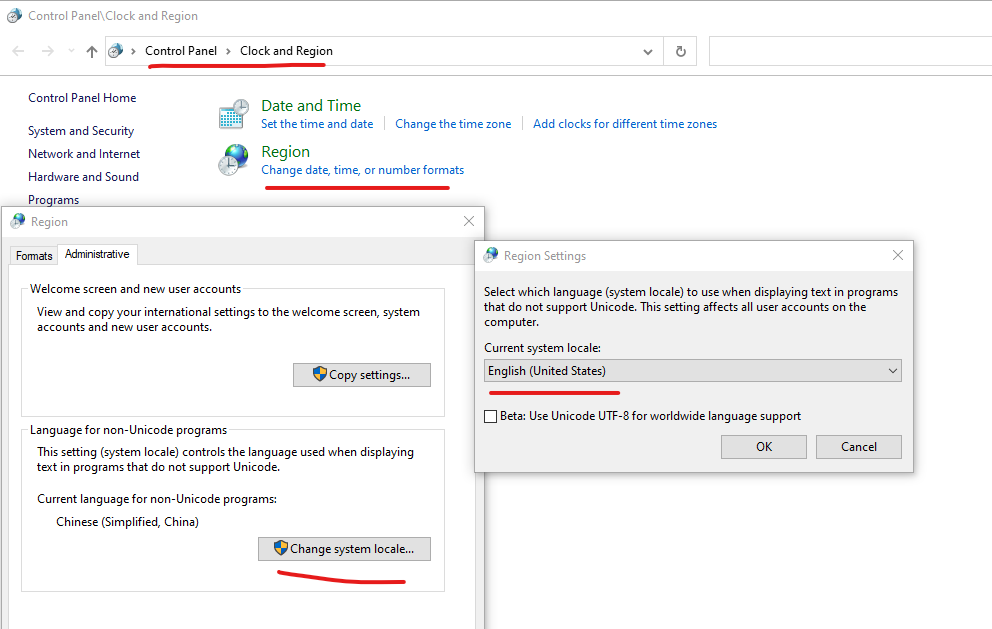

.. _odbc:

ODBC plugins
============

.. contents::

The Orthanc project provides two **official** plugins to replace the
default storage area (on the filesystem) and the default SQLite index
by a `ODBC database
<https://en.wikipedia.org/wiki/Open_Database_Connectivity>`__. This
can notably be used to connect Orthanc to Microsoft SQL Server.

The source code of the ODBC plugins can be found in the
``orthanc-databases`` `Mercurial repository
<https://orthanc.uclouvain.be/hg/orthanc-databases/>`__, next to the
source code of the :ref:`PostgreSQL <postgresql>` and
:ref:`MySQL/MariaDB <mysql>` plugins.

     
When to use ODBC?
-----------------

In general, you'll always get better performance by using native C/C++
plugins dedicated to one single database engine, instead of the ODBC
plugins that can connect to any database driver. This is the price of
genericity: Some specific optimisations can only be done if focusing
on one single database.

That being said, there are multiple use cases for the ODBC plugins:

* Connection to Microsoft SQL Server (MSSQL), including Microsoft
  Azure SQL, is only possible with ODBC. Note that the ODBC plugins
  were only validated against MSSQL 2017 and MSSQL 2019, under
  GNU/Linux.

* Contrarily to the built-in SQLite engine and to the MySQL/MariaDB
  index plugin, the ODBC index plugin supports the :ref:`revision
  mechanism <revisions>` to protect metadata and attachments from
  concurrent modifications.

* Because of its genericity, the ODBC storage area plugin does not
  implement the :ref:`read-range primitive <registry>`. As a
  consequence, using it will write two attachments for each stored
  DICOM instance (namely, ``Attachment 1`` that corresponds to the
  DICOM instance itself, and ``Attachment 3`` that corresponds to the
  tags before the pixel data).

* The Linux Standard Base (LSB) `pre-compiled binaries
  <https://orthanc.uclouvain.be/downloads/linux-standard-base/orthanc-odbc/index.html>`__ of the ODBC plugins
  are not compatible with the ``libsqliteodbc`` `Debian/Ubuntu package
  <http://www.ch-werner.de/sqliteodbc/>`__ because the latter package
  was compiled with the ``HAVE_SQLITE3LOADEXTENSION`` flag.
  
* Finally, make sure to read the :ref:`recommended setup for best
  scalability <scalability>`.
  
Very importantly, pay attention to the fact that the ODBC plugins use
a different database schema than the built-in SQLite driver, and than
the PostgreSQL/MariaDB/MySQL plugins. As a consequence, it is **not
possible to switch back and forth** between ODBC and the native
drivers without running a :ref:`full replication procedure
<replication>`. As a consequence, pay attention to choose the right
plugin from the beginning, as you will need to stick to it.

Summarizing, here are two tables containing our recommendations about
when to use the ODBC plugins:

+------------------------------+--------------------------------------------------------+
| Database management system   | Recommended index plugin                               |
+==============================+========================================================+
| Microsoft SQL server (MSSQL) | ODBC plugin                                            |
| or Microsoft Azure SQL       |                                                        |
+------------------------------+--------------------------------------------------------+
| MySQL (with revisions)       | ODBC plugin                                            |
+------------------------------+--------------------------------------------------------+
| MySQL (without revisions)    | :ref:`MySQL plugin <mysql>`                            |
+------------------------------+--------------------------------------------------------+
| PostgreSQL                   | :ref:`PostgreSQL plugin <postgresql>`                  |
+------------------------------+--------------------------------------------------------+
| SQLite (with revisions)      | ODBC plugin                                            |
+------------------------------+--------------------------------------------------------+
| SQLite (without revisions)   | No plugin needed                                       |
+------------------------------+--------------------------------------------------------+
| Other                        | Create a :ref:`dedicated plugin <creating-plugins>`    |
|                              | or implement a new dialect in the ODBC plugins         |
+------------------------------+--------------------------------------------------------+

+------------------------------+--------------------------------------------------------+
| Type of storage area         | Recommended storage plugin                             |
+==============================+========================================================+
| Filesystem                   | No plugin needed                                       |
+------------------------------+--------------------------------------------------------+
| Microsoft SQL server (MSSQL) | ODBC plugin                                            |
| or Microsoft Azure SQL       |                                                        |
+------------------------------+--------------------------------------------------------+
| MySQL                        | :ref:`MySQL plugin <mysql>`                            |
+------------------------------+--------------------------------------------------------+
| PostgreSQL                   | :ref:`PostgreSQL plugin <postgresql>`                  |
+------------------------------+--------------------------------------------------------+
| SQLite                       | ODBC plugin                                            |
+------------------------------+--------------------------------------------------------+
| Google Cloud Storage, Azure  | :ref:`Cloud object storage plugins <object-storage>`   |
| blob storage, AWS S3         |                                                        |
+------------------------------+--------------------------------------------------------+
| Other                        | Create a :ref:`dedicated plugin <creating-plugins>`,   |
|                              | implement a new dialect in the ODBC plugins,           |
|                              | or prototype using :ref:`Python <python_storage_area>` |
+------------------------------+--------------------------------------------------------+

Compilation
-----------

Static linking
^^^^^^^^^^^^^^

.. highlight:: text

The procedure to compile these plugins is similar to that for the
:ref:`core of Orthanc <compiling>`. The following commands should work
for most UNIX-like distribution (including GNU/Linux)::

  $ mkdir BuildOdbc
  $ cd BuildOdbc
  $ cmake ../Odbc -DSTATIC_BUILD=ON -DCMAKE_BUILD_TYPE=Release
  $ make

The compilation will produce 2 shared libraries, each containing one plugin for Orthanc:

* ``OrthancOdbcIndex`` replaces the default SQLite index of Orthanc by ODBC. 
* ``OrthancOdbcStorage`` makes Orthanc store the DICOM files it receives into ODBC. 

  
Microsoft Windows and Apple OS X
^^^^^^^^^^^^^^^^^^^^^^^^^^^^^^^^

Pre-compiled binaries for Microsoft Windows 32bit `are also available
<https://orthanc.uclouvain.be/downloads/windows-32/orthanc-odbc/index.html>`__,
as well as for `Apple macOS
<https://orthanc.uclouvain.be/downloads/macos/orthanc-odbc/index.html>`__.

.. _odbc-ubuntu1604:

Dynamic linking on Ubuntu 16.04
^^^^^^^^^^^^^^^^^^^^^^^^^^^^^^^

.. highlight:: text

If static linking is not desired, here are build instructions for
Ubuntu 16.04 (provided build dependencies for the :ref:`core of
Orthanc <compiling>` have already been installed)::

  $ sudo apt-get install libodbc1 unixodbc unixodbc-dev
  $ mkdir BuildOdbc
  $ cd BuildOdbc
  $ cmake ../Odbc -DCMAKE_BUILD_TYPE=Release \
                  -DALLOW_DOWNLOADS=ON \
                  -DUSE_SYSTEM_GOOGLE_TEST=OFF \
                  -DUSE_SYSTEM_ORTHANC_SDK=OFF
  $ make

  
Usage
-----

You of course first have to :ref:`install Orthanc <binaries>`, with a
version above 0.9.5. You then have to **configure an ODBC data
source** dedicated to Orthanc. The procedure depends upon your
operating system:

* Many UNIX-like platforms (including Debian and Ubuntu) use `unixODBC
  <https://en.wikipedia.org/wiki/UnixODBC>`__. You first have to
  install at least one ODBC driver (e.g. on Debian, installing the
  packages ``libsqliteodbc`` and ``odbc-postgresql`` will respectively
  install the driver for SQLite and for PostgreSQL). Secondly, you
  have to edit your ``~/.odbc.ini`` to define the data sources
  (i.e. the actual databases).

* On Microsoft Windows, the configuration tool ``odbcad32.exe`` ("ODBC
  Data Source Administrator") allows to define the data sources.  You
  also have to install at least one ODBC driver. For instance, the
  `SQLite ODBC Driver <http://www.ch-werner.de/sqliteodbc/>`__ can be
  used to access SQLite.

* If you are interested in interfacing Orthanc with Microsoft SQL
  Server, the corresponding ODBC drivers can be `downloaded from
  Microsoft
  <https://docs.microsoft.com/en-us/sql/connect/odbc/download-odbc-driver-for-sql-server>`__.

.. highlight:: json

Once Orthanc is installed and the data sources have been defined, you
must add a section in the :ref:`configuration file <configuration>`
that specifies the **data source(s) to be used**. You also have to
tell Orthanc in which path it can find the plugins: This is done by
properly modifying the ``Plugins`` option. You could for instance
adapt the following configuration file::

  {
    "Name" : "MyOrthanc",
    "Odbc" : {
      "EnableIndex" : true,
      "EnableStorage" : true,
      "IndexConnectionString" : "DSN=index",
      "StorageConnectionString" : "DSN=storage",
      "MaximumConnectionRetries" : 10,
      "ConnectionRetryInterval" : 5,
      "IndexConnectionsCount" : 1
    },
    "Plugins" : [
      "/home/user/orthanc-databases/BuildOdbc/libOrthancOdbcIndex.so",
      "/home/user/orthanc-databases/BuildOdbc/libOrthancOdbcStorage.so"
    ]
  }

The values of ``IndexConnectionString`` and
``StorageConnectionString`` are known as `ODBC connection strings
<https://www.connectionstrings.com/>`__, and define how to connect to
the ODBC data source. These connection strings are specific to the
different types of ODBC drivers. In the following sections, we'll
review connection strings for SQLite, PostgreSQL, MySQL and Microsoft
SQL Server.
  
**Important:** The ``EnableIndex`` and ``EnableStorage`` options must
be explicitly set to ``true``, otherwise Orthanc will continue to use
its default SQLite back-end and the filesystem storage area.

**Remark 1:** When using the ODBC storage area plugin, the DICOM files
are stored as large objects in the database.  This might actually
consume more space than the DICOM file itself.

**Remark 2:** A typical usage of the ODBC plugins is to enable only
the index plugin, and to use the default filesystem storage for DICOM
files (on a NAS with proper disaster recovery strategies).

Orthanc must of course be **restarted** after the modification of its
configuration file.

Supported ODBC drivers
----------------------

The ODBC plugins for Orthanc are universal, in the sense that they can
connect to any ODBC driver. However, there are some minor variations
in the SQL language, that are known as "dialects" in the `source code
of the plugins <https://orthanc.uclouvain.be/hg/orthanc-databases/>`__.

As of ODBC plugins 1.0, the supported dialects are Microsoft SQL
Server, PostgreSQL, MySQL and SQLite. Orthanc auto-detects the dialect
to be used. Adapting the ODBC plugins to support more dialects should
be fairly easy by adding new values to the
``OrthancDatabases::Dialect`` enumeration in the C++ source code.

Also, note that the database for the index and the database for the
storage area can mix different type of ODBC drivers.

We now review sample `connection strings
<https://www.connectionstrings.com/>`__ for the supported ODBC drivers
under Ubuntu 18.04.

Microsoft SQL Server
^^^^^^^^^^^^^^^^^^^^

.. highlight:: bash

1. Install the `ODBC driver for SQL server
   <https://docs.microsoft.com/fr-fr/sql/connect/odbc/download-odbc-driver-for-sql-server>`__
   (version 2017).
               
2. A **non-persistent** developer instance of MSSQL 2019 can be
   started using the `Docker image provided by Microsoft
   <https://hub.docker.com/_/microsoft-mssql-server>`__ as follows::

     $ docker run --name mssql --rm -t -i -e 'ACCEPT_EULA=Y' -e 'SA_PASSWORD=MyStrOngPa55word!' \
       -e MSSQL_MEMORY_LIMIT_MB=512 -p 1433:1433 mcr.microsoft.com/mssql/server:2019-latest

3. Create a database dedicated to Orthanc in MSSQL::

     $ /opt/mssql-tools/bin/sqlcmd -S 192.168.0.17 -U sa -P 'MyStrOngPa55word!' -Q 'CREATE DATABASE orthanctest'

.. highlight:: text

4. Create the following sample `unixODBC
   <https://en.wikipedia.org/wiki/UnixODBC>`__ configuration file::
    
     $ cat ~/.odbc.ini
     [orthanctest]
     Driver = ODBC Driver 17 for SQL Server  
     Server = tcp:localhost,1433
     Database = orthanctest

   Note that there exist `many more configuration options
   <https://docs.microsoft.com/en-us/sql/relational-databases/native-client/applications/using-connection-string-keywords-with-sql-server-native-client>`__
   for Microsoft SQL Server. In particular, ``Encrypt`` and
   ``TrustServerCertificate`` and ``Connect Timeout`` can be
   interesting in the case of a connection to Microsoft Azure SQL.
     
.. highlight:: json

5. Start Orthanc using the following :ref:`configuration file
   <configuration>` for ODBC::
     
     {
       "Odbc" : {
         "EnableIndex" : true,
         "EnableStorage" : true,
         "IndexConnectionString" : "DSN=orthanctest;Uid=sa;Pwd=MyStrOngPa55word!",
         "StorageConnectionString" : "DSN=orthanctest;Uid=sa;Pwd=MyStrOngPa55word!"
       }
     }

   In the connection strings:
     
   * ``DSN`` corresponds to the name of the entry in ``~/.odbc.ini``.
   * ``Uid`` is the user name in MSSQL (by default, the Docker image uses ``sa``).
   * ``Pwd`` is the password that has been provided in the ``SA_PASSWORD``
     environment variable when starting Docker.
   * For security reasons, the ``Uid`` and ``Pwd`` parameters cannot
     be set in ``~/.odbc.ini``.

**Remark:** It is actually not necessary to create an entry in
``~/.odbc.ini``.  All the parameters can indeed be provided directly
in the connection strings, for instance::
   
  {
    "Odbc" : {
      "EnableIndex" : true,
      "EnableStorage" : true,
      "IndexConnectionString" : "Driver={ODBC Driver 17 for SQL Server};Server=tcp:localhost,1433;Database=orthanctest;Uid=sa;Pwd=MyStrOngPa55word!",
      "StorageConnectionString" : "Driver={ODBC Driver 17 for SQL Server};Server=tcp:localhost,1433;Database=orthanctest;Uid=sa;Pwd=MyStrOngPa55word!"
    }
  }

**Remark:** On Windows systems, we have noticed that the ODBC drivers character encoding 
seems to depend on a system level configuration.  This configuration needs to enforce UTF-8.
Therefore, it is advised to configure the system locale as follow:

|

PostgreSQL
^^^^^^^^^^

1. Install the ``odbc-postgresql`` package.

.. highlight:: text

2. Create the following sample `unixODBC
   <https://en.wikipedia.org/wiki/UnixODBC>`__ configuration file::
    
     $ cat ~/.odbc.ini
     [orthanctest]
     Driver      = PostgreSQL Unicode
     Servername  = localhost
     Database    = orthanctest
     UserName    = postgres
     Password    = postgres
     Port        = 5432

.. highlight:: json

3. Start Orthanc using the following :ref:`configuration file
   <configuration>` for ODBC::
     
     {
       "Odbc" : {
         "EnableIndex" : true,
         "EnableStorage" : true,
         "IndexConnectionString" : "DSN=orthanctest",
         "StorageConnectionString" : "DSN=orthanctest"
       }
     }
   

MySQL
^^^^^

1. Install the official `Connect/ODBC package
   <https://dev.mysql.com/downloads/connector/odbc/>`__ (it is not
   packaged for Ubuntu 18.04).

.. highlight:: text

2. Create the following sample `unixODBC
   <https://en.wikipedia.org/wiki/UnixODBC>`__ configuration file::
    
     $ cat ~/.odbc.ini
     [orthanctest]
     Driver      = MySQL ODBC 8.0 Unicode Driver
     Servername  = localhost
     Database    = orthanctest
     UID         = root
     PWD         = root
     Port        = 3306

.. highlight:: json

3. Start Orthanc using the following :ref:`configuration file
   <configuration>` for ODBC::
     
     {
       "Odbc" : {
         "EnableIndex" : true,
         "EnableStorage" : true,
         "IndexConnectionString" : "DSN=orthanctest;charset=utf8",
         "StorageConnectionString" : "DSN=orthanctest;charset=utf8"
       }
     }

   The ``charset=utf8`` option is necessary if using MySQL 8.x.

SQLite
^^^^^^

1. Install the ``libsqliteodbc`` package.

.. highlight:: text

2. Create the following sample `unixODBC
   <https://en.wikipedia.org/wiki/UnixODBC>`__ configuration file::
    
     $ cat ~/.odbc.ini
     [index]
     Driver=SQLite3
     Database=/tmp/test-odbc-index.sqlite

     [storage]
     Driver=SQLite3
     Database=/tmp/test-odbc-storage.sqlite

   Note that we define two different data sources, one for the index
   and another for the storage area, because a SQLite database can
   only be opened by one client at once.
     
.. highlight:: json

3. Start Orthanc using the following :ref:`configuration file
   <configuration>` for ODBC::
     
     {
       "Odbc" : {
         "EnableIndex" : true,
         "EnableStorage" : true,
         "IndexConnectionString" : "DSN=index",
         "StorageConnectionString" : "DSN=storage",
         "IndexConnectionsCount" : 1
       }
     }

   **Remark 1:** As written just above, one SQLite database should
   only be opened by one client at a time. This implies that the
   ``IndexConnectionsCount`` must be set to ``1``, and that the index
   and storage area must never have connection strings corresponding
   to the same SQLite database.

   **Remark 2:** As written above, the ODBC plugin supports the
   :ref:`revision mechanism <revisions>`. This contrasts with the
   built-in SQLite database of Orthanc. So, it might be interesting to
   use the ODBC index plugin instead of the built-in SQLite database
   of Orthanc, if you are a developer who wants to test revisions
   before a :ref:`large-scale deployment <scalability>`.

Advanced options
----------------

Several advanced options are available as well to fine-tune the
configuration of the ODBC plugins. They are documented below.

.. _odbc-multiple-writers:

Multiple writers or connections
^^^^^^^^^^^^^^^^^^^^^^^^^^^^^^^

Starting with Orthanc 1.9.2, it is possible to use :ref:`multiple
writers or connections in large-scale deployments
<multiple-writers>`. Here is the list of configuration that control
this behaviour:

* ``MaximumConnectionRetries`` governs how many times Orthanc tries to
  connect to the database, as well as how many times Orthanc replays
  transactions to deal with collisions between multiple writers.

* ``IndexConnectionsCount`` controls the number of connections from
  the index plugin to the ODBC database. It is set to ``1`` by
  default, which corresponds to the old behaviour of Orthanc <= 1.9.1.

* ``ConnectionRetryInterval`` is only used when opening one database
  connection to ODBC.

* These options cannot be used in the case of SQLite databases, that
  only support one client at once.
