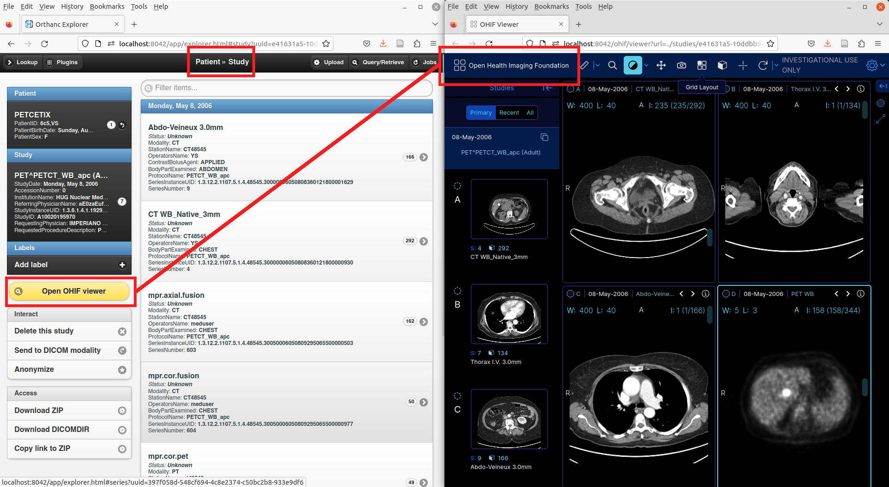

.. _ohif:

OHIF plugin
===========

.. contents::

This **official** plugin by the `ICTEAM institute of UCLouvain
<https://uclouvain.be/en/research-institutes/icteam>`__ extends
Orthanc with the `OHIF <https://ohif.org/>`__ extensible Web imaging
platform.

The plugin greatly simplifies the deployment of OHIF, as it does not
necessitate the setup of any reverse proxy.

If you face difficulties in using OHIF, please get in touch with the
`OHIF community <https://ohif.org/collaborate>`__ in the first place.
Indeed, the OHIF and Orthanc communities are entirely distinct.

Usage
-----

This plugin adds a dedicated button to Orthanc Explorer, which
provides an easy, fast access to the OHIF viewers (click on the image
to view a demo video):

|

Compilation
-----------

.. highlight:: bash

Official releases can be `downloaded from the Orthanc homepage
<https://www.orthanc-server.com/browse.php?path=/plugin-ohif>`__. As
an alternative, the `repository containing the source code
<https://orthanc.uclouvain.be/hg/orthanc-ohif/>`__ can be accessed
using Mercurial.

The procedure to compile this plugin is similar of that for the
:ref:`core of Orthanc <binaries>`. The following commands should work
on most GNU/Linux distributions, provided Docker is installed::

  $ mkdir Build
  $ cd Build
  $ ../Resources/CreateOHIFDist.sh
  $ cmake .. -DSTATIC_BUILD=ON -DCMAKE_BUILD_TYPE=Release
  $ make

The compilation will produce a shared library ``libOrthancOHIF.so``
that contains the OHIF plugin for Orthanc.

Pre-compiled Linux Standard Base (LSB) binaries `are available for
download <https://lsb.orthanc-server.com/plugin-ohif/>`__.

Pre-compiled binaries for Microsoft Windows and macOS `are also
available
<https://www.orthanc-server.com/browse.php?path=/plugin-ohif>`__.

Furthermore, the :ref:`Docker images <docker>`
``jodogne/orthanc-plugins`` and ``osimis/orthanc`` also contain the
plugin. Debian and Ubuntu packages can be found in the
:ref:`standalone repository <binaries>`
``https://debian.orthanc-labs.com/``.

Configuration
-------------

.. highlight:: json

Here is a minimal sample :ref:`configuration file <configuration>` to
use this plugin::

  {
    "Plugins" : [
      "/home/user/orthanc-ohif/Build/libOrthancOHIF.so"
    ]
  }

Orthanc must of course be restarted after the modification of its
configuration file.

Using DICOMweb
^^^^^^^^^^^^^^

.. highlight:: json

By default, the plugin uses the `DICOM JSON data source
<https://v3-docs.ohif.org/configuration/datasources/dicom-json/>`__ of
OHIF. This data source is optimized to provide the fastest access to
the DICOM images, while requiring no additional plugin. However, in
order to deliver fast access, the OHIF plugin will cache additional
information about each DICOM instance as :ref:`metadata <metadata>` in
the Orthanc database, which results in a larger size of the Orthanc
database (an additional 1KB is roughly needed per instance).

As an alternative, it is possible to enable the `DICOMweb data source
<https://v3-docs.ohif.org/configuration/dataSources/dicom-web>`__. In
this case, the :ref:`DICOMweb plugin of Orthanc <dicomweb>` must also
be loaded. It can also be useful to load the :ref:`GDCM plugin <gdcm>`
if the DICOM images are encoded using a JPEG2k compressed transfer
syntax.

The advantages of using DICOMweb over the default DICOM JSON are:

* More standard-compliant.

* The OHIF study list is accessible, notably as a button on the
  welcome screen of Orthanc Explorer. The study list is not available
  if using the DICOM JSON data source.

* No additional space is used in the Orthanc database.
  
Here is a minimal configuration file to use DICOMweb::

  {
    "Plugins" : [
      "/home/user/orthanc-ohif/Build/libOrthancOHIF.so",
      "/home/user/orthanc-dicomweb/Build/libOrthancDicomWeb.so"
    ],
    "OHIF" : {
      "DataSource" : "dicom-web"
    }
  }
  

User configuration of OHIF
^^^^^^^^^^^^^^^^^^^^^^^^^^

.. highlight:: json

OHIF comes with a number of `configuration options
<https://v3-docs.ohif.org/configuration/configurationfiles/#configuration-options>`__
that can be fine-tuned by the user. User settings can be injected
using the ``UserConfiguration`` option as follows::

  {
    "Plugins" : [
      "/home/user/orthanc-ohif/Build/libOrthancOHIF.so"
    ],
    "OHIF" : {
      "UserConfiguration" : "ohif.js"
    }
  }

.. highlight:: javascript

A minimal ``ohif.js`` would be::

  window.config = {
    extensions: [],
    modes: []
  }

Note that the following configuration options will be overridden by
the OHIF plugin to properly configure the data source and the
integration with the Orthanc Web server:

* ``window.config.dataSources``
* ``window.config.defaultDataSourceName``
* ``window.config.routerBasename``
* ``window.config.showStudyList`` (set to ``false`` if using the DICOM
  JSON data source)
  

.. _ohif-router-basename:

Router basename
^^^^^^^^^^^^^^^

.. highlight:: json

If Orthanc is not branched at the root of a Web server thanks of the
presence of a reverse proxy, the configuration option
``RouterBasename`` must be adapted.

For instance, if Orthanc is running at address
``https://host.com/imaging/demo/orthanc/``, the following
configuration file must be used for OHIF to work::

  {
    "Plugins" : [
      "/home/user/orthanc-ohif/Build/libOrthancOHIF.so"
    ],
    "OHIF" : {
      "RouterBasename" : "/imaging/demo/orthanc/ohif/"
    }
  }

The default value of ``RouterBasename`` is ``/ohif/``.

.. _ohif-preloading:

Preloading
^^^^^^^^^^

.. highlight:: json

If using the DICOM JSON data source, whenever a new DICOM instance is
received by Orthanc, the OHIF plugin will compute a summary of the
DICOM tags of interest to OHIF, and will store it as :ref:`metadata
<metadata>` in the Orthanc database. This process has the advantage of
speeding up even the first opening of the DICOM study by OHIF, which
probably corresponds to the expectations of most radiologists.

However, if your Orthanc deployment is focused on speed, this
preloading might be undesirable, as it slows down the ingestion of new
DICOM instances by Orthanc. Furthermore, if your Orthanc server will
contain a large number of DICOM studies that will never be displayed
using OHIF, this can result in a waste of space in the Orthanc
database because of the metadata that will be preloaded, but that will
never be read.

It is consequently possible to turn off the automated preloading
of metadata using the following configuration::

  {
    "Plugins" : [
      "/home/user/orthanc-ohif/Build/libOrthancOHIF.so"
    ],
    "OHIF" : {
      "DataSource" : "dicom-json",
      "Preload" : false
    }
  }

If the ``Preload`` option is set to ``false``, the first display of a
DICOM study can take several seconds because of the computation of the
metadata, but subsequent displays will run much faster.

Note that preloading is only applied to the newly received instances:
The DICOM instances that were stored in the Orthanc server before the
installation of the OHIF plugin will only benefit from the
optimization starting with their second display using OHIF.

.. _ohif-https:

HTTPS encryption
^^^^^^^^^^^^^^^^

.. highlight:: bash

In order to use the :ref:`built-in HTTPS encryption <https-builtin>`
of Orthanc together with the OHIF plugin, first generate a proper
X.509 certificate for the ``localhost``::

  $ openssl req -x509 -nodes -days 365 -newkey rsa:2048 \
            -subj "/C=BE/CN=localhost" -keyout /tmp/private.key -out /tmp/certificate.crt
  $ cat /tmp/private.key /tmp/certificate.crt > /tmp/certificate.pem

.. highlight:: json

Secondly, create the following configuration file::

  {
    "Plugins" : [
      "/home/user/orthanc-ohif/Build/libOrthancOHIF.so"
    ],
    "SslEnabled" : true,
    "SslCertificate" : "/tmp/certificate.pem",
    "OHIF" : {
      "DataSource" : "dicom-json",
      "RouterBasename" : "/ohif/"
    }
  }

If more complex scenarios with reverse proxies are involved, make sure
to properly setup :ref:`CORS in your reverse proxy <nginx-cors>` and
to :ref:`adapt the router basename <ohif-router-basename>`. If you
face difficulties, while the simple setup with the built-in HTTPS
encryption described above works, your issue is related to OHIF, so
please get in touch with the `OHIF community
<https://ohif.org/collaborate>`__.

For developers
--------------

Extensions to the REST API
^^^^^^^^^^^^^^^^^^^^^^^^^^

.. highlight:: bash

The content of the `DICOM JSON data source
<https://v3-docs.ohif.org/configuration/datasources/dicom-json/>`__
for a DICOM study of interest can be retrieved as follows::

  $ curl http://demo.orthanc-server.com/studies/6b9e19d9-62094390-5f9ddb01-4a191ae7-9766b715/ohif-dicom-json

This data source is constructed from the :ref:`metadata 4202
<registry>` associated with the individual DICOM instances of the
DICOM study. The metadata corresponds to the `Base64 encoding
<https://en.wikipedia.org/wiki/Base64>`__ of a gzipped JSON file. For
debugging, the JSON file associated with a DICOM instance can be
inspected using::

  $ curl http://demo.orthanc-server.com/instances/1f3c00bd-49df10b7-f416a598-1b3bb5a2-cb791b52/metadata/4202 | base64 -d | gunzip -c
  

Preloading existing studies
^^^^^^^^^^^^^^^^^^^^^^^^^^^

:ref:`As explained above <ohif-preloading>`, the metadata associated
with DICOM instances are only preloaded for the newly ingested DICOM
instances. Using the REST API of Orthanc, it is easy to create a
script that would preload the metadata for the already existing DICOM
studies, hereby greatly speeding up the first opening of those studies
as well.

This script would loop over the :ref:`the DICOM studies that are
stored by Orthanc <rest-access>` using ``GET /studies``. For each
study whose :ref:`Orthanc identifier <orthanc-ids>` is ``id``, the
script would simply call ``GET /studies/{id}/ohif-dicom-json``.

