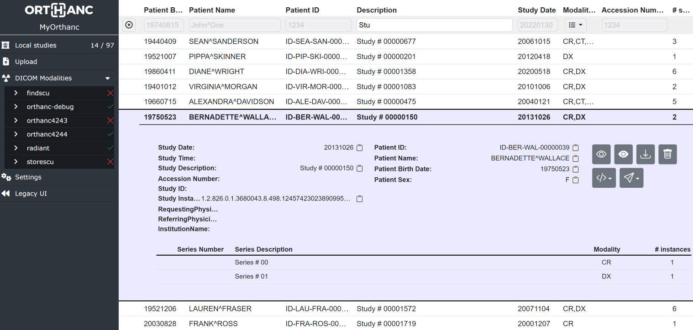
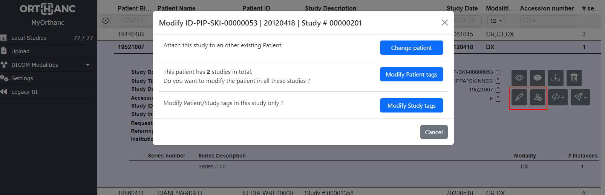
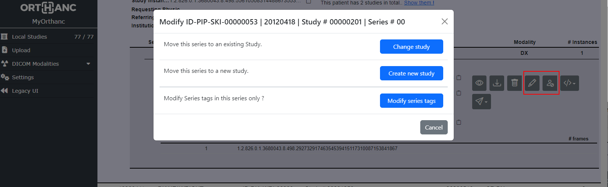
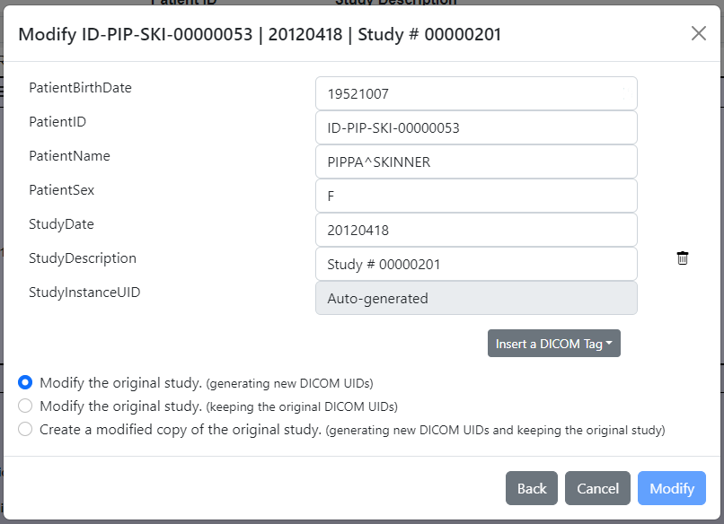

.. _orthanc-explorer-2:

Orthanc Explorer 2 plugin
=========================

.. contents::

   
Introduction
------------

This plugin provides a new User Interface (UI) to Orthanc.  It aims at being
more user-friendly, more configurable and more evolutive than the default
Orthanc UI which was developed mainly for testing/administrative purpose.

|

Note that a major difference between the legacy UI and Orthanc Explorer 2 (OE2)
is that OE2 works only at the study level, not the patient level.  The main page is
the study list in which, of course, you can apply a filter to display only the studies of a single patient.

Since version 0.7.0, once connected to `Keycloak <https://www.keycloak.org/>`__ and the `orthanc-auth-service <https://github.com/orthanc-team/orthanc-auth-service>`__, 
OE2 is able to handle user permissions and sharing of links to access a single study.  This is demonstrated in `this sample <https://github.com/orthanc-team/orthanc-auth-service/tree/main/minimal-setup/keycloak>`__.

How to get it ?
---------------

The source code is available on `GitHub <https://github.com/orthanc-server/orthanc-explorer-2>`__.

Binaries are included in:

- The `orthancteam/orthanc Docker image <https://hub.docker.com/r/orthancteam/orthanc>`__
- The `Windows Installer <https://orthanc.uclouvain.be/downloads/windows-64/installers/index.html>`__
- The `macOS packages <https://orthanc.uclouvain.be/downloads/macos/packages/index.html>`__

Release notes are available `here <https://github.com/orthanc-server/orthanc-explorer-2/blob/master/release-notes.md>`__.

Depending on the configuration, the plugin can replace the default Orthanc UI you are redirected to when accessing orthanc at `http://localhost:8042/ <http://localhost:8042/>`__.
In any case, the new and old UI can coexist:

- Orthanc Explorer 2 is available at `http://localhost:8042/ui/app/ <http://localhost:8042/ui/app/>`__
- Legacy UI remains available at `http://localhost:8042/app/explorer.html <http://localhost:8042/app/explorer.html>`__

Configuration
-------------

.. highlight:: json

The plugin must be configured through a configuration file.  The minimal configuration to include in your orthanc configuration file is::

  "OrthancExplorer2" : {
    "Enable": true,
    "IsDefaultOrthancUI": true
  }

There are many more options that are documented in the 
`default configuration file <https://github.com/orthanc-server/orthanc-explorer-2/blob/master/Plugin/DefaultConfiguration.json>`__.

Main features you can configure:

- Root URL
- Whether OE2 becomes the default Orthanc UI
- Configure the side menu
- Configure the actions available on the resources
- Configure the columns of the main study list
- Configure `Keycloak <https://www.keycloak.org/>`__ integration and :ref:`authorization plugin <authorization>`

Advanced features
-----------------

User permissions and web diffusion
^^^^^^^^^^^^^^^^^^^^^^^^^^^^^^^^^^

Check the documentation of the `orthanc-auth-service <https://github.com/orthanc-team/orthanc-auth-service>`__ 
companion web service that provides user permissions and sharing of studies.

Direct access to a selection of studies
^^^^^^^^^^^^^^^^^^^^^^^^^^^^^^^^^^^^^^^

You may open the OE2 interface directly on a specific study or patient by specifying DICOM Tags directly in the URL.
e.g::

    http://localhost:8042/ui/app/#/filtered-studies?PatientID="00000169"
    http://localhost:8042/ui/app/#/filtered-studies?StudyDate=20220512-20220513&ModalitiesInStudy=CR\DX
    http://localhost:8042/ui/app/#/filtered-studies?StudyInstanceUID="1.2.3"
    http://localhost:8042/ui/app/#/filtered-studies?StudyInstanceUID="1.2.3"&expand
    http://localhost:8042/ui/app/#/filtered-studies?StudyInstanceUID="1.2.3"&expand=study
    http://localhost:8042/ui/app/#/filtered-studies?StudyInstanceUID="1.2.3"&expand=series

By default, OE2 will add a wildcard ``*`` at the beginning and at the end of the search text.  Therefore, searching
for ``PatientID=1234`` will actually search for ``PatientID=*1234*``.  If you do not want to have these extra wildcards
added, you should use ``"`` at the beginning and/or at the end of the search text.  Therefore, searching for
``PatientID="1234"`` will return only the studies whose ``PatientID`` is exactly ``1234``.
These ``"`` can also be used in the User Interface search fields.

DICOM Modifications
^^^^^^^^^^^^^^^^^^^

Since version 0.6.0, it is possible to edit some of the DICOM Tags directly in the User Interface.
:ref:`DICOM Modification <anonymization>` is quite a complex topic that is provided by Orthanc
Rest API.  The Orthanc Explorer 2 User Interface aims at simplifying its use but is also limiting
it to common use cases mainly related to correcting errors in Patient and Study DICOM Tags.

At study level, it is possible to:

- Modify a Study
  
  - to attach it to another existing patient by providing the ``PatientID`` if e.g. the study was
    acquired for the wrong patient.
  - to edit the patient in all its studies if e.g. the ``PatientName`` was misspelled.
  - correct patient or study tags in this study only if e.g. the ``StudyDescription`` was incorrect.

- Anonymize a Study and possibly provide the anonymized ``PatientID`` or ``PatientName`` to
  e.g. force it to a specific identifier for a clinical study.
  

|

At series level, it is possible to:

- Modify a Series
  
  - to move it to another existing study by providing the ``StudyInstanceUID`` if e.g. the operator
    forgot to switch patient in the modality
  - to move it to a new study if e.g. the operator forgot to switch patient in the modality
  - correct series tags in this series only if e.g. the ``SeriesDescription`` was incorrect.

- Anonymize a Series and possibly provide the anonymized ``PatientID`` or ``PatientName`` to
  e.g. force it to a specific identifier for a clinical study.
  

|

Each time you modify a study, the user interface might propose you 3 modification modes related to
the handling of the :ref:`DICOM identifiers <dicom-identifiers>` .

- You may modify the original study and have Orthanc generates new ``StudyInstanceUID``, ``SeriesInstanceUID``
  and ``SOPInstanceUID`` DICOM Tags.  This means the that orthanc identifiers will change and the source
  study will be deleted.
- You may keep the original ``StudyInstanceUID``, ``SeriesInstanceUID`` and ``SOPInstanceUID`` DICOM Tags.  
  This means the that orthanc identifiers will not change (unless you also change the ``PatientID`` and the 
  study will be modified "in place").
- You may keep the original study and create a modified copy.  In this case, of course, the new modified copy
  will have a different orthanc identifiers.

|

There are many options related to DICOM Modification in the plugin 
`default configuration file <https://github.com/orthanc-server/orthanc-explorer-2/blob/master/Plugin/DefaultConfiguration.json>`__.
Check the ``Modifications`` section and the ``PatientMainTags``, ``StudyMainTags``, ``SeriesMainTags``, ``EnableAnonymization``
and ``EnableModification`` configurations.

Retrieve a study from a distant modality and open the viewer
^^^^^^^^^^^^^^^^^^^^^^^^^^^^^^^^^^^^^^^^^^^^^^^^^^^^^^^^^^^^

If you want to open e.g. the :ref:`Stone Web viewer <stone_webviewer>`:: on a study that is not yet
stored in Orthanc but that you know that it is stored in a remote modality, you may use this endpoint::

    http://localhost:8042/ui/app/retrieve-and-view.html?StudyInstanceUID=1.2.3....&modality=pacs&viewer=stone-viewer

This will first check if the study is already in Orthanc, if not, it will retrieve it from the modality and,
once the transfer is complete, open the viewer.

This feature has been introduced in v 0.7.0.

Bug reports & support
---------------------

As usual, you can get support and report issues from the `Orthanc Users group <https://groups.google.com/g/orthanc-users>`__.

You may also directly introduce bugs or feature requests in `GitHub <https://github.com/orthanc-server/orthanc-explorer-2/issues>`__.

The plugin is currently maintained by the `Orthanc Team <https://orthanc.team/>`__ who, like many of you, enjoys 
receiving a salary for his work.  Feel free to hire us if you need a specific feature or bug fixed.

Donations to `Open Collective <https://opencollective.com/orthanc>`__ may also be used to maintain/develop this plugin.
