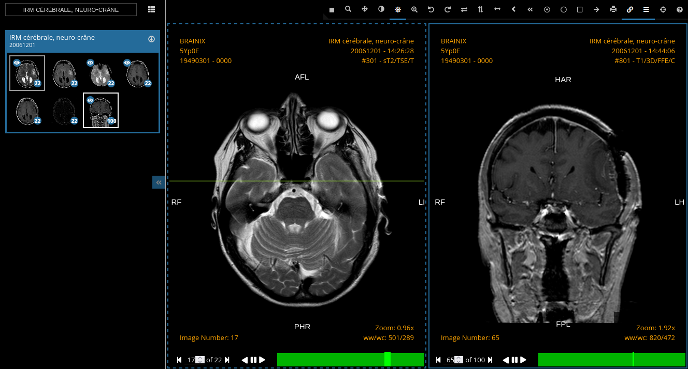

.. _osimis_webviewer:

Osimis Web Viewer plugin (deprecated)
=====================================

.. contents::

.. warning::

   The Osimis Web viewer is now deprecated and superseded by the
   :ref:`Stone Web viewer <stone_webviewer>`.

This plugin by Osimis extends Orthanc with a Web viewer of medical
images, with more advanced features than the basic :ref:`Orthanc Web
viewer plugin <webviewer>`. The Osimis plugin adds tools for
measuring, for viewing multiple series, and for split-pane.

This plugin adds a dedicated button to Orthanc Explorer to open the
viewer that looks like the following image:

How to get it
-------------

For general information, `check out the source code
<https://github.com/orthanc-team/osimis-webviewer-deprecated>`__.

The Osimis Web viewer is part of the `Windows installers
<https://www.orthanc-server.com/download-windows.php>`__.

For GNU/Linux users, you'll find it in the :ref:`orthancteam/orthanc
<docker-orthancteam>` Docker images or you can download precompiled LSB
(Linux Standard Base) binaries `here
<https://orthanc.uclouvain.be/downloads/linux-standard-base/osimis-web-viewer/index.html>`__.

The compilation process is quite complex since it requires to build
first the frontend and then the backend. All information can be found
in the `source code
<https://github.com/orthanc-team/osimis-webviewer-deprecated>`__.

Usage
-----

.. highlight:: json

On Windows, the plugin is enabled by default and will work
out-of-the-box.

If you're using the ``orthancteam/orthanc`` Docker images, you'll have to
define the ``OSIMIS_WEB_VIEWER1_PLUGIN_ENABLED`` :ref:`environment variable <docker-orthancteam>`
to ``true``.

On plain GNU/Linux distributions (i.e. if not using Docker), the
Osimis Web viewer will only work with LSB (Linux Standard Base)
Orthanc binaries that can be downloaded from `here
<https://orthanc.uclouvain.be/downloads/linux-standard-base/osimis-web-viewer/1.4.3/index.html>`__ (that will work with most
recent GNU/Linux distributions). Once Orthanc is installed, you must
change the :ref:`configuration file <configuration>` to tell Orthanc
where it can find the plugin: This is done by properly modifying the
``Plugins`` option. You could for instance use the following
configuration file::

  {
    "Name" : "MyOrthanc",
    [...]
    "Plugins" : [
      "/home/user/xxx/Downloads/libOsimisWebViewer.so"
    ]
  }

.. highlight:: text

Orthanc must of course be restarted after the modification of its
configuration file. 

Once a :ref:`DICOM study <model-world>` is opened using Orthanc
Explorer, a yellow button entitled ``Osimis Web Viewer`` will show
up. It will open the Web viewer for that particular study.

Advanced options
----------------

.. highlight:: json

The configuration of the Web viewer can be fine-tuned by adapting some
options in the `configuration file
<https://github.com/orthanc-team/osimis-webviewer-deprecated/blob/dev/doc/default-configuration.json>`__.

FAQ
---

- **Can I use the Osimis Viewer in a medical environment ?**

  The Osimis Viewer is not a Medical Device; it is not CE marked or FDA approved.

  The Osimis Viewer is an open source Viewer that cannot be used for diagnostic or therapeutic purposes.

  However, the viewer can be used as a communication tool that allows Researchers, Teachers, Technicians, General Practitioner or Patients to visualize medical images for information only.

  Check your local regulations to ensure you're using it in a legal manner.

- **What video formats are supported by the Osimis Web Viewer ?**

  The set of codecs supported by the Osimis Viewer is an intersection
  of the sets of codecs supported by the `DICOM standard
  <http://dicom.nema.org/medical/dicom/current/output/chtml/part05/PS3.5.html>`__
  and those supported by the `web browsers
  <https://developer.mozilla.org/en-US/docs/Web/Media/Formats>`__.
  In short, this mostly comes down to just MPEG-4.
  
- **Where are the annotations stored ?**

  Annotations are stored in :ref:`metadata <metadata>` (id ``9999``)
  in a custom format.  Note that annotation storage is disabled by
  default and can be enabled by setting ``"AnnotationStorageEnabled":
  true`` in the configuration file.

