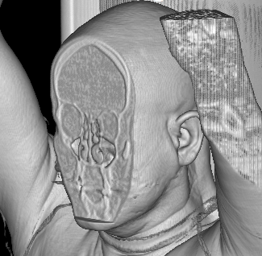
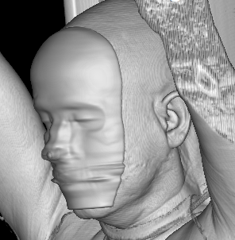
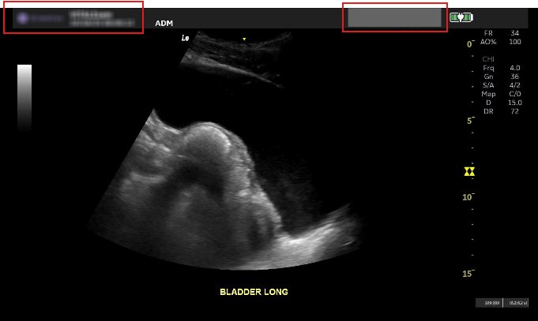

.. _pixels-masker-plugin:

Pixels Masker plugin
====================

.. contents::

This page describes a plugin that extends the ``/modify`` and ``/anonymize``
REST API routes enabling masking of pixels in the image.

.. Disclaimer::
  This plugin is very low-level and does not detect the area to masks.
  This plugin does not have a UI; it is only available through the REST API.

Configuration
-------------

.. highlight:: json

Here's a sample configuration section for this plugin with its default values::

  {
    "PixelsMasker": {

      // Enables/disables the plugin
      "Enable": false
  }

REST API
--------

The plugins does not replace the default ``/modify`` and ``/anonymize`` API routes but provides new
variants at:

- ``/plugins/pixels-masker/studies/../modify``
- ``/plugins/pixels-masker/studies/../anonymize``
- ``/plugins/pixels-masker/series/../modify``
- ``/plugins/pixels-masker/series/../anonymize``
- ``/plugins/pixels-masker/instances/../modify``
- ``/plugins/pixels-masker/instances/../anonymize``

These are the additional fields that can be added to regular ``/modify`` and ``/anonymize`` payloads::

    {
        "MaskPixelData" : {
            "Regions": [
                {
                    "MaskType": "MeanFilter",
                    "FilterWidth": 20,
                    "RegionType" : "2D",             // area is defined by an area in pixel coordinates
                    "Origin": [150, 100],            // X, Y in pixel coordinates
                    "End": [400, 200],               // X, Y in pixel coordinates
                    "TargetSeries" : [               // the series the pixel mask applies to.  If empty -> applies to all series
                        "cd589a09-6e705e06-57997219-7812eb49-709873a9"
                    ],
                    "TargetInstances" : [            // the instances the pixel mask applies to.  If empty -> applies to all instances
                    ]
                },
                {
                    "MaskType": "Fill",
                    "FillValue": 0,
                    "RegionType" : "3D",                // area is defined by a volume in world coordinates
                    "Origin": [-150.5, -250.4, -811],   // X, Y, Z in World coordinates
                    "End": [148.4, 220.7, -955],        // X, Y, Z in World coordinates
                    "TargetSeries" : [                  // in this mode, no need to list the instances since the Z coordinate shall handle that !
                        "94df9100-3b476f5b-f4e8c381-d78c327f-a387bc7e"
                    ]
                }
            ]
        }
    }

Here's a sample REST API call to mask the pixels with a constant value in a 3D image::

    $ curl -X POST http://localhost:8042/plugins/pixels-masker/studies/321d3848-40c81c82-49f6f235-df6b1ec7-ed52f2fa/modify \
        --data-binary '{
                "Replace" : {
                    "StudyInstanceUID": "1.2.3", 
                    "StudyDescription": "Filled Area"
                },
                "Force": true,
                "MaskPixelData": {
                    "Regions": [{
                        "MaskType": "Fill",
                        "FillValue": 0,
                        "RegionType" : "3D",
                        "Origin": [-150.0, -300, -750],
                        "End": [150.0, -250, -1000]
                }]
                }
            }'

And the same request to apply a mean filter on the same area::

    $ curl -X POST http://localhost:8042/plugins/pixels-masker/studies/321d3848-40c81c82-49f6f235-df6b1ec7-ed52f2fa/modify \
        --data-binary '{
                "Replace" : {
                    "StudyInstanceUID": "1.2.4", 
                    "StudyDescription": "Mean Filter"
                },
                "Force": true,
                "MaskPixelData": {
                    "Regions": [{
                        "MaskType": "MeanFilter",
                        "FilterWidth": 30,
                        "RegionType" : "3D",
                        "Origin": [-150.0, -300, -750],
                        "End": [150.0, -250, -1000]
                }]
                }
            }'

Here is a request to apply multiple 2D masks on an US series::

    $ curl -X POST http://localhost:8042/plugins/pixels-masker/series/4583e108-24b5e113-2be9a691-7183e535-902578c7/modify \
        --data-binary '{
                "Replace" : {
                    "StudyInstanceUID": "1.2.5", 
                    "StudyDescription": "Masked US"
                },
                "Force": true,
                "MaskPixelData": {
                    "Regions": [{
                        "MaskType": "MeanFilter",
                        "FilterWidth": 20,
                        "RegionType" : "2D",
                        "Origin": [0, 0],
                        "End": [400, 60]
                }, {
                        "MaskType": "Fill",
                        "FillValue": 100,
                        "RegionType" : "2D",
                        "Origin": [1080, 0],
                        "End": [1380, 60]
                }]
                }
            }'

