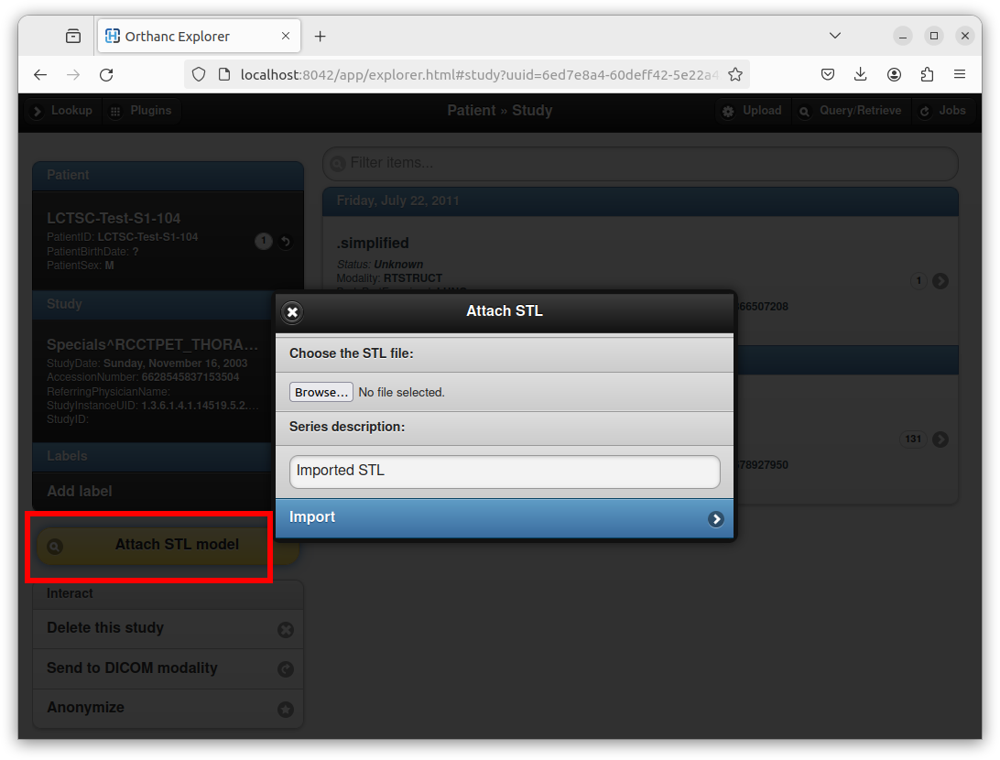
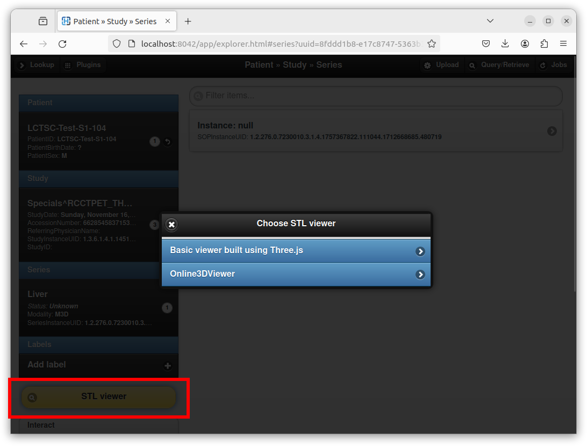
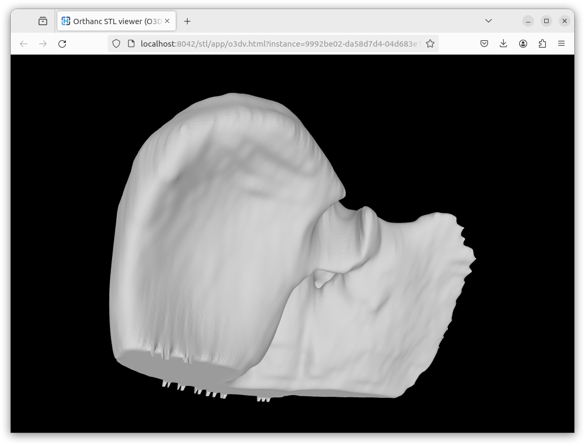
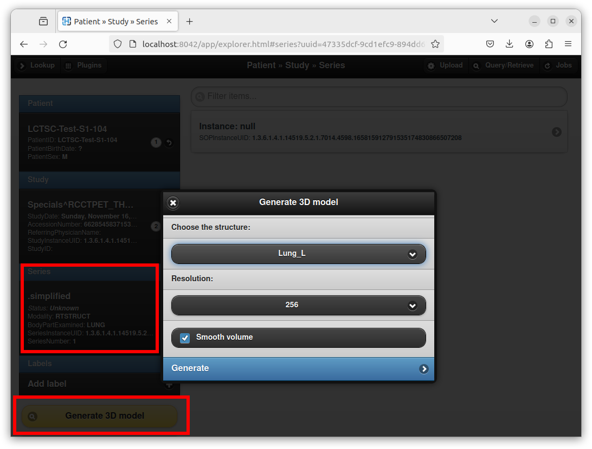
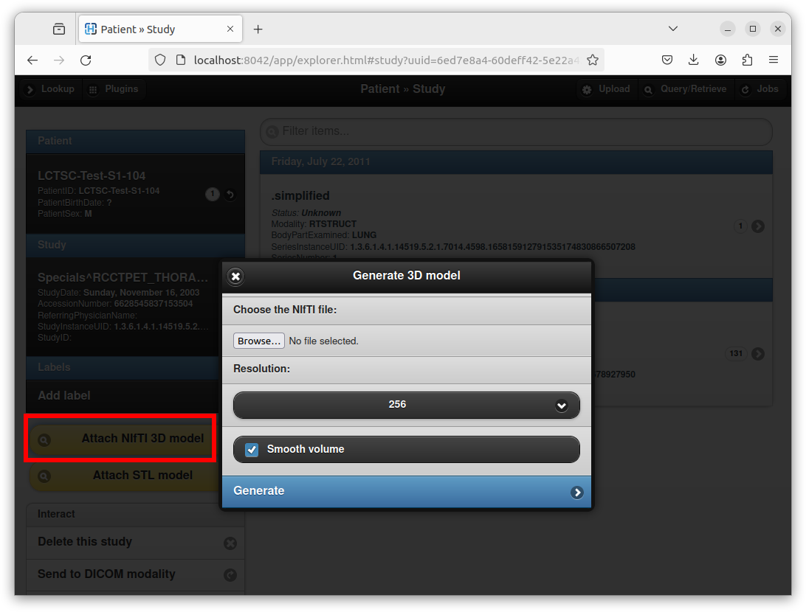
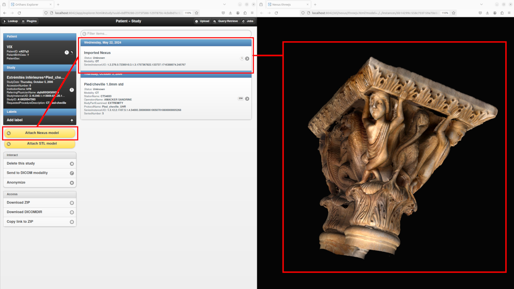
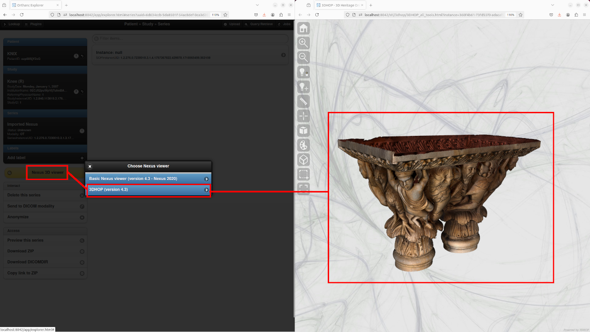

.. _stl-plugin:

STL plugin for Orthanc
======================

.. contents::

Overview
--------

This **official** plugin by the `ICTEAM institute of UCLouvain
<https://orthanc.uclouvain.be/>`__ extends Orthanc with support for
`Encapsulated 3D Manufacturing Model IODs
<https://dicom.nema.org/medical/dicom/current/output/chtml/part03/sect_A.85.html>`_.
As of release 1.0 of the plugin, this support is limited to `STL files
<https://en.wikipedia.org/wiki/STL_(file_format)>`__.

The plugin allows to attach STL files to existing DICOM studies and to
generate a STL mesh from structure sets (i.e., DICOM RT-STRUCT) or
from `NIfTI binary volumes
<https://en.wikipedia.org/wiki/Neuroimaging_Informatics_Technology_Initiative>`__.
A high-level description of these features is `available as a paper
<https://doi.org/10.1145/3632047.3632051>`__.

Importantly, any creation of a STL file requires the version of
Orthanc to be above or equal to 1.12.1.

**For researchers**: `Please cite this paper
<https://doi.org/10.1145/3632047.3632051>`__.

Compilation
-----------

.. highlight:: bash

Official releases can be `downloaded from the Orthanc homepage
<https://orthanc.uclouvain.be/downloads/sources/orthanc-stl/index.html>`__. As
an alternative, the `repository containing the source code
<https://orthanc.uclouvain.be/hg/orthanc-stl/>`__ can be accessed
using Mercurial.

The procedure to compile this plugin is similar of that for the
:ref:`core of Orthanc <binaries>`. The following commands should work
on most GNU/Linux distributions, provided Docker is installed::

  $ mkdir Build
  $ cd Build
  $ ../Resources/CreateJavaScriptLibraries.sh
  $ cmake .. -DSTATIC_BUILD=ON -DCMAKE_BUILD_TYPE=Release
  $ make

The compilation will produce a shared library ``libOrthancSTL.so``
that contains the STL plugin for Orthanc.

Pre-compiled Linux Standard Base (LSB) binaries `are available for
download <https://orthanc.uclouvain.be/downloads/linux-standard-base/orthanc-stl/index.html>`__.

Pre-compiled binaries for `Microsoft Windows <https://orthanc.uclouvain.be/downloads/windows-32/orthanc-stl/index.html>`__
and `macOS <https://orthanc.uclouvain.be/downloads/macos/orthanc-stl/index.html>`__ are available as well.

Furthermore, the :ref:`Docker images <docker>`
``jodogne/orthanc-plugins`` and ``orthancteam/orthanc`` also contain the
plugin. Debian and Ubuntu packages can be found in the
:ref:`standalone repository <binaries>`
``https://orthanc.uclouvain.be/debian/``.

.. _stl_orthanc_explorer:

Usage using Orthanc Explorer
----------------------------

The plugin extends the default :ref:`Orthanc Explorer
<orthanc-explorer>` Web interface with some new features.

.. _stl_attach:

Attach STL file
^^^^^^^^^^^^^^^

An existing STL file can be attached to an existing DICOM study by
clicking on the "*Attach STL model*" yellow button:

After selecting the STL file, entering a series description, and
clicking on the "*Import*" button, Orthanc creates a new DICOM
instance that embeds the STL file. Orthanc Explorer then automatically
opens the parent DICOM series containing the newly created DICOM STL
instance. A button entitled "*STL viewer*" can then be used to render
the STL:

Note how the STL plugin provides two viewers:

* One `very basic custom viewer
  <https://orthanc.uclouvain.be/hg/orthanc-stl/file/OrthancSTL-1.0/WebApplications/three.js>`__
  with a small footprint that is directly built using the well-known
  `Three.js library <https://en.wikipedia.org/wiki/Three.js>`__.

* One slightly more advanced Web viewer that corresponds to `Online 3D
  Viewer <https://github.com/kovacsv/Online3DViewer>`__ running in
  `engine mode
  <https://kovacsv.github.io/Online3DViewer/Page_Usage.html>`__.

Here is a screenshot of a rendering using the Online3DViewer embedded
viewer:

.. _stl_rt_struct:

Create STL from RT-STRUCT
^^^^^^^^^^^^^^^^^^^^^^^^^

The plugin can also be used to create a STL model from DICOM structure
sets (RT-STRUCT) that are routinely used in the context of
radiotherapy and nuclear medicine. To this end, open a DICOM RT-STRUCT
series using Orthanc Explorer:

As can be seen in this screenshot, an interface opens to choose the
structure set of interest, as well as the resolution of the
intermediate 3D bitmap that will be used to create the STL mesh. After
clicking on the "*Generate*" button, just like if :ref:`attaching an
existing STL file <stl_attach>`, Orthanc Explorer will open the newly
created DICOM series and will propose to open a STL viewer.

Internally, the 3D model is generated using the well-known `marching
cubes algorithm <https://en.wikipedia.org/wiki/Marching_cubes>`__, as
implemented by the `VTK library <https://en.wikipedia.org/wiki/VTK>`__
by Kitware. Additional technical details can be found in the
`reference paper <https://doi.org/10.1145/3632047.3632051>`__.

Create STL from binary NIfTI
^^^^^^^^^^^^^^^^^^^^^^^^^^^^

.. highlight:: json

Besides converting :ref:`RT-STRUCT to STL <stl_rt_struct>`, it is also
possible to convert a `NIfTI
<https://en.wikipedia.org/wiki/Neuroimaging_Informatics_Technology_Initiative>`__
3D binary bitmap into a STL mesh. As this use case is very specific,
it must be explicitly enabled in the :ref:`configuration file of
Orthanc <configuration>` as follows::

  {
    "Plugins" : [ "libOrthancSTL.so" ],
    "STL" : {
      "EnableNIfTI" : true
    }
  }

If the ``EnableNIfTI`` option is present, a new button entitled
"*Attach NIfTI 3D model*" appears if opening an existing DICOM study:

This dialog box can be used to upload a NIfTI volume, and to generate
a 3D mesh with a specific resolution through the marching cubes
algorithm.

REST API
--------

Besides :ref:`extending the Orthanc Explorer user interface
<stl_orthanc_explorer>`, the STL plugin adds dedicated routes to the
REST API of Orthanc.

DICOM-ization of STL files
^^^^^^^^^^^^^^^^^^^^^^^^^^

The creation of a DICOM instance that embeds an existing STL file can
be done using the ``/tools/create-dicom`` `route
<https://orthanc.uclouvain.be/api/#tag/System/paths/~1tools~1create-dicom/post>`__
in the built-in REST API of Orthanc (starting with version
1.12.1). This route can be used similarly to the :ref:`DICOM-ization
of PDF files <pdf>`, with the `data URI scheme
<https://en.wikipedia.org/wiki/Data_URI_scheme>`__ using ``model/stl``
instead of ``application/pdf``. Here is a working example in Python 3:

.. literalinclude:: stl/dicomize.py
                    :language: python

Note that if the ``Parent`` field is not provided, a new DICOM study
will be created.

Extraction of STL from DICOM
^^^^^^^^^^^^^^^^^^^^^^^^^^^^

.. highlight:: txt

The route ``/instances/{id}/stl`` can be used to extract a STL from a
DICOM instance embedding a STL file, where ``id`` is the :ref:`Orthanc
identifier <orthanc-ids>` of the DICOM instance. For instance::

  $ curl http://localhost:8042/instances/a88c4c3f-8f2bd6fd-02080bed-92ab6817-2cb3c26e/stl > /tmp/liver.stl
  $ meshlab /tmp/liver.stl

Evidently, an error is generated for DICOM instances that do not embed
a STL file. Note that ``meshlab`` is a well-known desktop application
to display STL file.

Listing structures of a DICOM RT-STRUCT
^^^^^^^^^^^^^^^^^^^^^^^^^^^^^^^^^^^^^^^

.. highlight:: txt

The STL plugin provides the list of the names of the structures that
are part of a DICOM RT-STRUCT instance with :ref:`Orthanc identifier
<orthanc-ids>` ``id`` at route ``/stl/rt-struct/{id}``. For instance::

  $ curl http://localhost:8042/stl/rt-struct/f0dc2345-8f627774-f66083ae-a14d781e-1187b513
  [
    "Esophagus",
    "Heart",
    "Lung_L",
    "Lung_R",
    "SpinalCord"
  ]

Generating a STL mesh from RT-STRUCT
^^^^^^^^^^^^^^^^^^^^^^^^^^^^^^^^^^^^

A DICOM RT-STRUCT instance can be converted into a DICOM STL instance
using the ``/stl/encode-rtstruct`` route provided by the STL plugin.
Here is a sample Python script:

.. literalinclude:: stl/rt-struct.py
                    :language: python

Note that contrarily to :ref:`the default user interface
<stl_rt_struct>`, this route can be used to encode multiple structure
sets as a single STL model.

Generating a STL mesh from NIfTI
^^^^^^^^^^^^^^^^^^^^^^^^^^^^^^^^

Here is a sample Python 3 script to convert a NIfTI file as a DICOM
STL instance:

.. literalinclude:: stl/nifti.py
                    :language: python

Support for Nexus
-----------------

Starting with release 1.1, the STL plugin provides support for the
DICOM-ization of 3D models encoded using the `Nexus file format (.NXS
and .NXZ extensions) <https://vcg.isti.cnr.it/nexus/>`__. Nexus
provides a way to publish large, **textured 3D models** over Internet,
with **adaptive rendering** depending on the available network
bandwidth. Nexus is notably popular for the preservation of **cultural
heritage**.

The plugin ships the static HTML/CSS/JavaScript assets of the official
Nexus Web viewer, so that it can easily be opened right from Orthanc
Explorer, as depicted in the following screenshot:

|

Starting with release 1.2 of the STL plugin, the `3DHOP viewer
<https://www.3dhop.net/>`__ is also available to render DICOM-ized
Nexus models:

                   

Internals
^^^^^^^^^

Because Nexus is not endorsed by the DICOM specification, the plugin
encapsulates the Nexus file using the `Raw Data IOD
<https://dicom.nema.org/medical/dicom/current/output/chtml/part03/sect_A.37.3.html>`__.
The Nexus file is encoded as the ``(0x4205,0x1001)`` private DICOM
tag.

Configuration
^^^^^^^^^^^^^

.. highlight:: json

As it is non-standard, support for Nexus must be explicitly enabled in
the configuration file of Orthanc as follows::

  {
    "Plugins" : [ "libOrthancSTL.so" ],
    "STL" : {
      "EnableNexus" : true
    }
  }

More advanced configuration options are available::

  {
    "Plugins" : [ "libOrthancSTL.so" ],
    "STL" : {
      "EnableNexus" : true,
      "3DHOP" : {
        "CanvasStyle": "background-color: rgb(0,0,0)"  // Change the background of 3DHOP viewer
      }
    }
  }

REST API
^^^^^^^^

The STL plugin extends the REST API with two routes that are dedicated
to the handling of Nexus files:

1. ``/stl/create-nexus`` can be used to DICOM-ize a Nexus file. This
   route is a wrapper around the ``/tools/create-dicom``
   :ref:`standard route of Orthanc <image-dicomization>`. The Nexus
   file must be provided as a `Base64 string
   <https://en.wikipedia.org/wiki/Base64>`__ in the ``Content`` field
   of the request. Here is a sample Python script::

.. literalinclude:: stl/nexus.py
                    :language: python

2. ``/instances/{id}/nexus`` provides access to a DICOM-ized Nexus
   file by decapsulating it from the DICOM instance whose
   :ref:`Orthanc identifier <orthanc-identifiers>` is
   ``id``. Importantly, this route supports `HTTP range requests
   <https://developer.mozilla.org/en-US/docs/Web/HTTP/Range_requests>`__
   for adaptive streaming of Nexus models over Internet.
