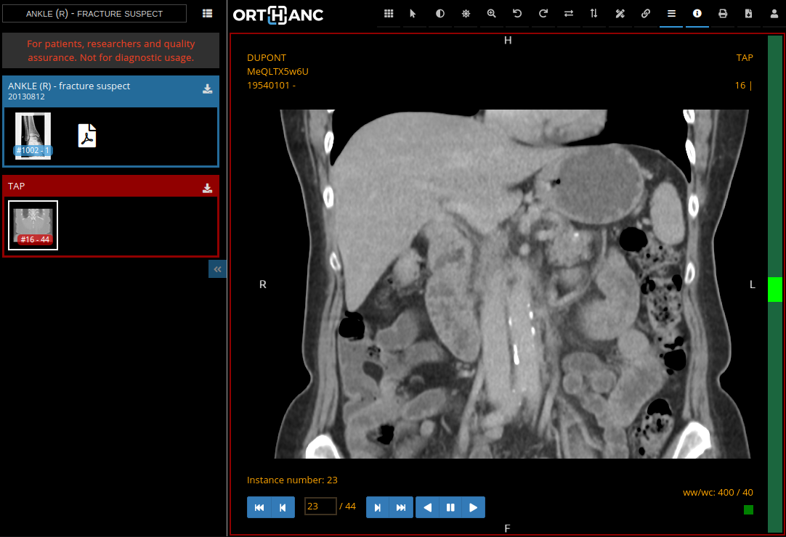
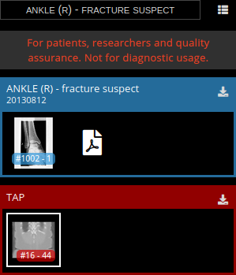
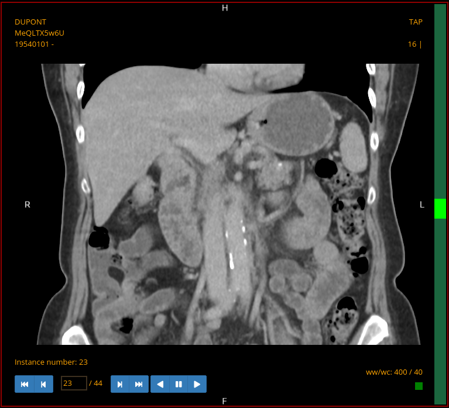
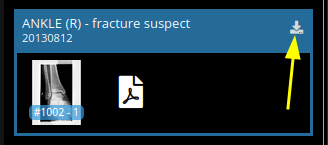
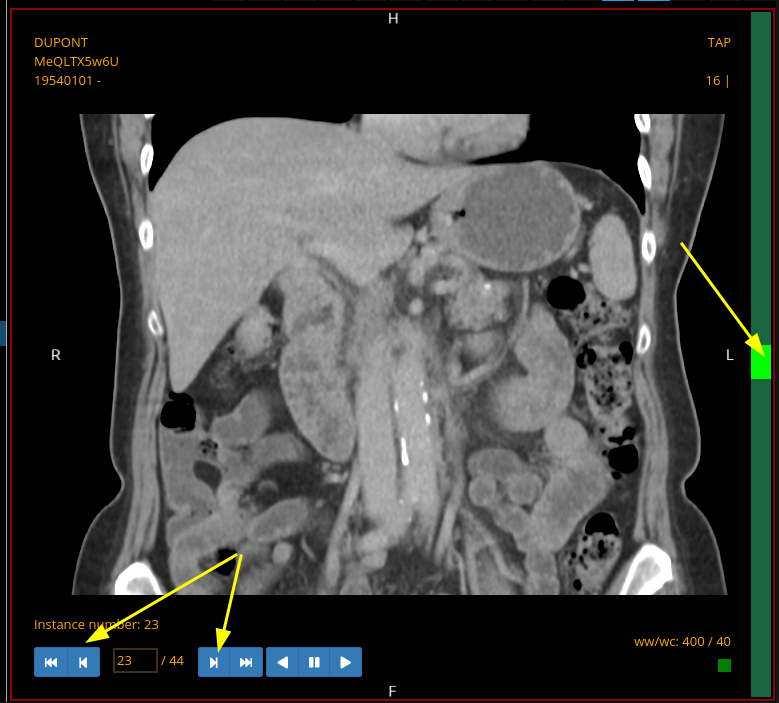
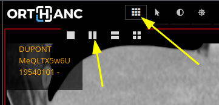
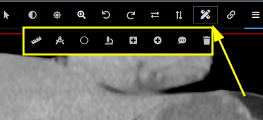
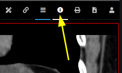
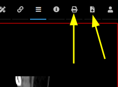

.. _stone-quick-start:

Stone Web Viewer quick start guide
==================================

.. contents::

This short guide highlights the main features of the :ref:`Orthanc
Stone viewer <stone_webviewer>`.

Overview
--------

One or more studies can be loaded in the viewer. Here is a sample with 2 studies loaded:

The viewer interface is made of 3 main areas: the side panel on the
left, the toolbar at the top and the viewport in the main area.

Side panel
..........

The side panel shows the list of the loaded studies. Each study has
its own random color:

Toolbar
.......

The toolbar contains all the tools to interact with the series loaded in the viewport:

Viewport
........

The view port will show one (or more) series:

How to?
-------

Show a series
.............

Drag a series icon from a study in the side panel and drop it to the viewport.

Download a study
................

Click on the download icon in the side panel:

Browse the instances
....................

Use one of these:

* Mouse wheel
* Navigation buttons (bottom of the viewport)
* Navigation bar (right of the viewport)

Manage windowing
................

Click-drag to change the Hounsfield windowing level and modify the
contrast/brightness of the image. The viewer comes with a series of
windowing presets for lung, bone,... that are configured at
installation. The viewer will also suggest presets that are stored in
the image DICOM tags.

Zoom the image
..............

Use the mouse right click and move the mouse up and down.

Compare two series
..................

Use the viewport manager in the toolbar to display 2 viewports:

Then, drag a different series on each viewport.

Annotate an image
.................

Click on the annotate tool in the toolbar and then on the annotation
tool you want to use:

Hide/show series information
............................

Click on the toggle button:

Print or download a JPEG export of the current image
....................................................

|
