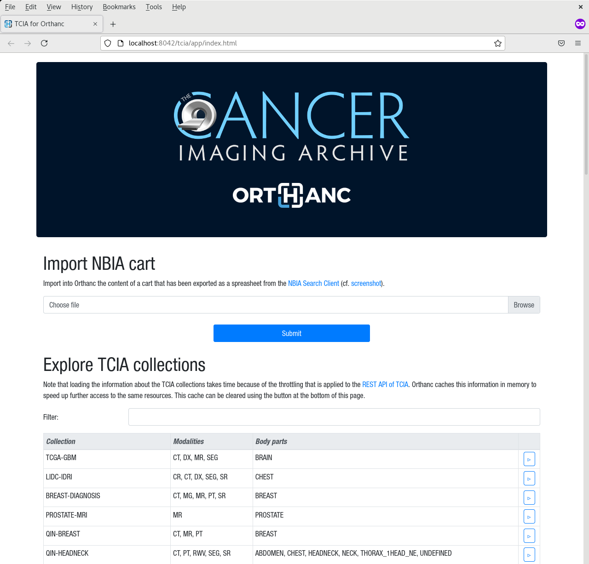
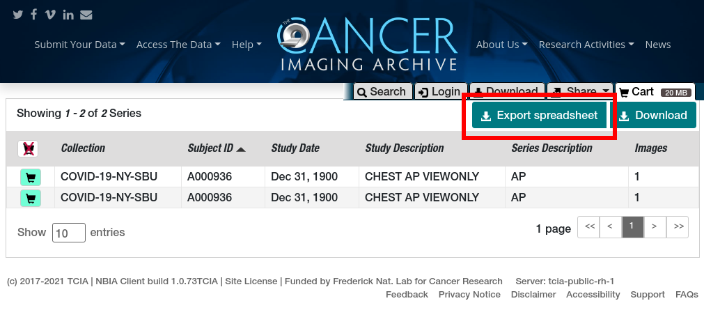

.. _tcia:

TCIA plugin
===========

.. contents::

This **official** plugin extends Orthanc with a Web interface that can
be used to import open-data medical images from `The Cancer Imaging
Archive (TCIA) <https://www.cancerimagingarchive.net/>`__, and serve
them immediately using Orthanc.

The plugin can be used to import so-called "cart spreadsheet"
generated by the `NBIA Search Client
<https://nbia.cancerimagingarchive.net/nbia-search/>`__, or to browse
the image collections of TCIA thanks to its `REST API
<https://wiki.cancerimagingarchive.net/display/Public/TCIA+REST+API+Guide>`__.

Compilation
-----------

.. highlight:: bash

The procedure to compile this plugin is similar of that for the
:ref:`core of Orthanc <binaries>`. The following commands should work
for most UNIX-like distribution (including GNU/Linux)::

  $ mkdir Build
  $ cd Build
  $ cmake .. -DSTATIC_BUILD=ON -DCMAKE_BUILD_TYPE=Release
  $ make

The compilation will produce a shared library ``OrthancTcia``
that contains the TCIA plugin for Orthanc.

Pre-compiled Linux Standard Base (LSB) binaries `can be downloaded
<https://lsb.orthanc-server.com/plugin-tcia/>`__.

Pre-compiled binaries for Microsoft Windows and macOS `are also
available
<https://www.orthanc-server.com/browse.php?path=/plugin-tcia>`__.

Furthermore, the :ref:`Docker images <docker>`
``jodogne/orthanc-plugins`` also contain the plugin.

Configuration
-------------

You of course first have to :ref:`install Orthanc <compiling>`. Once
Orthanc is installed, you must change the :ref:`configuration file
<configuration>` to tell Orthanc where it can find the plugin: This is
done by properly modifying the ``Plugins`` option.

You then have to set the two following options:

* The setting ``Enable`` in section ``Tcia`` must be set to ``true``
  to enable the TCIA plugin.

* The setting ``HttpsCACertificates`` must contain a path to a file
  containing a list of `trusted Certificate Authorities (CA)
  <https://curl.haxx.se/docs/sslcerts.html>`__. Depending on your
  operating system, this file can be found as follows:

  - On Debian-based system, the standard file
    ``/etc/ssl/certs/ca-certificates.crt`` can be used.
  - On other systems (including Microsoft Windows), the cURL project
    provides `CA certificates
    <https://curl.haxx.se/docs/caextract.html>`__ that are extracted
    from Mozilla.

.. highlight:: json

On Ubuntu, you could for instance use the following minimalist
configuration file::

  {
    "HttpsCACertificates" : "/etc/ssl/certs/ca-certificates.crt",
    "Plugins" : [
      "/home/user/OrthancTcia/Build/libOrthancTcia.so"
    ],
    "Tcia" : {
      "Enable" : true
    }
  }

.. highlight:: text

Orthanc must of course be restarted after the modification of its
configuration file.

Usage
-----

Once Orthanc Explorer is opened, a button entitled "The Cancer Imaging
Archive" will show up at the bottom of the page. Clicking on this
button will open the TCIA interface for Orthanc:

As can be seen, this Web application allows to both import a cart from
the NBIA Search Client, and to browse the various collections of
medical images from TCIA.

The following screenshot illustrates how to export a cart using the
NBIA Search Client, that can then be imported using this plugin:

