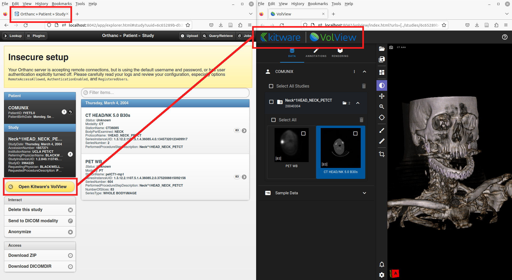
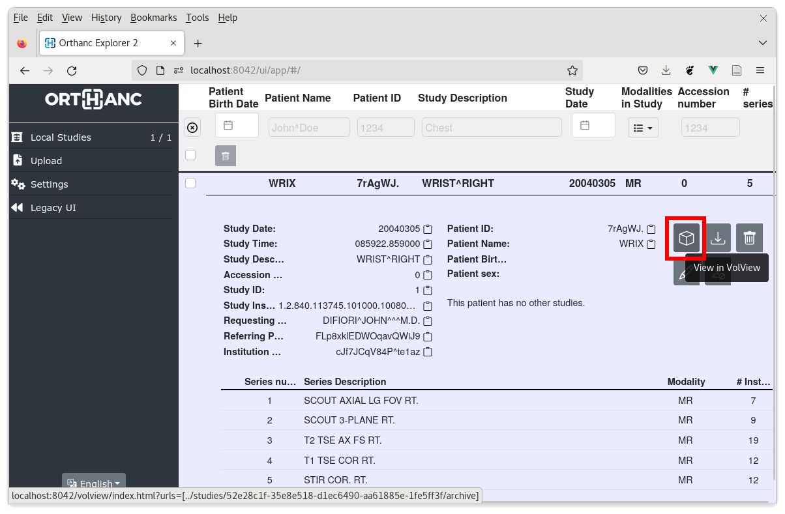

.. _volview:

Kitware's VolView plugin
========================

.. contents::

This **official** plugin by the `ICTEAM institute of UCLouvain
<https://uclouvain.be/en/research-institutes/icteam>`__ extends
Orthanc with `Kitware's VolView <https://volview.kitware.com/>`__ Web
interface for cinematic volume rendering of DICOM data.

Usage
-----

This plugin adds a dedicated button to Orthanc Explorer, which
provides an easy access to VolView (click on the image to view a demo
video):

|

Starting with its release 0.8.2, the :ref:`Orthanc Explorer 2
<orthanc-explorer-2>` plugin also provides a button to open VolView:

Compilation
-----------

.. highlight:: bash

Official releases can be `downloaded from the Orthanc homepage
<https://orthanc.uclouvain.be/downloads/sources/orthanc-volview/index.html>`__. As
an alternative, the `repository containing the source code
<https://orthanc.uclouvain.be/hg/orthanc-volview/>`__ can be accessed using
Mercurial.

The procedure to compile this plugin is similar of that for the
:ref:`core of Orthanc <binaries>`. The following commands should work
on most GNU/Linux distributions, provided Docker is installed::

  $ mkdir Build
  $ cd Build
  $ ../Resources/CreateVolViewDist.sh
  $ cmake .. -DSTATIC_BUILD=ON -DCMAKE_BUILD_TYPE=Release
  $ make

The compilation will produce a shared library ``libOrthancVolView.so``
that contains the VolView plugin for Orthanc.

Pre-compiled Linux Standard Base (LSB) binaries `are available for
download <https://orthanc.uclouvain.be/downloads/linux-standard-base/orthanc-volview/index.html>`__.

Pre-compiled binaries for `Microsoft Windows <https://orthanc.uclouvain.be/downloads/windows-32/orthanc-volview/index.html>`__
and `macOS <https://orthanc.uclouvain.be/downloads/macos/orthanc-volview/index.html>`__ are available as well.

Furthermore, the :ref:`Docker images <docker>`
``jodogne/orthanc-plugins`` and ``osimis/orthanc`` also contain the
plugin. Debian and Ubuntu packages can be found in the
:ref:`standalone repository <binaries>`
``https://debian.orthanc-labs.com/``.

Configuration
-------------

.. highlight:: json

Here is a minimal sample :ref:`configuration file <configuration>` to
use this plugin::

  {
    "Plugins" : [
      "/home/user/OrthancVolView/Build/libOrthancVolView.so"
    ]
  }

Orthanc must of course be restarted after the modification of its
configuration file.
