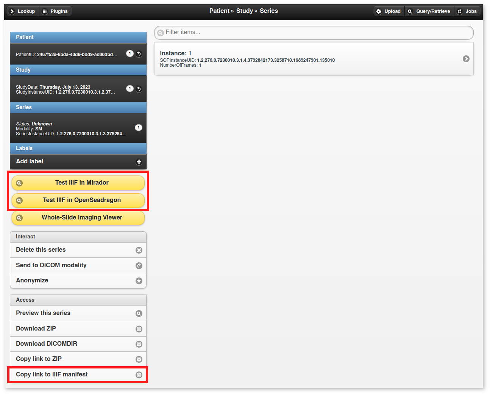
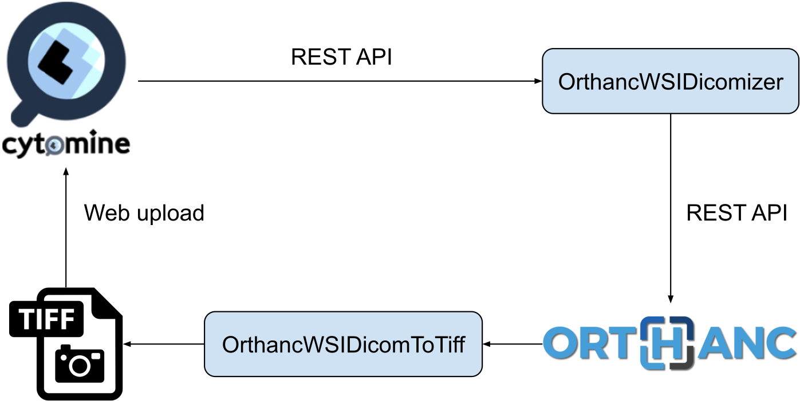
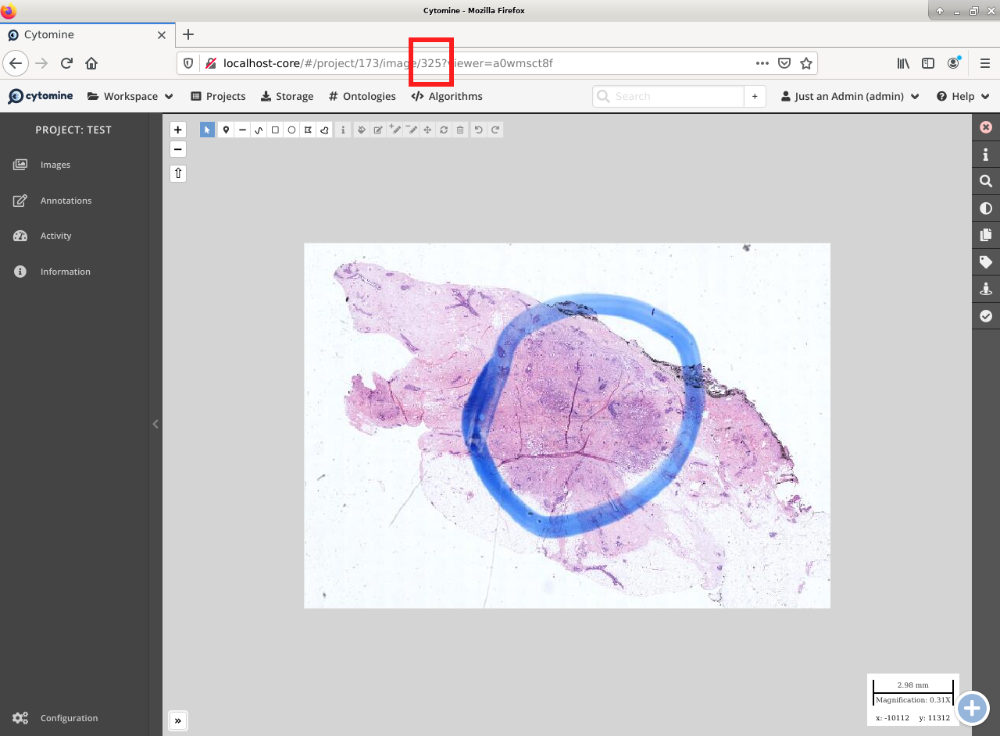
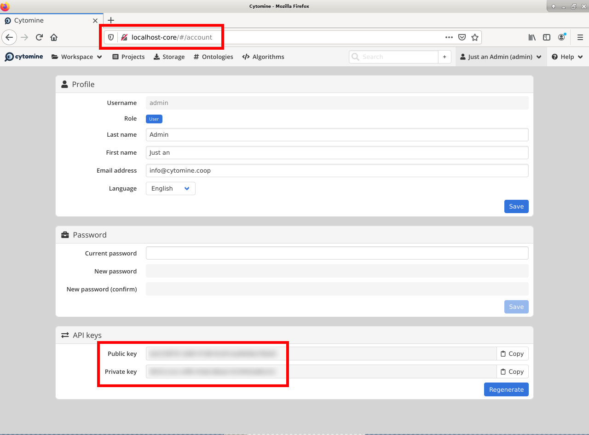

.. _wsi:

Whole-slide microscopic imaging
===============================

.. contents::

The Orthanc project provides three **official tools** to support DICOM
for whole-slide microscopic imaging (WSI):

1. A so-called "DICOM-izer" command-line tool that converts
   whole-slide images to DICOM series, following `Supplement 145
   <ftp://medical.nema.org/medical/dicom/final/sup145_ft.pdf>`__.
2. A plugin that extends Orthanc with a Web viewer of whole-slide
   images for digital pathology. 
3. Another command-line tool that converts a DICOM series stored
   inside Orthanc, to a standard hierarchical TIFF image.

Check out our `demonstration server
<https://orthanc.uclouvain.be/wsi/>`__.

**For researchers**: `Please cite this paper
<https://doi.org/10.5220/0006155100810087>`__.

Compilation
-----------

Static linking
^^^^^^^^^^^^^^

.. highlight:: text

The procedure to compile the WSI framework is similar of that for the
:ref:`core of Orthanc <binaries>`. The following commands should work
for most UNIX-like distribution (including GNU/Linux)::

  # Firstly, compile the command-line tools
  $ mkdir Applications/Build
  $ cd Applications/Build
  $ cmake .. -DSTATIC_BUILD=ON -DCMAKE_BUILD_TYPE=Release
  $ make

  # Secondly, compile the viewer plugin
  $ mkdir ../../ViewerPlugin/Build
  $ cd ../../ViewerPlugin/Build
  $ cmake .. -DSTATIC_BUILD=ON -DCMAKE_BUILD_TYPE=Release
  $ make  

The compilation will produce 3 binaries:

* ``Applications/Build/OrthancWSIDicomizer``, which contains the DICOM-izer.
* ``Applications/Build/OrthancWSIDicomToTiff``, which contains the DICOM-to-TIFF converter.
* ``ViewerPlugin/Build/OrthancWSI``, which is a shared library containing the viewer plugin for Orthanc.

Microsoft Windows
^^^^^^^^^^^^^^^^^
  
Note that pre-compiled binaries for Microsoft Windows `are available
<https://orthanc.uclouvain.be/downloads/windows-32/orthanc-wsi/index.html>`__.

Dynamic linking
^^^^^^^^^^^^^^^

.. highlight:: text
               
If static linking is not desired, here are build instructions for
Ubuntu 16.04 (provided build dependencies for the :ref:`core of
Orthanc <compiling>` have already been installed)::

  $ sudo apt-get install libopenjpeg-dev

  # Firstly, compile the command-line tools
  $ mkdir Applications/Build
  $ cd Applications/Build
  $ cmake .. -DCMAKE_BUILD_TYPE=Release -DUSE_SYSTEM_ORTHANC_SDK=OFF
  $ make

  # Secondly, compile the viewer plugin
  $ mkdir ../../ViewerPlugin/Build
  $ cd ../../ViewerPlugin/Build
  $ cmake .. -DCMAKE_BUILD_TYPE=Release -DUSE_SYSTEM_ORTHANC_SDK=OFF -DALLOW_DOWNLOADS=ON
  $ make

Usage of the plugin
-------------------

.. highlight:: text

You of course first have to :ref:`install Orthanc <compiling>`. Once
Orthanc is installed, you must change the :ref:`configuration file
<configuration>` to tell Orthanc where it can find the plugin: This is
done by properly modifying the ``Plugins`` configuration option. You
could for instance use the following configuration file under
GNU/Linux::

  {
    "Name" : "MyOrthanc",
    [...]
    "Plugins" : [
      "/home/user/orthanc-wsi/ViewerPlugin/Build/libOrthancWSI.so"
    ]
  }

Orthanc must of course be restarted after the modification of its
configuration file. The WSI plugin has no specific configuration
option.

Once a :ref:`DICOM series <model-world>` is opened using :ref:`Orthanc
Explorer <orthanc-explorer>`, a yellow button entitled ``Whole-Slide
Imaging Viewer`` will show up for series corresponding to whole-slide
images. This button will open the WSI viewer for that particular
series. This behavior can be seen on the Orthanc Explorer interface
running on our `WSI demonstration server
<https://orthanc.uclouvain.be/wsi-orthanc/app/explorer.html>`__.

Support of IIIF
---------------

Starting with its release 2.0, the WSI plugin can act as a data source
that follows the `IIIF specification
<https://en.wikipedia.org/wiki/International_Image_Interoperability_Framework>`__. This
turns Orthanc into a tool to deliver collection of high-resolutions
images over the web through IIIF, while simultaneously enabling a
standard, long-term preservation of those collections through `DICOM
vendor-neutral archiving <https://en.wikipedia.org/wiki/DICOM>`__.

REST API
^^^^^^^^

The WSI plugin associates each of the **DICOM series** stored by
Orthanc whose :ref:`Orthanc identifier <orthanc-ids>` is ``seriesId``,
with a IIIF-compliant `Presentation API 3.0
<https://iiif.io/api/presentation/3.0/>`__ manifest located at URI
``/wsi/iiif/series/{seriesId}/manifest.json`` in the Web server of
Orthanc. In turn, this manifest points to a IIIF-compliant `Image API
3.0 <https://iiif.io/api/image/3.0/>`__ data source to deliver the
DICOM series over the web.

Note that this data source is not only available for the whole-slide
microscopic series, but also for the other types of medical images,
which enables both telepathology and teleradiology workflows:

* In the case of a whole-slide image, the URI to the IIIF data source
  is: ``/wsi/iiif/tiles/{seriesId}/info.json``.

* In the case of a regular radiology series, one IIIF data source is
  associated with each frame of the DICOM series. Indeed, the
  :ref:`DICOM model of the real-world <model-world>` specifies that a
  single DICOM series can contain multiple instances, which in turn
  can contain multiple frames. The URI to the IIIF data source
  corresponding to one individual frame of interest is:
  ``/wsi/iiif/frames/{seriesId}/{frameIndex}/info.json``, where
  ``frameIndex`` is the index of the frame in the DICOM series.  The
  ``manifest.json`` of the parent DICOM series automatically
  aggregates all the frames of the series as a single collection.

Web user interface
^^^^^^^^^^^^^^^^^^
  
:ref:`Orthanc Explorer <orthanc-explorer>` contains a button to easily
copy/paste the URL of the IIIF manifest corresponding to a DICOM
series:

|

Furthermore, as can be seen in the image above, buttons can be enabled
to test the opening of the IIIF data source using `Mirador
<https://projectmirador.org/>`__ and/or `OpenSeadragon
<https://openseadragon.github.io/>`__.

Pay attention to the fact that the assets of Mirador and OpenSeadragon
(notably JavaScript) are loaded from the `unpkg CDN
<https://www.unpkg.com/>`__, which necessitates an Internet
connection. For this reason, these assets are disabled by default.

Configuration options
^^^^^^^^^^^^^^^^^^^^^

.. highlight:: json

The IIIF features can be configured using the following
:ref:`configuration file <configuration>` of Orthanc::

  {
    "Name" : "MyOrthanc",
    [...]
    "Plugins" : [
      "/home/user/orthanc-wsi/ViewerPlugin/Build/libOrthancWSI.so"
    ],
    "WholeSlideImaging" : {
      "EnableIIIF" : true,           // Can be used to disable support of IIIF
      "OrthancPublicURL" : "http://localhost:8042/",
      "ServeMirador" : false,        // Whether to show the "Test IIIF in Mirador" button
      "ServeOpenSeadragon" : false,  // Whether to show the "Test IIIF in OpenSeadragon" button
      "ForcePowersOfTwoScaleFactors" : true   // Can be used to disable the compatibility mode
    }
  }

A few remarks:
  
* The ``OrthancPublicURL`` option must be adapted if Orthanc is
  branched behind a :ref:`reverse proxy <nginx>`.

* In the case of a whole-slide image, the
  ``ForcePowersOfTwoScaleFactors`` option instruct the WSI plugin to
  only publish the pyramid levels whose scale factors follow a
  powers-of-two patterns (i.e., 1, 2, 4, 8, 16...). This provides
  maximum compatibility with viewers (for instance, consider `this
  issue
  <https://github.com/openseadragon/openseadragon/issues/2379>`__),
  but can break a smooth delivery of high-resolution images whose
  pyramid is irregular. Compatibility mode is enabled by default.

Command-line tools
------------------

.. highlight:: text

The command-line tools ``OrthancWSIDicomizer`` and
``OrthancWSIDicomToTiff`` provide documentation of all their options
if started with the ``--help`` parameter::

  $ ./OrthancWSIDicomizer --help
  $ ./OrthancWSIDicomToTiff --help

In this section, we review the most common usages of these tools.

Transcoding a DICOM image
^^^^^^^^^^^^^^^^^^^^^^^^^

The most simple usage consists in converting some whole-slide image to
DICOM, then uploading it to Orthanc::

  $ ./OrthancWSIDicomizer Source.tif

This command will transcode some `hierarchical, tiled TIFF
<https://en.wikipedia.org/wiki/TIFF>`__ image called ``Source.tif``,
and push the generated DICOM files to the default Orthanc server
(running on ``localhost`` and listening to HTTP port ``8042``) using
its :ref:`REST API <rest>`. The log of the command will give you the
:ref:`identifier of the generated series <orthanc-ids>`, so that you
can locate it in Orthanc Explorer. This conversion is fast, as no
re-encoding takes place: If the source TIFF image contains JPEG tiles,
these tiles will be simply written as such.

Obviously, you can specify the parameters of the REST API of your
target Orthanc server::

  $ ./OrthancWSIDicomizer Source.tif --orthanc=http://localhost:8042/ --username=orthanc --password=orthanc

It is also possible to write the DICOM instances directly onto some
folder of the filesystem (the target folder must be existing)::

  $ ./OrthancWSIDicomizer Source.tif --folder=/tmp/dicomized/

This command will create a set of files entitled like
``/tmp/dicomized/wsi-XXXXXX.dcm``. You can modify this pattern using
the command-line option ``--folder-pattern``.

By default, the DICOM-izer will spread the output series as a set of
DICOM files whose size stays below 10MB. This prevents the appearance
of huge files, which speeds up further processing. This behavior can
be controlled using the ``--max-size`` command-line option.

Re-encoding a DICOM image
^^^^^^^^^^^^^^^^^^^^^^^^^

The section above explained how to transcode whole-slide images,
without modifying the compression scheme of their individual tiles
(which is most commonly JPEG). You can instruct the DICOM-izer to
re-encode each and every individual tile as follows::

  $ ./OrthancWSIDicomizer Source.tif --reencode=1 --compression=jpeg2000

This example would create a series of DICOM instances encoded using
the JPEG2k transfer syntax (whose UID is ``1.2.840.10008.1.2.4.90``).
As JPEG2k is not natively supported by many Web browsers, the Web
viewer plugin would transparently convert such JPEG2k-encoded tiles to
PNG images.

It is also possible to re-encode the image so as to reduce disk space
consumption by changing the JPEG quality::

  $ ./OrthancWSIDicomizer Source.tif --reencode=1 --compression=jpeg --jpeg-quality=10

The DICOM-izer also allows to re-generate all the multi-resolution
pyramid. This is extremely importantly to enhance the user experience
of the Web interface, if the source image only features the finest
zoom level of the whole-slide image::

  $ ./OrthancWSIDicomizer Source.tif --pyramid=1 --smooth=1

The number of levels in the pyramid can be controlled using the
``--levels`` command-line option. The ``--smooth=1`` option tells the
DICOM-izer to apply `Gaussian smoothing
<https://en.wikipedia.org/wiki/Gaussian_blur>`__ when re-scaling the
image, in order to avoid the appearance of aliasing in the
multi-resolution pyramid. This produces nicer images, at the price of
higher computation time.

All the examples described in this section are obviously much more
CPU-intensive than simple transcoding. The DICOM-izer takes advantage
in multi-threading to reduce the computation time.  By default, it will
use half the number of logical CPU cores that are available. This
behavior can be fine-tuned using command-line option ``--threads``.

Proprietary file formats
^^^^^^^^^^^^^^^^^^^^^^^^

Out-of-the-box, the DICOM-izer supports standard hierarchical TIFF
images. Some commonplace image formats (PNG and JPEG) can be
DICOM-ized as well. However, whole-slide images can come in many
proprietary file formats. To re-encode such images, the DICOM-izer
relies upon the `OpenSlide toolbox <https://openslide.org/>`__.

For this feature to work, you have to tell the command-line tool where
it can find the OpenSlide shared library. GNU/Linux distributions
generally provide packages containing the OpenSlide shared library
(e.g. under Debian/Ubuntu, simply install the ``libopenslide0``
package)::

  $ ./OrthancWSIDicomizer --openslide=libopenslide.so CMU-1-JP2K-33005.svs

Pre-compiled Microsoft Windows binaries of this shared library can be
found on the `OpenSlide homepage <https://openslide.org/download/>`__ (Note that
you should copy all .dll files from the OpenSlide package next to the OrthancWSIDicomizer
executable)::

  $ ./OrthancWSIDicomizer --openslide=libopenslide-0.dll CMU-1-JP2K-33005.svs

Note that this operation implies the re-encoding of the source image
from the proprietary file format, which is much more time-consuming
than simply transcoding a TIFF image.

Specifying a DICOM dataset
^^^^^^^^^^^^^^^^^^^^^^^^^^

So far, we have only been discussing the whole-slide image by itself,
and not the :ref:`medical information <dicom-tags>` that is associated
with each DICOM file. The DICOM tags that must be embedded inside the
generated DICOM series can be specified using the user-friendly JSON
file format. You would first generate a minimal, sample JSON dataset
as follows::

  $ ./OrthancWSIDicomizer --sample-dataset > dataset.json

Secondly, you would edit the just-generated ``dataset.json`` file
using any text editor (or any script interfaced with your RIS), so as
to encode medical information associated with the image
acquisition. Finally, tell the DICOM-izer where it can find the
dataset when re-encoding or transcoding the image::

  $ ./OrthancWSIDicomizer Source.tif --dataset=dataset.json

Note that it is always a good idea to check whether all the required
DICOM tags have been properly provided, e.g. by running the
``dciodvfy`` command-line tool provided by `David Clunie
<http://www.dclunie.com/dicom3tools.html>`__ that checks the
compliance of DICOM files.

Converting DICOM to TIFF
^^^^^^^^^^^^^^^^^^^^^^^^

The whole-slide imaging framework for Orthanc also provides a
command-line tool that converts some DICOM series, as a standard
hierarchical, tiled TIFF image. This is important if you wish to
export some DICOM file to a framework that does not support DICOM
Supplement 145.

Here is how you would convert a whole-slide image stored in the
default Orthanc server::

  $ ./OrthancWSIDicomToTiff fdf53e42-06d7377a-c24c59fd-3704e72d-f4c75b68 Target.tif

You just have to provide the :ref:`Orthanc identifier <orthanc-ids>`
of the series of interest (that can be retrieved using :ref:`Orthanc
Explorer <orthanc-explorer>` or the :ref:`REST API <rest>`), and the
path to the target TIFF file.

Similarly to the DICOM-izer, the command-line options ``--orthanc``,
``--username`` and ``--password`` can be used to specify the
parameters of your Orthanc server.

Interface with Cytomine
-----------------------

`Cytomine <https://cytomine.be/>`__ is an "*open-source rich internet
application for collaborative analysis of multi-gigapixel images.*"
Starting with release 1.1 of the whole-slide imaging framework for
Orthanc, it is possible to exchange digital pathology images back and
forth between Orthanc and Cytomine according to the following
workflow:

|

As can be seen, ``OrthancWSIDicomizer`` imports the source image from
Cytomine using its REST API, then puts the converted DICOM instances
onto Orthanc using its REST API. Here is a minimalist sample call to
the ``OrthancWSIDicomizer`` command-line tool to convert an image from
a Cytomine server onto an Orthanc server listening on
``localhost:8042`` with default parameters ::

  $ ./OrthancWSIDicomizer --cytomine-url=http://XXX --cytomine-image=325 \
                          --cytomine-public-key=YYY --cytomine-private-key=ZZZ \
                          --threads=4 --pyramid=1 --username=orthanc --password=orthanc --verbose 

The ``--cytomine-image`` parameter corresponds to the ID of the `Image
Instance <https://doc.uliege.cytomine.org/dev-guide/api/reference>`__
of interest. This ID can easily be retrieved from the Web interface of
Cytomine:

|

The ``--cytomine-public-key`` and ``--cytomine-private-key``
parameters grant access to the REST API of Cytomine, and can be found
in the parameters of your account using the Web interface of Cytomine:

|

REST API
--------

Besides providing an user interface, the plugin for whole-slide
imaging also enrich the :ref:`REST API <rest>` of Orthanc with some
new URIs, that are described in this section.

Note that the Web interface of the plugin exclusively relies upon this
enriched REST API in order to display whole-slide images using the
`OpenLayers 3 <https://openlayers.org/>`__ JavaScript library.

Information about a whole-slide image
^^^^^^^^^^^^^^^^^^^^^^^^^^^^^^^^^^^^^

You can check whether a DICOM series associated with some known
:ref:`Orthanc ID <orthanc-ids>` ``id`` corresponds to a whole-slide
image by calling the ``/wsi/pyramids/{id}`` URI. A HTTP status code
404 is returned if the series is *not* a whole-slide image::

  $ curl -v http://localhost:8042/wsi/pyramids/ca2cc2ef-2dd8be12-0a4506ae-d565b7e1-a4ca9068
  [...]
  < HTTP/1.1 404 Not Found

However, if the identifier corresponds to a valid whole-slide image,
you will get information about its multi-resolution pyramid, formatted
using JSON::

  $ curl http://localhost:8042/wsi/pyramids/f0ed5846-2ce36a70-d27bb5d3-6ed9dac2-ee638d85
  {
    "ID" : "f0ed5846-2ce36a70-d27bb5d3-6ed9dac2-ee638d85",
    "Resolutions" : [ 1, 2, 4, 8, 16 ],
    "Sizes" : [
      [ 10800, 5400 ],
      [ 5400, 2700 ],
      [ 2700, 1350 ],
      [ 1350, 675 ],
      [ 675, 338 ]
    ],
    "TileHeight" : 512,
    "TileWidth" : 512,
    "TilesCount" : [
      [ 22, 11 ],
      [ 11, 6 ],
      [ 6, 3 ],
      [ 3, 2 ],
      [ 2, 1 ]
    ],
    "TotalHeight" : 5400,
    "TotalWidth" : 10800
  }

The size of the finest level of the pyramid is verbatim available from
this output (in the example above, ``10,800 x 5,400`` pixels), as well
as the size of each individual tile (``512 x 512`` pixels). The
``TilesCount`` gives, for each level of the pyramid (sorted in
decreasing resolutions), the number of tiles along each dimension: In
the example above, the coarsest level contains 2 tiles along the X
axis, and 1 tile along the Y.

Note that the interpretation of the whole-slide image is done
transparently by the plugin, which frees the user from parsing each
and every DICOM instance in the series.

The medical information associated with the series or its instances
can as usual be retrieved using the core :ref:`REST API <rest>` of
Orthanc.

Decoding the individual tiles
^^^^^^^^^^^^^^^^^^^^^^^^^^^^^

As discussed above, the ``/wsi/pyramids/{id}`` gives information about
the number of tiles in each level of the multi-resolution pyramid
associated with series ``id``.

You can then retrieve the individual tiles of each level using the
``/wsi/tiles/{id}/{z}/{x}/{y}`` URI, where ``z`` corresponds to the
level of interest, and (``x``, ``y``) the index of the tile of
interest at this level. All of these indices start at zero, the level
``z=0`` corresponding to the finest level.

For instance, here is how to retrieve the central tile of the finest
level of the pyramid (that contains ``22 x 11`` tiles in our example)::

  $ curl http://localhost:8042/wsi/tiles/f0ed5846-2ce36a70-d27bb5d3-6ed9dac2-ee638d85/0/11/5 > tile.jpg
  $ identify ./tile.jpg 
  ./tile.jpg JPEG 512x512 512x512+0+0 8-bit DirectClass 88.5KB 0.000u 0:00.000

As can be seen, the plugin has returned a JPEG image of size ``512 x
512``, which corresponds to the size of the tiles in this sample
image. If trying to access a tile outside the image, the plugin will
return with an HTTP status code that is not ``200 OK``. Similarly,
here is how to retrieve a tile at the coarsest level (the pyramid has
5 levels in our example)::

  $ curl http://localhost:8042/wsi/tiles/f0ed5846-2ce36a70-d27bb5d3-6ed9dac2-ee638d85/4/0/0 > tile.jpg

Depending upon the transfer syntax of the DICOM instances, the tile
might not be encoded using JPEG. Indeed, if the transfer syntax is
uncompressed (UID ``1.2.840.10008.1.2`` and friends) or JPEG2k
lossless (UID ``1.2.840.10008.1.2.4.90``), the plugin will
transparently re-encode the tile to PNG in order to avoid any
destructive compression.

NB: Starting with version 2.0 of the WSI plugin, the
``/wsi/tiles/{id}/{z}/{x}/{y}`` route accepts the ``Accept`` HTTP
header, which can be used to force the compression of the tile. The
allowed values for ``Accept`` are: ``image/png``, ``image/jpeg``, and
``image/jp2`` (which corresponds to JPEG2k).
