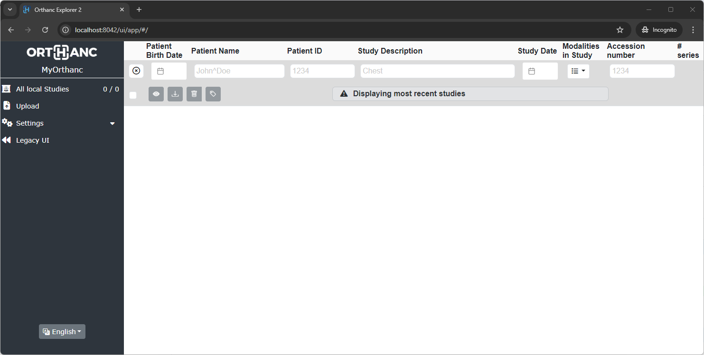

.. _quick-start-windows:

Quickstart guide for Windows
============================

Orthanc is a lightweight, free and open-source DICOM server that is ideal for medical imaging professionals. This guide will help you to quickly set up and run Orthanc on a Microsoft Windows computer.

Step 1: Download Orthanc
------------------------

1. **Visit the Orthanc Website**

   Navigate to the `Orthanc downloads for Microsoft Windows <https://www.orthanc-server.com/download-windows.php>`__ Web site.

2. **Download the Windows Installer**

   Identify your OS version 64 or 32 bits (note: very likely 64 bits) and download the latest version of the Orthanc installer (``.exe`` file).

Step 2: Install Orthanc
-----------------------

1. **Run the Installer**

   Locate the downloaded installer file on your computer. Double-click on it to start the installation process.  Note that the installer is not signed and that you might have to click on ``More info`` and ``Run anyway``:

.. image:: ../images/win-quick-start-protect.png
           :align: center
           :width: 60%

2. **Follow the Installation Wizard**

* Accept the license agreement.
* Choose the installation directory (default value ``C:\Program Files\Orthanc Server`` is usually fine).
* Select the folder in which Orthanc will store its data (default value ``C:\Orthanc`` is usually fine).
* Select the plugins to install.  Although you might not need all of them, they are all selected by default and this is fine: Plugins that are not explicitly enabled do not consume any resources.
* Complete the installation by following the prompts.

.. image:: ../images/win-quick-start-inst.png
           :align: center
           :width: 40%

Step 3: Orthanc is running!
---------------------------

At this stage, Orthanc is running as a Windows Service, which means that it will automatically start whenever your computer starts.

The :ref:`Orthanc Explorer 2 <orthanc-explorer-2>` interface is accessible at `http://localhost:8042/ui/app/ <http://localhost:8042/ui/app/>`__ (default username/password is ``orthanc``). As Orthanc has not received any DICOM file yet, its content is currently empty:

Step 4: Upload and view your first DICOM images!
------------------------------------------------

The easiest way to feed Orthanc with DICOM images is through the ``Upload`` menu of the Orthanc Explorer 2 interface:

Once uploaded, your DICOM images will appear in the list of studies. You will be able to browse them and visualize them with one of the pre-installed viewers.
Remember that we have installed all plugins? Therefore, you have the choice between 4 viewers:

* The :ref:`Stone Web viewer <stone_webviewer>`,
* The :ref:`OHIF viewer <ohif>`,
* The :ref:`Kitware VolView viewer <volview>`.

Each of these viewers can easily be launched by clicking on the buttons highlighted in red:

.. image:: ../images/win-quick-start-orthanc-study-list.png
           :align: center
           :width: 80%

Step 5: Configure Orthanc
-------------------------

Orthanc is configured using a `JSON <https://en.wikipedia.org/wiki/JSON>`__ configuration file. The Windows installers come with a default configuration file that is suitable for quick testing.
However, at some point, you will probably want to customize the settings.

1. **Locate the Configuration Files**

   The Windows configuration is split into multiple configuration files (one main configuration file, plus one for each plugin). These files are typically stored in ``C:\Program Files\Orthanc\Configuration\``.
   ``orthanc.json`` is the main configuration file.  Its complete documentation is available `here <https://orthanc.uclouvain.be/hg/orthanc/file/default/OrthancServer/Resources/Configuration.json>`__.
   In addition, each :ref:`plugin <plugins>` has its own configuration file that is described in the documentation of the plugin.

2. **Edit the Configuration File**

   To edit a configuration file, you must start your editor with ``Run as administrator``.
   We recommend to edit your configuration file using an editor such as `Notepad++ <https://notepad-plus-plus.org/>`__.
   It will warn you that this file can only be edited by an administrator and suggest that you restart Notepad++ as an administrator so that you will be able to save it.

   Some important configuration options are for instance:
   
   * **HTTP Server Port**: ``"HttpPort": 8042`` (default is 8042)
   * **DICOM Server Port**: ``"DicomPort": 4242`` (default is 4242)
   * **Database Storage Path**: ``"StorageDirectory": "OrthancStorage"``

   Save your changes.

   **Remark 1:** When specifying paths under Microsoft Windows,
   backslashes (i.e. ``\``) should be either escaped by doubling them (as
   in ``\\``), or replaced by forward slashes (as in ``/``).

   **Remark 2:** In JSON, every ``{}`` and every ``,`` counts!  Orthanc will refuse to
   start if the file is not in a valid JSON format.  There are numerous online JSON validators to validate your
   JSON.

3. **Restart Orthanc service**

   To take the changes to the configuration files into account, Orthanc must be restarted.  This is done through the
   ``services`` panel of Microsoft Windows (type the ``Windows`` key and search for ``services``).  Locate the Orthanc service, right click, and select ``Restart``:

.. image:: ../images/win-quick-start-services.png
            :align: center
            :width: 70%

4. **Check Orthanc is Running Correctly**

   Open the user interface at `http://localhost:8042/ui/app/ <http://localhost:8042/ui/app/>`__ to validate that Orthanc is still running correctly after your changes.
   If not, you should check the :ref:`Orthanc logs <log>` in the ``C:\Program Files\Orthanc Server\Logs\`` folder.

Next steps
----------

Now that you know how to configure Orthanc, here are a few suggested sections to continue your exploration:

* :ref:`Connect Orthanc to a DICOM modality <configure-modality>`
* Connect a DICOMweb client such as :ref:`Osirix <integrate-osirix-using-dicomweb>`
* Learn to use the Orthanc :ref:`REST API <rest>`
* Start to customize Orthanc through :ref:`Lua scripting <lua>`
* Extend Orthanc using a :ref:`Python plugin <python-plugin>`
* And learn much more by reading the whole :ref:`Orthanc book <orthanc-book>`
