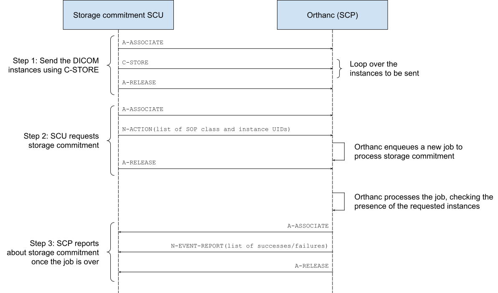

.. _storage-commitment:

DICOM storage commitment
========================

.. contents::
   :depth: 3

Introduction
------------
           
Starting with **release 1.6.0**, Orthanc implements DICOM storage
commitment, both as an SCP and as a SCU.

Storage commitment is a feature of the DICOM standard by which an
imaging modality "A" asks a remote imaging modality "B", whether "B"
accepts responsibility for having stored the images "A" has sent to
it.

Typically, a storage commitment request is issued by "A" after "A" has
sent images to "B" using the :ref:`DICOM C-STORE command
<dicom-store>`. If "B" answers that all the images have been properly
received, the modality "A" has the guarantee that the C-STORE commands
ran fine, and thus "A" might decide to remove the images from its
database. If "B" answers that there was an error, "A" might decide to
send the images again.

For more technical information, one may refer to the storage
commitment `Information Object Definition
<http://dicom.nema.org/medical/dicom/2019e/output/html/part03.html#sect_B.15>`__
and `Service Class
<http://dicom.nema.org/medical/dicom/2019e/output/html/part04.html#chapter_J>`__
in the DICOM standard. Orthanc follows the objective of the IHE
Technical Framework regarding the `Storage Commitment transaction
(RAD-10)
<https://www.ihe.net/uploadedFiles/Documents/Radiology/IHE_RAD_TF_Vol2.pdf#page=160>`__. Following
this IHE specification, Orthanc only implements the **Storage
Commitment Push Model SOP Class**, both as an SCU ("Evidence Creator")
and as an SCP ("Image Manager").

Orthanc makes the assumption that the storage commitment responses are
sent **asynchronously**, which corresponds to most implementations of
storage commitment.

.. _storage-commitment-scp:

Storage commitment SCP
----------------------

Overview
^^^^^^^^

Here is a diagram that outlines how storage commitment works in Orthanc:

| In this sequence, three DICOM associations are used: The first one
  is the usual command to send the DICOM images from some SCU to the
  Orthanc SCP (:ref:`C-STORE <dicom-store>`), the second association
  is the one by which the SCU asks the Orthanc SCP to process a
  storage commitment request (the SCU provides a list of DICOM
  instances to be checked by specifying their SOP instance UID and
  their SOP class UID), and the third one is the storage commitment
  response coming from the Orthanc SCP. The response is sent
  asynchronously from the Orthanc SCP to the SCU, once the storage
  commitment request has been processed by Orthanc.

The list of the DICOM modalities from which Orthanc accepts incoming
storage commitment requests is specified in the :ref:`configuration
file of Orthanc <configuration>`, by the ``DicomModalities``
option. It is possible to disable storage commitment for selected
modalities by setting their dedicated Boolean permission flag
``AllowStorageCommitment`` to ``false``.

As can be seen, the storage commitment SCP of Orthanc also takes
advantage of the :ref:`jobs engine <jobs>` that is embedded within
Orthanc. Whenever Orthanc receives a storage commitment request, it
internally creates a job with a dedicated type (namely
``StorageCommitmentScp``). :ref:`This job can be controlled
<jobs-monitoring>` using the REST API of Orthanc, just like any other
job. As a consequence, an external software is able to monitor, cancel
or pause incoming storage commitment requests, by inspecting the list
of jobs whose type is ``StorageCommitmentScp``.

Sample usage
^^^^^^^^^^^^

In this section, we show how to query the storage commitment SCP of
Orthanc from the command-line tool ``stgcmtscu``. This free and
open-source tool originates from the `dcm4che project
<https://www.dcm4che.org/>`__ and simulates a basic storage commitment
SCU.

.. highlight:: json

Firstly, we define one DICOM modality corresponding to ``stgcmtscu``
by creating the following :ref:`configuration file <configuration>`
for Orthanc::

  {
    "DicomPort" : 4242,
    "DicomModalities" : {
      "storage-commitment" : [ "STGCMTSCU", "127.0.0.1", 11114 ]
    }
  }

.. highlight:: text
               
Secondly, we start Orthanc using the just-created configuration file::

  $ ./Orthanc --verbose storage-commitment.json

We'll be using some sample file ``/tmp/DummyCT.dcm``, whose DICOM tags
"SOP instance UID" and "SOP class UID" can be retrieved as follows::
  
  $ dcm2xml /tmp/DummyCT.dcm | grep -E '"SOPInstanceUID"|"SOPClassUID"' 
  <element tag="0008,0016" vr="UI" vm="1" len="26" name="SOPClassUID">1.2.840.10008.5.1.4.1.1.4</element>
  <element tag="0008,0018" vr="UI" vm="1" len="54" name="SOPInstanceUID">1.2.840.113619.2.176.2025.1499492.7040.1171286242.109</element>

Thirdly, we use ``stgcmtscu`` to get the status of one sample DICOM
file. Here is what can be read at the end of the logs of
``stgcmtscu``::

  $ /home/jodogne/Downloads/dcm4che-5.20.0/bin/stgcmtscu -b STGCMTSCU:11114 -c ORTHANC@localhost:4242 /tmp/DummyCT.dcm
  [...]
  18:14:22,949 DEBUG - STGCMTSCU<-ORTHANC(2) >> 1:N-EVENT-REPORT-RQ Dataset receiving...
  18:14:22,949 DEBUG - Dataset:
  (0008,1195) UI [2.25.250402771220435242864082979068071491247] TransactionUID
  (0008,1198) SQ [1 Items] FailedSOPSequence
  >Item #1
  >(0008,1150) UI [1.2.840.10008.5.1.4.1.1.4] ReferencedSOPClassUID
  >(0008,1155) UI [1.2.840.113619.2.176.2025.1499492.7040.1171286242.109] ReferencedSOPInstanceUID
  >(0008,1197) US [274] FailureReason
  (0008,1199) SQ [] ReferencedSOPSequence

As can be seen, the SOP class/instance UIDs of ``/tmp/DummyCT.dcm``
are reported by the Orthanc SCP in the ``FailedSOPSequence`` field,
which indicates the fact that Orthanc has not stored this instance
yet. The ``FailureReason`` 274 corresponds to status 0x0112, namely
"No such object instance".

Fourthly, let's upload the sample file, then execute ``stgcmtscu`` a
second time::

  $ storescu localhost 4242 /tmp/DummyCT.dcm
  $ /home/jodogne/Downloads/dcm4che-5.20.0/bin/stgcmtscu -b STGCMTSCU:11114 -c ORTHANC@localhost:4242 /tmp/DummyCT.dcm
  [...]
  18:19:48,090 DEBUG - STGCMTSCU<-ORTHANC(2) >> 1:N-EVENT-REPORT-RQ Dataset receiving...
  18:19:48,090 DEBUG - Dataset:
  (0008,1195) UI [2.25.141864351815234988385597655400095444069] TransactionUID
  (0008,1199) SQ [1 Items] ReferencedSOPSequence
  >Item #1
  >(0008,1150) UI [1.2.840.10008.5.1.4.1.1.4] ReferencedSOPClassUID
  >(0008,1155) UI [1.2.840.113619.2.176.2025.1499492.7040.1171286242.109] ReferencedSOPInstanceUID

The instance of interest is now reported in the
``ReferencedSOPSequence`` tag, instead of ``FailedSOPSequence``. This
shows that Orthanc has properly received the sample instance.

  

Plugins
^^^^^^^

The Orthanc core implements a basic storage commitment SCP. This basic
handler simply checks for the presence of the requested DICOM
instances in the Orthanc database, and makes sure that their SOP class
UIDs do match those provided by the remote storage commitment SCU.

For more advanced scenarios, it is possible to override this default
SCP to customize the way incoming storage commitment requests are
processed by Orthanc. This customization is done :ref:`by creating an
Orthanc plugin <creating-plugins>`.

The custom storage commitment SCP is installed in the Orthanc core by
using the ``OrthancPluginRegisterStorageCommitmentScpCallback()``
function of the `plugin SDK <http://sdk.orthanc-server.com/>`__.

Importantly, this primitive frees the plugin developer from manually
creating the Orthanc jobs. One job is automatically created for each
incoming storage commitment request by the Orthanc core, allowing the
developer to focus only on the processing of the queried instances.

Note that a `sample plugin
<https://bitbucket.org/sjodogne/orthanc/src/storage-commitment/Plugins/Samples/StorageCommitmentScp/>`__
is also available in the source distribution of Orthanc.

           

.. _storage-commitment-scu:

Storage commitment SCU
----------------------

*Work in progress*

*Sample using dcmqrscp*
