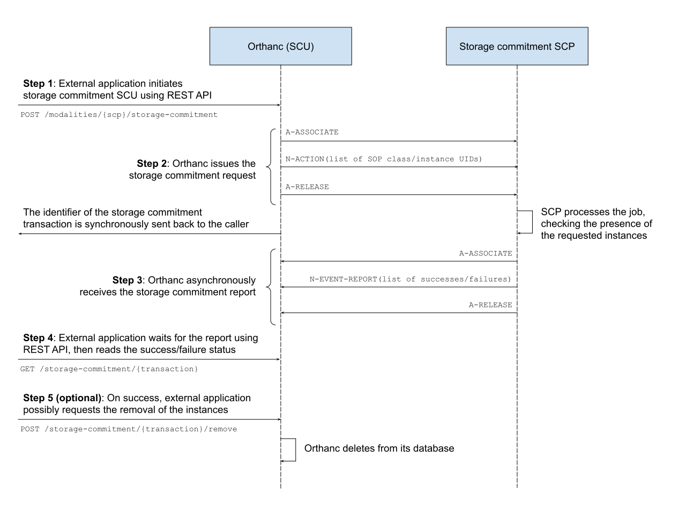

.. _storage-commitment:

DICOM storage commitment
========================

.. contents::
   :depth: 3

Introduction
------------
           
Starting with **release 1.6.0**, Orthanc implements DICOM storage
commitment, both as SCP and as SCU (i.e. both as a server and as a
client).

Storage commitment is a feature of the DICOM standard by which an
imaging modality "A" asks a remote imaging modality "B", whether "B"
accepts responsibility for having stored a set of DICOM instances.

Typically, a storage commitment request is issued by "A" after "A" has
sent images to "B" using the :ref:`DICOM C-STORE command
<dicom-store>`. If "B" answers that all the images have been properly
received, the modality "A" has the guarantee that the C-STORE commands
ran fine, and thus "A" could decide to remove the images from its
local database. If "B" answers that there was an error, "A" could
decide to send the images again.

For more technical information, one may refer to the storage
commitment `Information Object Definition
<http://dicom.nema.org/medical/dicom/2019e/output/html/part03.html#sect_B.15>`__
and `Service Class
<http://dicom.nema.org/medical/dicom/2019e/output/html/part04.html#chapter_J>`__
in the DICOM standard. Orthanc follows the objective of the IHE
Technical Framework regarding the `Storage Commitment transaction
(RAD-10)
<https://www.ihe.net/uploadedFiles/Documents/Radiology/IHE_RAD_TF_Vol2.pdf#page=160>`__. Following
this IHE specification, Orthanc only implements the **Storage
Commitment Push Model SOP Class**, both as an SCU ("Evidence Creator")
and as an SCP ("Image Manager").

Orthanc makes the assumption that the storage commitment responses are
sent **asynchronously**, which corresponds to most implementations of
storage commitment.

.. _storage-commitment-scp:

Storage commitment SCP
----------------------

Overview
^^^^^^^^

Here is a diagram that outlines how storage commitment works in Orthanc:

.. image:: ../images/StorageCommitmentSCP.svg
           :align: center
           :width: 700px

| In this sequence, three DICOM associations are used: The first one
  is the usual command to send the DICOM images from some SCU to the
  Orthanc SCP (:ref:`C-STORE <dicom-store>`), the second association
  is the one by which the SCU asks the Orthanc SCP to process a
  storage commitment request (the SCU provides a list of DICOM
  instances to be checked by specifying their SOP instance UID and
  their SOP class UID), and the third one is the storage commitment
  response coming from the Orthanc SCP. The response is sent
  asynchronously from the Orthanc SCP to the SCU, once the storage
  commitment request has been processed by Orthanc.

The list of the DICOM modalities from which Orthanc accepts incoming
storage commitment requests is specified in the :ref:`configuration
file of Orthanc <configuration>`, through the ``DicomModalities``
option. It is possible to disable storage commitment for selected
modalities by setting their dedicated Boolean permission flag
``AllowStorageCommitment`` to ``false``.

As can be seen in the figure above, the storage commitment SCP of
Orthanc takes advantage of the :ref:`jobs engine <jobs>` that is
embedded within Orthanc. Whenever Orthanc receives a storage
commitment request, it internally creates a job with a dedicated type
(namely ``StorageCommitmentScp``). :ref:`This job can be controlled
<jobs-monitoring>` using the REST API of Orthanc, just like any other
job. As a consequence, an external software is able to monitor, cancel
or pause incoming storage commitment requests, by inspecting the list
of jobs whose type is ``StorageCommitmentScp``.

.. _storage-commitment-scp-sample:

Sample usage
^^^^^^^^^^^^

In this section, we show how to query the storage commitment SCP of
Orthanc from the command-line tool ``stgcmtscu``. This free and
open-source tool is part of the `dcm4che project
<https://www.dcm4che.org/>`__ and emulates the behavior of a storage
commitment SCU.

.. highlight:: json

Firstly, we define one DICOM modality corresponding to ``stgcmtscu``
by creating the following :ref:`configuration file <configuration>`
for Orthanc::

  {
    "DicomPort" : 4242,
    "DicomModalities" : {
      "scu" : [ "STGCMTSCU", "127.0.0.1", 11114 ]
    }
  }

.. highlight:: text
               
Secondly, we start Orthanc using the just-created configuration file::

  $ ./Orthanc --verbose storage-commitment.json

We'll be using some sample file ``/tmp/DummyCT.dcm``, whose DICOM tags
"SOP instance UID" and "SOP class UID" can be retrieved as follows::
  
  $ dcm2xml /tmp/DummyCT.dcm | grep -E '"SOPInstanceUID"|"SOPClassUID"' 
  <element tag="0008,0016" vr="UI" vm="1" len="26" name="SOPClassUID">1.2.840.10008.5.1.4.1.1.4</element>
  <element tag="0008,0018" vr="UI" vm="1" len="54" name="SOPInstanceUID">1.2.840.113619.2.176.2025.1499492.7040.1171286242.109</element>

Thirdly, we use ``stgcmtscu`` to get the status of one sample DICOM
file. Here is what can be read at the end of the logs of
``stgcmtscu``::

  $ /home/jodogne/Downloads/dcm4che-5.20.0/bin/stgcmtscu -b STGCMTSCU:11114 -c ORTHANC@localhost:4242 /tmp/DummyCT.dcm
  [...]
  18:14:22,949 DEBUG - STGCMTSCU<-ORTHANC(2) >> 1:N-EVENT-REPORT-RQ Dataset receiving...
  18:14:22,949 DEBUG - Dataset:
  (0008,1195) UI [2.25.250402771220435242864082979068071491247] TransactionUID
  (0008,1198) SQ [1 Items] FailedSOPSequence
  >Item #1
  >(0008,1150) UI [1.2.840.10008.5.1.4.1.1.4] ReferencedSOPClassUID
  >(0008,1155) UI [1.2.840.113619.2.176.2025.1499492.7040.1171286242.109] ReferencedSOPInstanceUID
  >(0008,1197) US [274] FailureReason
  (0008,1199) SQ [] ReferencedSOPSequence

As can be seen, the SOP class/instance UIDs of ``/tmp/DummyCT.dcm``
are reported by the Orthanc SCP in the ``FailedSOPSequence`` field,
which indicates the fact that Orthanc has not stored this instance
yet. The ``FailureReason`` 274 corresponds to `status 0x0112
<http://dicom.nema.org/medical/dicom/current/output/chtml/part03/sect_C.14.html#sect_C.14.1.1>`__,
namely *"No such object instance"*.

Fourthly, let's upload the sample file to Orthanc, then execute
``stgcmtscu`` for a second time::

  $ storescu localhost 4242 /tmp/DummyCT.dcm
  $ /home/jodogne/Downloads/dcm4che-5.20.0/bin/stgcmtscu -b STGCMTSCU:11114 -c ORTHANC@localhost:4242 /tmp/DummyCT.dcm
  [...]
  18:19:48,090 DEBUG - STGCMTSCU<-ORTHANC(2) >> 1:N-EVENT-REPORT-RQ Dataset receiving...
  18:19:48,090 DEBUG - Dataset:
  (0008,1195) UI [2.25.141864351815234988385597655400095444069] TransactionUID
  (0008,1199) SQ [1 Items] ReferencedSOPSequence
  >Item #1
  >(0008,1150) UI [1.2.840.10008.5.1.4.1.1.4] ReferencedSOPClassUID
  >(0008,1155) UI [1.2.840.113619.2.176.2025.1499492.7040.1171286242.109] ReferencedSOPInstanceUID

The instance of interest is now reported in the
``ReferencedSOPSequence`` tag, instead of ``FailedSOPSequence``. This
shows that Orthanc has properly received the sample instance.

  

Plugins
^^^^^^^

The Orthanc core implements a basic storage commitment SCP. This basic
handler simply checks for the presence of the requested DICOM
instances in the Orthanc database, and makes sure that their SOP class
UIDs do match those provided by the remote storage commitment SCU.

For more advanced scenarios, it is possible to override this default
SCP to customize the way incoming storage commitment requests are
processed by Orthanc. This customization is done :ref:`by creating an
Orthanc plugin <creating-plugins>`.

The custom storage commitment SCP is installed in the Orthanc core by
using the ``OrthancPluginRegisterStorageCommitmentScpCallback()``
function of the `plugin SDK <https://sdk.orthanc-server.com/>`__.

Importantly, this primitive frees the plugin developer from manually
creating the Orthanc jobs. One job is transparently created by the
Orthanc core for each incoming storage commitment request, allowing
the plugin developer to focus only on the processing of the queried
instances.

Note that a `sample plugin
<https://hg.orthanc-server.com/orthanc/file/tip/Plugins/Samples/StorageCommitmentScp>`__
is also available in the source distribution of Orthanc.

           

.. _storage-commitment-scu:

Storage commitment SCU
----------------------

As written above, Orthanc can act as a storage commitment SCP
(server). It can also act as a storage commitment SCU (client), which
is discussed in this section. Here is the corresponding workflow:

Note that depending on the type of long-term archive media (hard disk,
optical disk, tape, hard drive, cloud provider...), the storage
commitment report (DICOM command ``N-EVENT-REPORT``) may be sent long
time after Orthanc has sent its storage commitment request (DICOM
command ``N-ACTION``), which necessitates Orthanc to handle reports
asynchronously.

The active storage commitment reports are stored in RAM only, and are
lost if Orthanc is restarted. The :ref:`configuration option
<configuration>` ``StorageCommitmentReportsSize`` sets the limit on
the number of active storage commitment reports in order to avoid
infinite memory growth because of the asynchronous notifications (the
default limit is 100): The least recently used transactions are
removed first.

REST API
^^^^^^^^

Overview
........

As can be seen in the figure above, storage commitment SCU is governed
by 3 new routes that were introduced in the REST API of Orthanc 1.6.0:

* POST-ing to ``/modalities/{scp}/storage-commitment`` initiates
  storage commitment requests. In this route, ``{scp}`` corresponds to
  the symbolic name of a remote DICOM modality, as declared in the
  ``DicomModalities`` :ref:`configuration option <configuration>` of
  Orthanc.

* GET-ing on ``/storage-commitment/{transaction}`` retrieves the
  status of a previous storage commitment request. In this route,
  ``{transaction}`` corresponds to an identifier that is available in
  the output of the call to ``/modalities/{scp}/storage-commitment``.

* POST-ing on ``/storage-commitment/{transaction}/remove`` asks
  Orthanc to remove the instances that have been reported as
  successfully stored by the remote SCP. This route is only available
  for fully successful storage commitment reports.

In addition, the route ``/modalities/{scp}/store`` that is used to
:ref:`send one file from Orthanc to another modality
<rest-store-scu>`, accepts a new Boolean field
``StorageCommitment``. If this field is set to ``true``, a storage
commitment SCU request is automatically issued by Orthanc after the
C-STORE operation succeeds.

.. _storage-commitment-scu-trigger:

Triggering storage commitment SCU
.................................

.. highlight:: json
               
We'll be using a sample configuration file that is almost :ref:`the
same as for the SCP samples <storage-commitment-scp-sample>`, but in
which we declare a remote SCP instead of a remote SCU (only the AET
changes)::

  {
    "DicomPort" : 4242,
    "DicomModalities" : {
      "scp" : [ "DCMQRSCP", "127.0.0.1", 11114 ]
    }
  }

  
.. highlight:: text
               
Given that configuration, here is how to trigger a storage commitment
SCU request against the remote SCP, asking whether a single DICOM
instance is properly stored remotely::

  $ curl http://localhost:8042/modalities/scp/storage-commitment -X POST -d '{"DicomInstances": [ { "SOPClassUID" : "1.2.840.10008.5.1.4.1.1.4", "SOPInstanceUID" : "1.2.840.113619.2.176.2025.1499492.7040.1171286242.109" } ]}'
  {
    "ID" : "2.25.77313390743082158294121927935820988919",
    "Path" : "/storage-commitment/2.25.77313390743082158294121927935820988919"
  }

The REST call returns with the identifier of a storage commitment
transaction that can successively be monitored by the external
application (see below). A shorthand notation exists as well, where
the JSON object containing the fields ``SOPClassUID`` and
``SOPInstanceUID`` object is replaced by a JSON array containing these
two elements::
  
  $ curl http://localhost:8042/modalities/scp/storage-commitment -X POST -d '{"DicomInstances": [ [ "1.2.840.10008.5.1.4.1.1.4", "1.2.840.113619.2.176.2025.1499492.7040.1171286242.109" ] ]}'

It is also possible to query the state of all the instances from DICOM
resources that are locally stored by the Orthanc server (these
resources can be patients, studies, series or instances). In such a
situation, one has to use the ``Resources`` field and provide a list
of :ref:`Orthanc identifiers <orthanc-ids>`::
  
  $ curl http://localhost:8042/modalities/scp/storage-commitment -X POST -d '{"Resources": [ "b9c08539-26f93bde-c81ab0d7-bffaf2cb-a4d0bdd0" ]}'

Evidently, the call above accept a list of DICOM instances, not just a
single one (hence the enclosing JSON array).

Chaining C-STORE with storage commitment
........................................

Often, C-STORE SCU and storage commitment SCU requests are chained:
The images are sent, then storage commitment is used to check whether
all the images have all properly been received. This chaining can be
automatically done by setting the ``StorageCommitment`` field in the
:ref:`corresponding call to the REST API <rest-store-scu>`::

  $ curl http://localhost:8042/modalities/scp/store -X POST -d '{"StorageCommitment":true, "Resources": [ "b9c08539-26f93bde-c81ab0d7-bffaf2cb-a4d0bdd0" ]}'
  {
     "Description" : "REST API",
     "FailedInstancesCount" : 0,
     "InstancesCount" : 1,
     "LocalAet" : "ORTHANC",
     "ParentResources" : [ "b9c08539-26f93bde-c81ab0d7-bffaf2cb-a4d0bdd0" ],
     "RemoteAet" : "ORTHANC",
     "StorageCommitmentTransactionUID" : "2.25.300965561481187126241492642575174449473"
  }

Note that the identifier of the storage commitment transaction is part
of the answer. It can be used to inspect the storage commitment report
(see below).
  

Inspecting the report
.....................

Given the ID of one storage commitment transaction, one can monitor
the status of the report::

  $ curl http://localhost:8042/storage-commitment/2.25.77313390743082158294121927935820988919
  {
     "RemoteAET" : "ORTHANC",
     "Status" : "Pending"
  }

The ``Status`` field can have three different values:

* ``Pending`` indicates that Orthanc is still waiting for the response
  from the remote storage commitment SCP.
* ``Success`` indicates that the remote SCP commits to having properly
  stored all the requested instances.
* ``Failure`` indicates that the remote SCP has not properly stored at
  least one of the requested instances.

After waiting for some time, the report becomes available::

  $ curl http://localhost:8042/storage-commitment/2.25.77313390743082158294121927935820988919
  {
     "Failures" : [
        {
           "Description" : "One or more of the elements in the Referenced SOP Instance Sequence was not available",
           "FailureReason" : 274,
           "SOPClassUID" : "1.2.840.10008.5.1.4.1.1.4",
           "SOPInstanceUID" : "1.2.840.113619.2.176.2025.1499492.7040.1171286242.109"
        }
     ],
     "RemoteAET" : "ORTHANC",
     "Status" : "Failure",
     "Success" : []
  }

This call shows that the remote SCP had not received the requested
instance. Here the result of another storage commitment request after
having sent the same instance of interest::
  
  $ curl http://localhost:8042/storage-commitment/2.25.332757466317867686107317231615319266620
  {
     "Failures" : [],
     "RemoteAET" : "ORTHANC",
     "Status" : "Success",
     "Success" : [
        {
           "SOPClassUID" : "1.2.840.10008.5.1.4.1.1.4",
           "SOPInstanceUID" : "1.2.840.113619.2.176.2025.1499492.7040.1171286242.109"
        }
     ]
  }

Removing the instances
......................

If the ``Status`` field of the report equals ``Success``, it is then
possible to remove the instances from the Orthanc database through a
single call to the REST API::

  $ curl http://localhost:8042/storage-commitment/2.25.332757466317867686107317231615319266620/remove -X POST -d ''
  {}

Plugins
^^^^^^^

Thanks to the fact that Orthanc plugins have full access to the REST
API of Orthanc, plugins can easily trigger storage commitment SCU
requests as if they were external applications, by calling the
functions ``OrthancPluginRestApiPost()`` and
``OrthancPluginRestApiGet()``.

Testing against dcm4che
^^^^^^^^^^^^^^^^^^^^^^^

As explained :ref:`in a earlier section about SCP
<storage-commitment-scp-sample>`, the dcm4che project proposes
command-line tools to emulate the behavior of a storage commitment SCU
and SCP. The emulation tool for the SCP part is called ``dcmqrscp``.
This section gives instructions to test Orthanc against ``dcmqrscp``.

Let's start Orthanc with an empty database and the configuration file
we used :ref:`when describing the REST API for the SCU
<storage-commitment-scu-trigger>`::

  $ ./Orthanc --verbose storage-commitment.json

In another terminal, let's upload a sample image to Orthanc, generate
a DICOMDIR from it (as the tool ``dcmqrscp`` works with a DICOMDIR
media), and start ``dcmqrscp``::

  $ storescu localhost 4242 /tmp/DummyCT.dcm
  $ curl http://localhost:8042/studies/b9c08539-26f93bde-c81ab0d7-bffaf2cb-a4d0bdd0/media > /tmp/DummyCT.zip
  $ mkdir /tmp/dcmqrscp
  $ cd /tmp/dcmqrscp
  $ unzip /tmp/DummyCT.zip
  $ /home/jodogne/Downloads/dcm4che-5.20.0/bin/dcmqrscp -b DCMQRSCP:11114 --dicomdir /tmp/dcmqrscp/DICOMDIR
  15:20:09,476 INFO  - Start TCP Listener on 0.0.0.0/0.0.0.0:11114

In a third terminal, we ask Orthanc to send a storage commitment
request to ``dcmqrscp`` about the study (that is now both stored by
Orthanc and by ``dcmqrscp``)::

  $ curl http://localhost:8042/modalities/scp/storage-commitment -X POST -d '{"Resources":["b9c08539-26f93bde-c81ab0d7-bffaf2cb-a4d0bdd0"]}'
  {
     "ID" : "2.25.335431924334468284852143921743736408673",
     "Path" : "/storage-commitment/2.25.335431924334468284852143921743736408673"
  }
  $ curl http://localhost:8042/storage-commitment/2.25.335431924334468284852143921743736408673
  {
     "Failures" : [],
     "RemoteAET" : "DCMQRSCP",
     "Status" : "Success",
     "Success" : [
        {
           "SOPClassUID" : "1.2.840.10008.5.1.4.1.1.4",
           "SOPInstanceUID" : "1.2.840.113619.2.176.2025.1499492.7040.1171286242.109"
        }
     ]
  }

As can be seen, ``dcmqrscp`` reports that it knows about the
study. Let us now create another instance in the same study by
:ref:`running a modification <study-modification>` through the REST
API of Orthanc, then check that ``dcmqrscp`` doesn't know about this
modified study::

  $ curl http://localhost:8042/studies/b9c08539-26f93bde-c81ab0d7-bffaf2cb-a4d0bdd0/modify -X POST -d '{"Replace":{"StudyDescription":"TEST"}}'
  {
     "ID" : "0b57dfc8-edb5f4c7-78f8bcdc-546908dc-b79b06f4",
     "Path" : "/studies/0b57dfc8-edb5f4c7-78f8bcdc-546908dc-b79b06f4",
     "PatientID" : "6816cb19-844d5aee-85245eba-28e841e6-2414fae2",
     "Type" : "Study"
  }
  $ curl http://localhost:8042/modalities/scp/storage-commitment -X POST -d '{"Resources":["0b57dfc8-edb5f4c7-78f8bcdc-546908dc-b79b06f4"]}'
  {
     "ID" : "2.25.12626723691916447325628593043115134307",
     "Path" : "/storage-commitment/2.25.12626723691916447325628593043115134307"
  }
  $ curl http://localhost:8042/storage-commitment/2.25.12626723691916447325628593043115134307
  {
     "Failures" : [
        {
           "Description" : "One or more of the elements in the Referenced SOP Instance Sequence was not available",
           "FailureReason" : 274,
           "SOPClassUID" : "1.2.840.10008.5.1.4.1.1.4",
           "SOPInstanceUID" : "1.2.276.0.7230010.3.1.4.8323329.16403.1583936918.190455"
        }
     ],
     "RemoteAET" : "DCMQRSCP",
     "Status" : "Failure",
     "Success" : []
  }

