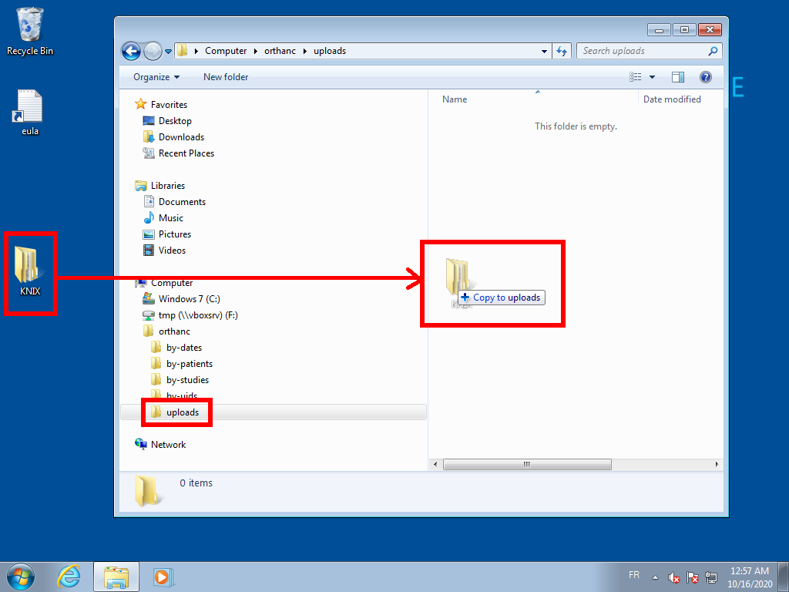

.. _webdav:

Accessing Orthanc from the file explorer using WebDAV
=====================================================

.. contents::

Since release 1.8.0, the content of an Orthanc server can be
**mapped/mounted as a network share** thanks to `WebDAV
<https://en.wikipedia.org/wiki/WebDAV>`__. Thanks to this feature, you
can easily browse the DICOM instances that are stored by Orthanc using
the built-in file explorer of your operating system. It is possible to
download, upload or delete DICOM instances as well.

Orthanc creates a so-called **virtual filesystem** that indexes the
same DICOM resources according to different views (data can be
accessed by patients, by studies, by date, or by DICOM UIDs).

.. _webdav_screenshots:

Screenshots
-----------

The screenshots below are generated using the `test virtual machines
<https://developer.microsoft.com/en-us/microsoft-edge/tools/vms/>`__
that are provided by Microsoft.

Here is the layout of the WebDAV server of Orthanc 1.8.0:

As can be noticed, Orthanc exposes a full hierarchy of DICOM
resources. These resources are transparently mapped to the database of
Orthanc. The same resource will appear at multiple locations of this
virtual filesystem, but in practice, it is stored only once. One can
choose the best way to access the information depending on the use
case.

Uploading a full folder containing a DICOM study (such as a CD or a
DVD containing a DICOMDIR) is as simple as a drag-and-drop onto the
``/uploads/`` folder:

Server configuration
--------------------

Options
^^^^^^^

Three configuration options can be used to configure the WebDAV
server:

* ``WebDavEnabled`` to enable/disable WebDAV.

* ``WebDavDeleteAllowed`` to turn on/off the possibility of deleting
  DICOM resources using WebDAV. This can be disabled for security
  reasons.

* ``WebDavUploadAllowed`` to turn on/off the possibility of uploading
  DICOM resources using WebDAV.

Security
^^^^^^^^

As WebDAV is an application layer above HTTP, you should pay attention
to :ref:`protect your HTTP server <security_http>`. At the minimum,
you should enable HTTP Basic Authentication (check out configuration
option ``RegisteredUsers``). The client will have to provide her
credentials when mapping the WebDAV share.

If you want to control which user can see which resource, you should
protect your network share by creating **access control lists**
through a :ref:`Lua script <lua-filter-rest>`, through the
:ref:`advanced authorization plugin <authorization>`, or through
:ref:`your own plugin <creating-plugins>`
(cf. ``OrthancPluginRegisterIncomingHttpRequestFilter2()``).

The HTTP methods that are used by WebDAV are ``GET`` (for read-only
accesses), ``PUT`` (for uploads), and ``DELETE`` (for deletions). The
access control lists can be focused on these methods.

Finally, it is highly recommended to enable :ref:`HTTPS encryption
<https>`, which might need additional configuration on some operating
systems (see below for Microsoft Windows 10).

Client configuration
--------------------

Nautilus on Ubuntu 18.04
^^^^^^^^^^^^^^^^^^^^^^^^

It is quite straightforward to use the WebDAV server using Nautilus on
Ubuntu:

Obviously, adapt the IP address and HTTP port number to your setup.
Once the share is connected, it is readily accessible:
                   

**Important:** If you use :ref:`HTTPS encryption <https>`, which is
recommended for security reasons, replace the prefix ``dav://`` by
``davs://``.

Microsoft Windows 7
^^^^^^^^^^^^^^^^^^^

This section illustrates how to use WebDAV on a Microsoft Windows 7
operating system. Obviously, the procedure is very similar for more
recent versions of Microsoft Windows, and many tutorials are available
on Internet.

WebDAV has a `known performance issue
<https://oddballupdate.com/2009/12/fix-slow-webdav-performance-in-windows-7/>`__
on barebone Microsoft Windows 7. To fix this issue, first open the 
"Internet Properties" configuration panel:

Then simply uncheck the "Automatically detect settings" checkbox in
the "LAN settings" panel:

Once this is done, in order to map Orthanc as a network share on
Microsoft Windows 7, first open the File Explorer, and right-click on
"Computer":

This will open the "Add Network Location Wizard". Click on "Next" to
choose the (only) available option:

Now enter the IP address and the HTTP port of your Orthanc server, and
don't forget to add the ``/webdav/`` suffix:

Give a name to your network share:
                   

At the "Completing the Add Network Location Wizard", click on
"Finish". You'll then be able to use the network share as depicted in
the :ref:`screenshots above <webdav_screenshots>`.

**Important:** For some reason, Microsoft Windows 7 sometimes "`gets
lost
<https://docs.microsoft.com/en-us/troubleshoot/windows-client/networking/cannot-automatically-reconnect-dav-share>`__"
after an upload and cannot access Orthanc anymore. In such situations,
you'll have to delete the network share and repeat the steps above
again.

Remote access using Microsoft Windows 10
^^^^^^^^^^^^^^^^^^^^^^^^^^^^^^^^^^^^^^^^

Depending on your security settings, Microsoft Windows 10 might impose
the use of HTTPS in the Orthanc server. First, you must obviously
configure :ref:`HTTPS security in Orthanc <https>`.

In order to connect successfully to Orthanc WebDAV server using basic
authentication and SSL with self-signed certificate.

1) download the ``.pem`` certificate

2) Open "Control Panel" → "Manage Computer Certificates"

3) Right click on "Certificates - Local Computer → Trusted Root
   Certification Authorities → Certificates" and choose "All Tasks →
   Import..."

4) Select the ``.pem`` certificate (you might need to enforce
   displaying ``*.*`` files in the dialog box, for the ``.pem``
   extension is not part of the standard certificate extensions)

5) Choose "Place all certifications in the following store: Trusted
   Root Certification Authorities"

6) A dialog box should pop up with "The import was successful"

When done, you can test the WebDAV connection :

1) Right click on the Explorer namespace root ("This PC", in Windows 10)

2) Choose "Map Network Drive"

3) Click the link named "Connect to a Web site that you can use..."

4) Choose custom network location

5) Type the WebDAV address like: ``http://10.10.10.107:8042/webdav/``

6) If all goes well, you should be prompted for the basic auth credentials.

When this is done, the WebDAV location should be mounted at the top of
the Explorer namespace (next to the C: drive, etc...). Something to
try if the mount fails:

- open ``regedit.exe``
  
- open the ``HKLM\SYSTEM\CurrentControlSet\Services\WebClient\Parameters key``
  
- create the ``BasicAuthLevel`` DWORD value if needed
  
- set the ``BasicAuthLevel`` DWORD value to ``2``

This should *not* be required, but was enabled on the PC that was used
to test the mounting procedure. `Details here
<http://techgenix.com/EnableBasicAuthforWebDAVonWindows7/>`__

Debugging WebDAV
----------------

As of release 1.8.0, the WebDAV server of Orthanc has been tested
against the following WebDAV clients: Nautilus, `davfs2
<https://en.wikipedia.org/wiki/Davfs2>`__, Microsoft Windows XP,
Microsoft Windows 7, and Microsoft Windows 10.

It is obviously impossible for us to test against all the possible
platforms. If you encounter an issue using your WebDAV client, you
should send us a trace generated by the `wsgidav reference server
<https://github.com/mar10/wsgidav/>`__ so that we can identify what is
the non-respect of Orthanc wrt. the WebDAV standard.

.. highlight:: bash

On Ubuntu, here are the commands to generate a useful log::

  $ sudo pip install wsgidav cheroot
  $ mkdir -p /tmp/webdav/hello
  $ echo "foo" > /tmp/webdav/hello/world
  $ wsgidav -v -v --auth anonymous --host=0.0.0.0 --port=8042 --root=/tmp/webdav/ | tee /tmp/wsgidav.log

Connect your WebDAV client to ``http://localhost:8042/``, and do some
basic operations (access ``/hello/world``, create a file, create a
folder, and delete a file). Then, stop the ``wsgidav`` server and
publish the content of the ``/tmp/wsgidav.log`` logfile on the
`Orthanc Users discussion group
<https://groups.google.com/g/orthanc-users>`__.
